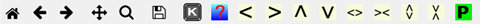

# GSAS-II GUI Organization

The GSAS-II GUI uses three windows, which are described below. The main window has two parts. To the left is the "Data Tree" and to the right is the "Data Window". A second window, called the "Plots Window" is used for graphics such as plots of data or display of three-dimensional structures. The third window, the Console window, is used to show output from the program. 

## GSAS-II Data Tree

The data tree shows contents of a GSAS-II project (which can be read or saved as a .gpx file) in a hierarchical view. Clicking on any item in the tree opens that information on the right side of the window in the "Data Editing" section, where information in that item can be viewed or edited. For example, the "[Sample Parameters](#TBD)" item under a 'PWDR’ entry contains information about how data were collected, such as the sample temperature. The arrow keys (up & down) move the selection to successive entries in the data tree; both the data window and the associated plot (if any) will change.

<H3 style="color:blue;font-size:1.1em">What can I do here?</H3>

The leftmost entries in the GSAS-II menu provide access to many features of GSAS-II. Other menu items will change depending on what type of entry is selected in the data tree. The menu commands that do not change and are described in the [main menu commands](#TBD) section.

## GSAS-II Data Window

Different information is displayed in the Data Editing Window, depending on which section of the [data tree](#Data_tree) is selected. For example, clicking on the "Notebook" entry of the data tree brings up the [Notebook editing window](#TBD), as documented elsewhere.

## GSAS-II Graphics Window

This window presents all the graphical material as a multipage tabbed set of plots utilizing the matplotlib python package. Each page containing a graph or plot has a tool bar with these controls:

The first eight icons have the following functions: **Home**, **Back**, **Forward**, **Pan**, **Zoom**, **Save**, **Key Press** and **Help**, respectively and are described below. The remainder (yellow arrows) move or rescale the plot. The last "P" allows preparation of a publication quality plot. The meaning of these icons are as follows:

* **Home** - returns the plot to the initial view/scaling
* **Back** - returns the plot to the previous view/scaling
* **Forward** - reverses the action in the previous press(es) of the Back button
* **Pan** - allows you to control panning across the plot (press left mouse button & drag) and zooming (press right mouse button & drag),
* **Zoom** - allows you to select a portion of the plot (press left mouse button & drag for zoom box) for the next plot.
* **Save** - allows you to save the currently displayed plot in one of several graphical formats suitable for printing or insertion in a document.
*  - 
Shows a menu of key press commands that can be used to interact with the plot. These actions can be initiated from the menu.
*  - 
accesses GSASII help on the specific plot type.
* "<" - Shifts the plot to the left, relative to the axes
* ">" - Shifts the plot to the right, relative to the axes
* "^" - Shifts the plot up, relative to the axes
* "v" - Shifts the plot down, relative to the axes
* "<>" - Zooms in on the plot (magnifies) along the horizontal (x) direction to show more details.
* "><" - Zooms out on the plot (demagnifies) along the horizontal (x) direction.
*  - 
Zooms in on the plot (magnifies) along the vertical (y) direction to show more details.
*  - 
Zooms out on the plot (demagnifies) along the vertical (y) direction.
*  - 
prepare a fancy publishable version of the current plot (PWDR plots only)

For 3-dimensional structure drawings there will be below the toolbar may be a status bar that on the left may show either an instruction for a keyed input or a pull down selection of keyed input; on the right may be displayed position dependent information that is updated as the mouse is moved over the plot region.

## GSAS-II Console Window

This is a "terminal" or "cmd.exe" window that shows simple text. It is used for output from the program and in some cases error messages may appear here. 

<H3 style="color:blue;font-size:1.1em">What can I do here?</H3>

You can never type anything into this window. It is for output from GSAS-II only. If something is not working properly, you may find some useful information here. Please do include the contents of this window when reporting a bug.  
