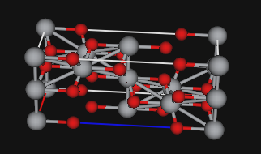
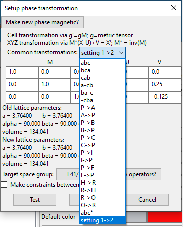

# Help for GSAS-II – Phase Tree Items and its Tab Sections

This is where to find information on the Phase Tree items in GSAS-II. Phases are listing in the data tree as subentries under the "Phases" entry. When a phase is selected a window with multiple tabs is displayed for that phase. The help information here is broken down by tab section.

Phases are either created with the Data/"Add new phase" menu item (manual input) or are read in using the Import/Phase menu items. After a phase is imported, if there are histograms (datasets) present in the project, you will be offered a chance to link the imported phase to the previously imported histogram(s). Likewise, if histograms(s) are imported after phase(s) you will also be asked to link the new data to existing phases. It is also possible to add histograms to a phase later by selecting that phase in the data tree and then selecting the "Data" tab and finally using the "Edit Phase"/"Add powder histograms" menu command. Note that there is no limit to the number of phases that can be included in a GSAS-II project (other than as limited by available computer memory), but phases that are not linked to at least one histogram are ignored in refinements.

# Phase data tree items

When a phase is selected from the data tree, parameters are shown for that selected phase in a tabbed window. Clicking on each tab raises the windows listed below. Each tab is identified by the underlined phrase in the following:

## General Phase Parameters

This gives overall parameters describing the phase such as the name, space group, the unit cell parameters and overall parameters for the atom present in the phase. It also has the controls for Pawley intensity extraction and for computing Fourier maps for this phase. It can also has the controls for Monte Carlo/Simulated Annealing for solving structures with flexible rigid molecular bodies..

<H3 style="color:blue;font-size:1.1em">What can I do here?</H3>

1. Menu '**Compute**' – The compute menu shows computations that are possible for this phase.

    **Fourier map**
    :    Compute Fourier maps according to the controls set at bottom of General page. 

    **Search map**
    :    Search the computed Fourier map. Peaks that are above 'Peak cutoff' % of the maximum will be found in this procedure; they will be printed on the console and will be shown in the 'Map peaks' page. This page will immediately be shown, and the peaks will be shown on the structure drawing for this phase as white 3-D crosses. 

    **Charge flipping**
    :    Performs a charge flipping ab initio structure solution using the method of Oszlanyi & Suto (Acta Cryst. A60, 134-141, 2004). You will need to select a source for the reflection set and perhaps select an element for normalization by its form factor, a resolution limit (usually 0.5Å) and a charge flip threshold (usually 0.1); these are found near the bottom of the General window. There are also Test HKLs to show the progress in phasing with charge flipping cycles. They show the generally chaotic phase behavior before a solution is found; after that the phases are essentially fixed. No use is made of this information; it is just for your edification. A progress bar showing the charge flip residual is shown while the charge flip is in operation. When the residual is no longer decreasing (be patient – it doesn't necessarily fall continuously), press the Cancel button to stop the charge flipping, otherwise it will stop at 10000 cycles. The resulting map will be positioned to properly place symmetry operators (NB: depends on the quality of the resulting phases; the map could be still offset by a few steps), searched for peaks and the display shifts to Map peaks to show them. 

    **4D Charge flipping**
    :   4-Dimensional charge flipping is done for a modulated structure. Only available for phases with a 3+1 superspace group. 

    **Clear map**
    :   This clears any Fourier/charge flip map from memory; the Fourier map controls are also cleared. 

    **MC/SA**
    :    Perform Monte Carlo/Simulated Annealing structure solution using the model as set up in the MC/SA tab and the controls at the bottom of this tab. 

    **Multi MC/SA**
    :    Perform multiple Monte Carlo/Simulated Annealing structure solutions, accumulating the best ones as set up in the MC/SA tab. 

    **Transform**
    :    This allows for a change in axes, symmetry or unit cell. It is also used to create a magnetic phase from a chemical (nuclear) phase. One important transformation that can be done here is for Origin 1 settings to Origin 2 (described below). 

    **Compare Cells**
    :    Compares two supplied unit cells for a transformation matrix that converts one to the other within supplied search tolerances using the NIST*LATTICE program. If this is used, please cite:
        
    * V. L. Karen and A. D. Mighell, NIST Technical Note 1290 (1991). (link)
    * V. L. Karen & A. D. Mighell, U.S. Patent 5,235,523. (link) 

    **Compare polyhedra**
    :    Compares idealized polyhedra (tetrahedron & octahedron) to those obtained from a Reverse Monte Carlo run in RMCProfile. 

    **Select magnetic/subgroup phase**
    :    Selection of the results from a magnetic subgroup analysis done in the Phase/Unit cells list tab. This will generate a new magnetic phase. Can also be used to select from possible subgroups of a nonmagnetic super group for possible symmetry reduction. See Unit cells list for further information. 

    **Protein quality**
    :    Evaluate protein quality by python versions of errat & errat2 codes by Colovos, C. & Yeates, T.O. Protein Science 2, 1511-1519 (1991). 

The items in the upper part of the General page that can be changed are Phase name, Phase type, Space group, unit cell parameters & refine flag. These are described in turn:

* **Phase name** – this is the name assigned to this phase. It can be changed at any time.
* **Phase type** – this can only be set when there are no atoms in the Atoms page for this phase. Select it when the phase is initialized.
* **Space group** – this should be set when the phase is initialized; it can be changed later. Be careful about the impact on Atom site symmetry and multiplicity if you do. GSAS-II will recognize any legal space group symbol using the short Hermann-Mauguin forms; put a space between the axial fields (e.g. 'F d 3 m' not 'Fd3m'; 'F d 3 m' is understood as well as 'F d -3 m'). For space groups with a choice of origin (e.g. F d 3 m), GSAS-II always uses the 2nd setting where the center of inversion is located at the origin. The choice of space group will set the available unit cell parameters.
* **Refine unit cell** – set this flag to refine the unit cell parameters in a Rietveld or Pawley refinement. The actual parameters refined are the symmetry allowed terms (A0-A5) in the expression

$$
d^{*2} = A_0h^2 + A_1 k^2 + A_2 l^2 + A_3 hk + A_4 hl + A_5 kl
$$

\(A_0 - A_5\) correspond to the reciprocal metric tensor elements \( G_{11}, G_{22}, G_{33}, 2 * G_{12}, 2 * G_{13}, 2 * G_{23} \)

* **a, b, c, alpha, beta, gamma** – lattice parameters; only those permitted by the space group are shown. The volume is computed from the values entered.

If there are entries in the Atoms tab, then the Elements table is shown next on the General page; you may select the isotope (only relevant for neutron diffraction experiments). The density (just above the Elements) is computed depending on this choice, the unit cell volume and the atom fractions/site multiplicities in the entries on the Atoms page.

Next are the Pawley controls.

* **Do Pawley refinement?** – This must be chosen to perform a Pawley refinement as opposed to a Rietveld refinement for this phase. NB: you probably should clear the Histogram scale factor refinement flag (found in Sample parameters for the powder data set) as it cannot be refined simultaneously with the Pawley reflection intensities.
* **Pawley dmin** – This is the minimum d-spacing to be used in a Pawley refinement. NB: be sure to set this to match the minimum d-spacing indicated by the powder pattern limits (see Limits for the powder data set).
* **Pawley dmax** – This is the maximum d-spacing for reflections in a Pawley refinement. It is usually defined by the beginning of the data collection scan and will thus remove reflections that have too large d-spacing to be seen in the scan.
* **Pawley neg. wt.** – This is the weight for a penalty function applied during a Pawley refinement on resulting negative intensities. Use with caution; initially try very small values (e.g. .01). A value of zero means no penalty is applied.

Fourier map controls are shown next on the General page. Single crystal data or a completed Rietveld or Pawley refinement is required before a Fourier map can be computed. Select the desired type of map, the source of the reflection set and the map resolution desired. The peak cutoff is defined as a percentage of the maximum and defines the lowest level considered in the peak search.

Charge flip controls are below the Fourier map controls.

* **Reflection sets** – This is the source of structure factors to be used in a charge flip calculation. These may be either a single crystal data set, or structure factors extracted from a powder pattern via a Pawley or LeBail refinement or a Rietveld refinement.
* **Normalizing element** – This is an element form factor chosen to normalize the structure factors before charge flipping. None (the default) can be selected from the lower right of the Periodic Table display shown when this is selected.
* **Map grid step** – This is the step size of the charge flip map; default is 0.25Å. The set of reflections is expanded to a full sphere and zero filled to 2X this value; this suite of reflections is then used for charge flipping.
* **k-Factor** – This is the threshold on the density map, all densities below this are charge flipped.
* **k-Max** – This is an upper threshold on the density map; all densities above this are charge flipped. In this way the "uranium solution" problem is avoided. Use k-Max = 10-12 for equal atom problems and larger for heavy atom ones (typically 2X largest atom number).
* **Test HKLs** – plot of phases for selected hkls are shown at end of charge flipping run. Just for you to look at.

Monte Carlo/Simulated Annealing controls are at the bottom of the window.

* **Reflection set from** – This is the source of structure factors to be used in a charge flip calculation. These may be either a single crystal data set, or structure factors extracted from a powder pattern via a Pawley or Lebail refinement or a Rietveld refinement.
* **d-min** - This restricts the set of reflections to be used in the MC/SA run. Suggest using no lower than 2.0.
* **MC/SA runs** – pulldown with selection of number of trials to be done.
* **MC/SA Refine** – requires a refinement of parameters over range about each test position.
* **MC/SA schedule** – This selects the schedule for the "temperature" to be used during MC/SA run. For 'fast' and 'log', coefficients control details of schedule; a plot shows the scheduled temperatures for the set of steps.
* **Annealing schedule** – This selects the beginning MC/SA "temperature", final "temperature", and number of trials at each step.

## Origin 1 -> Origin 2 Transformations

An important transformation may be needed in certain cases for space groups that have two alternate origin settings (listed here). These are centrosymmetric space groups where the highest symmetry point in the structure does not contain a center of symmetry. Origin 1 places the origin at the highest symmetry setting while Origin 2 places the origin at a center of symmetry (creating a -x,-y,-z symmetry operator, which means that reflection phases can only be 0 or π.) GSAS-II requires use of the Origin 2 settings because computations are much faster and simpler without complex structure factors. Alas, the literature contains a number of structures reported in Origin 1, where the origin choice may not be clearly communicated. (The CIF standard does not require that origin choice be indicated.) When a structure is imported that uses any of the space groups where an origin choice is possible, a message is shown in GSAS-II notifying the user that they must confirm that the origin choice is correct and then provides the opportunity to change origins.

**Example**: An example of what can go wrong is illustrated with the structure of anatase. The space group is I 41/a m d. The coordinates for the two origin choices are:

### Origin 1

| Atom  | X | Y | Z |
| ----- | --|---|-- |
| Ti    | 0 | 0 | 0  |
| O     | 0 | 0 | 0.208 |

### Origin 2

| Atom  | X | Y | Z |
| ----- | --|---|-- |
| Ti    | 0 | 1/4 | -1/8  |
| O     | 0 | 1/4 | 0.083 |

Note that the Origin 2 coordinates are shifted by (0,1/4,-1/8) relative to those in Origin 1.

GSAS-II always uses the symmetry operators for Origin 2; if the structure is input incorrectly with the coordinates set for Origin 1, there are several obvious signs of problems:

* the site symmetries and multiplicities are wrong, often giving an incorrect chemical formula,
* the interatomic distances are incorrect
* a plot of the structure is improbable.

In this case incorrect multiplicities gives rise to a density of 7.9 g/cc, double the correct value. Impossible interatomic distances of 1.88Å for Ti-Ti, and 1.39Å for Ti-O are seen. The unit cell contents with the wrong space group operators is shown to the right.

With coordinates that match the space group operations, the correct Ti-O distances are 1.92Å and 1.97Å and the shortest Ti-Ti distance is 3.0Å. (Note that interatomic distances can be computed in GSAS-II using the Phase Atoms tab and the Compute/"Show Distances & Angles" menu item.)

**Transform Origin**: To transform a space group setting from Origin setting 1 to 2, use the Transform option in the Compute menu and then select the last option in the "Common transformations" pulldown menu, which will be setting 1->2 for space groups where both origins are available, as shown to the right. The transformation matrix will be set to the identity and the "V" vector will have the required origin shift loaded. Press OK. The changes can be seen by selecting the Atoms tab.

## Data

This tab serves several purposes. It is used to link histograms to the selected phase, and it allows the values and refinement flags to be set for the parameters that are defined for each histogram-phase pair, labeled as HAP parameters. [Note that some GSAS-II parameters are defined for each phase (atomic positions, for example), other parameters are defined for each histogram (scale factors and instrumental constants, for example) but the HAP parameters have values for each histogram in each phase.] It can also be used to show a graphical representation of an HAP parameter set.

The HAP parameters include: the phase fraction; the sample contributions to peak broadening: microstrain and crystallite size; a LeBail intensity extraction flag; hydrostatic/elastic strain shifts to lattice parameters; corrections to peak intensities due to experimental effects (preferred orientation, extinction and disordered solvents).

For single crystal data, the only parameters are scale, extinction and disordered solvent. There is no Sample Parameters histogram scale factor.

* **Use flag** - When the Use flag is selected, the currently selected phase is used to compute intensities as a contribution to the selected histogram (single-crystal histograms can have only one phase; powder histograms can have any number of associated phases). When not set, the phase is not present in the selected histogram.
* **Start LeBail extraction** - When this is selected, intensities are set to values that are best fit using the LeBail intensity determination method rather than are computed from the atomic information for the phase. Cycling this setting will reset LeBail extracted intensities to their default (F2 = 100).
* **Phase fraction** - Used in powder histograms: a multiplier that determines the relative amount of the selected phase to a histogram. It is proportional the number of unit cells of the phase in the sample. Note that when the histogram scale factor is varied, these values are on a relative scale. Conventional practice is to vary the scale factor and to not vary the phase fraction for one phase in a histogram. Do not refine the scale factor and all phase fractions unless a constraint is defined so the phase fractions add to 1.
* **Scale factor** - Used for single crystal data: relates F2obs to F2calc.
* **Crystallite size peak broadening** – This is computed from size factor(s) in microns (μm = 10-6 m), with the Scherrer constant assumed as unity. Sizes can be computed in three ways: isotropic, uniaxial and ellipsoidal. In isotropic broadening, crystallites are assumed to average as uniform in all directions and a single size value is supplied; with uniaxial broadening, a preferred direction (as a crystallographic axis, such as 0,0,1 is supplied) -- note that for most crystal systems only one axis makes sense -- and two size parameters are defined, one for along the axis and one for in the perpendicular plane; with ellipsoidal, six terms are used to define a broadening tensor that has arbitrary orientation -- this model may require constraints and is seldom needed. Note that size broadening is usually Lorentzian, which corresponds to a LGmix value of 1.0; if this value is between 0. and 1., both Gaussian and Lorentz size broadening is modeled and a value of 0.0 is pure Gaussian. Values less than 0. or greater than 1. make no physical sense. Typical sensitivity is to no more than 4 μm; beyond that the particles are effectively infinite for a diffraction experiment.
* **Microstrain peak broadening**  - This is computed as unitless fraction of Δd/d (or equivalently ΔQ/Q) times 106. Microstrain can be represented in three ways: isotropic, uniaxial and generalized. In isotropic broadening, microstrain broadening assumed to be the same in all crystallographic directions and a single value is supplied; with uniaxial broadening, a preferred direction (as a crystallographic axis, such as 0,0,1) is supplied -- note that for most crystal systems only one axis makes sense -- and two microstrain parameters are defined, one for along the axis and one for in the perpendicular plane; with generalized, the Nicole Popa/Peter Stephens second-order expansion model is used and the number of terms will depend on the crystal system. It is typically possible to refine all terms when significant anisotropic strain broadening is present. Note that microstrain broadening is usually Lorentzian, which corresponds to a LGmix value of 1.0; if this value is between 0. and 1., both Gaussian and Lorentz broadening is modeled and a value of 0.0 is pure Gaussian. Values less than 0. or greater than 1. make no physical sense. Typical microstrain is ~1000.
* **Hydrostatic/elastic strain** – This shifts the lattice constants for the contribution of a phase into a histogram. The values are added to the reciprocal lattice parameter tensor terms. They must be refined in sequential refinements or where the lattice constants are slightly different in different histograms (as an example see the Combined X-ray/CW-neutron refinement of PbSO4 tutorial.
* **Preferred Orientation** – Preferred orientation (texture) can be treated in one of two different sections of GSAS-II depending on what is desired. The Preferred Orientation correction here in the Phase/Data tab applies a cylindrical specimen symmetry intensity correction to the current phase and a single histogram. The second option is found in the "Texture" tab for the Phase. This allows different choices for the specimen symmetry, based on its processing history. (The cylindrical symmetry option uses the same model as in the Preferred Orientation correction.) However, with the Texture tab, the single set of spherical harmonics terms will be applied to all histograms where the current phase appears. Note that multiple sample orientations or detector settings are usually needed to determine texture with symmetry lower than cylindrical. Typically, the Preferred Orientation correction here is used for crystallographic studies, where intensity corrections are desired to repair for undesired texture in the sample, while the Texture tab is used for studies where the goal is to characterize preferred orientation in a sample. Note that both the Preferred Orientation and Texture corrections should not be used at the same time.

    Within the Phase/Data Preferred Orientation intensity correction option there is a choice of two texture models. The simpler model is that of **March-Dollase**, which requires a definition of a unique axis (as a reciprocal space vector) and then a single ratio can be refined, which specifies the relative amount of excess or depleted crystallites in that direction. Note that there is only one choice for the unique axis for many crystal systems, such as 001 for hexagonal and tetragonal. The **Spherical Harmonics model** allows for a more complex probability surface (which is always constrained to match the symmetry of the crystal system and assumes a cylindrical symmetry sample.) An order parameter term is available which dictates how many terms are introduced into the model and thus the complexity of the probability surface. Note that use of this model requires that the correct value is used for Sample parameters/Goniometer chi setting: 90.0 for Debye-Scherrer or 0.0 for Bragg-Brentano.

    A measure of fit quality can be made by plotting the Preferred Orientation (see selection box at the at the top right) for different reflections. The MRD (multiples of random distribution) term will be one everywhere for a random (texture-free) sample. A value that is significantly below zero is not physically possible and indicates overfitting. The amount of the correction that has been applied to each reflection for a phase in a histogram is shown in the Prfo column of the "Reflection Lists" table. This should also be positive for every reflection.

* **Extinction** – This can occur when crystals/crystallites have minimal mosaic character, which results in lowering of diffraction intensities for the most intense reflections. This is not commonly seen in CW powder diffraction but can be more apparent in neutron TOF data. For single crystal data the extinction model is more complex allowing for primary and two types of secondary extinction.
* **Disordered solvent**; Babinet A & B - This correction, using the Babinet model, is typically used to treat scattering from solvent that is not well-ordered in protein structures. It probably makes no sense in most any other application.
* **Merohedral twins** - Used for single crystal data; gives twin law transformation matrix and fraction for each twin member. These are for merohedral twins where the observed structure factors are a composite of contributions from each twin. Twin fractions are automatically constrained to sum to unity.

<H3 style="color:blue;font-size:1.1em">What can I do here?</H3>

* In this tab, menu items allow copying values or refinement flags to histograms/phases and selection of which histograms are used in the current phase.
* The plot selection items allow for three dimensional representations of the microstrain or crystallite size distributions (which are spheres for isotropic treatments); preferred orientation can be plotted as a Psi scan (a plot of relative crystallite abundance for a particular reflection as a function of azimuthal angle) or as an inverse pole figure (which shows a stereographic projection of the probability distribution for different reciprocal lattice directions as viewed down the sample cylinder axis). For no texture/preferred orientation this figure would be flat = 1.0.

## Atoms

This is the table of parameters for the atoms in this crystal structure model. The menu controls allow manipulation of the values, refinement flags as well as initiate calculations of geometrical values (distances & angles) among the atoms.

<H3 style="color:blue;font-size:1.1em">What can I do here?</H3>

1. **Atom selection from table** - These are controlled by the mouse and the Shift/Ctrl/Alt keys. Note that for most purposes (one exception is atom reordering which requires an Alt-Left-click on the rows), selection of any cell for an atom will work equivalently with selection of the entire row. Upon selection the atoms will turn green in the structure drawing:

    * **Left Mouse Button (LMB)** – on a row number selects the atom.
    * **Shift LMB** – on a row number selects all atoms from last selection to the selected row (or top is none previously selected).
    * **Ctrl LMB** – on a row number selects/deselects the atom.
    * **Alt LMB** – on a row number selects that atom for moving; the status line at bottom of window will show name of atom selected. Use Alt LMB again to select a target row for this atom; insertion will be before this row and the table will be updated to show the change. NB: the Draw Atoms list is not updated by this change.

2. **Double left click a Type column headin**g: a dialog box is shown that allows you to select all atoms with that type.
3. **Double click a refine or I/A column heading**: a dialog box will be shown with choices to be applied to every atom in the list.
4. **Atom data item editing tools** – These are controlled by the mouse (Alt ignored, Shift & Ctrl allow selection of multiple cells but no use is made of them). An individual data item can be cut/pasted anywhere including from/to another document. Bad entries are rejected (yellow background). If any entry is changed, press Enter key or select another atom entry to apply the change.

    * **Name** – can change to any text string.
    * **Type** – causes a popup display of the Periodic Table of the elements; select the element/valence desired; the atom will be renamed as well.
    * **refine** – shows a pulldown of allowed refinement flag choices to be shown; select one (top entry is blank for no refinement).
    * **x,y,z** – change atom coordinate. Fractions (e.g. 1/3, 1/4) are allowed.
    * **frac,Uiso,Uij** – change these values; fractions (e.g. 1/3, 1/4) are allowed.
    * **I/A** – select one of I(sotropic) or A(nisotropic); the Uiso/Uij entries will change appropriately.

5. Menu '**Edit Atoms**' - The edit menu shows operations that can be performed on your selected atoms. You must select one or more atoms before using many of the menu items.
    
    * **On selected atoms...** -

        * **Refine selected** – A popup dialog box appears; select refinement flags to apply to all selected atoms.
        * **Modify parameters** – A popup dialog box appears with a list of atom parameter names; select one to apply to all selected atoms. Name will rename selected atoms according to position in table (e.g. Na(1) for Na atom as 1st atom in list in row '0'). Type will give periodic table popup; selected element valence will be used for all selected atoms and atoms names will be changed. I/A will give popup with choices to be used for all selected atoms. x,y,z will give popup for shift to be applied to the parameter for all selected atoms. Uiso and frac will give popup for new value to be used for all selected atoms.
        * **Set viewpoint** – Set the viewpoint to be position of 1st selected atom
        * **Move atom to viewpoint** – Move a single atom to viewpoint in plot.
        * **Insert atom** – insert an H atom (name= Unk) at 0,0,0 before the selected atom, it is also drawn as an H atom in the structure plot (small white ball).
        * I**nsert viewpoint** – insert an H atom (name= Unk) before the selected atom with coordinates matching the location of the viewpoint, it is also drawn as an H atom in the structure plot.
        * **Calc H atoms** – insert H-atoms in standard positions based on bonding patterns about selected atoms.
        * **Delete atom** – selected atoms will be deleted from the atom list; they should also vanish from the structure drawing.
        * **Transform atoms** – A popup dialog box appears; select space group operator/unit cell translation to apply to the selected atoms. You can optionally force the result to be within the unit cell and optionally generate a new set of atom positions. You may also invert a noncentrosymmetric structure. NB: many of these operations only make sense if all atoms are selected.
        * **Select all** – Selects all atoms for further changes. Atoms in drawing will turn green.
        * **Select from list** – A popup appears allowing selection of atoms for further changes. Selected atoms will turn green.
        * **Append atom** – add an H atom (name= Unk) at 0,0,0 to the end of the atom table, it is also drawn as an H atom in the structure plot.
        * **Append viewpoint** – add an H atom (name= Unk) to the end of the atom table with coordinates matching the location of the viewpoint, it is drawn as an H atom in the structure plot.
        * **Update H atoms** – Reset H-atoms according to bonding geometry; only applies to H-atoms initially placed via Calc H-atoms. Usually used after running a structure refinement.
        * **Assemble molecule** – move atoms to create single molecule, not appropriate for extended structures.
        * **Collect atoms** – move atoms to be closest to selected position
        * **Reload draw atoms** – reload drawing atoms from current atom list. Generally needed after a refinement.
        * **Reimport atoms** – from any importable phase file (e.g. cif, gpx)

6. Menu '**Compute**' –

    * **Show Distances & Angles** – compute distances and angles with esds (if possible) for selected atoms. A popup dialog box will appear with distance angle controls. NB: if atoms have been added or their type changed, you may need to do a Reset of this dialog box before proceeding.
    * **Save Distances & Angles** – same as a. but reports result to a file with extension ".disagl".
    * **Histogram bonds and angles** – forms histograms of bond lengths & angles about selected atoms.
    * **Apportion atom frac** – after selection of a 2nd element; this determines from atomic number and neutron scattering length the atom fractions of each type for selected atoms and presents results on the console.
    * **Density** – calculate density
    * **ISODISTORT mode values** – there must be available the ISODISTORT mode displacement constraints available. This will compute the mode displacements for the current atom positions and display them in a popup window.

<H3 style="color:blue;font-size:1.1em">What can I do with the plot?</H3>

A drawing of the crystal structure will be displayed only if the Draw Options or Draw Atoms tabs are visited first. When back at the Atoms tab, the following are applicable and use of the mouse buttons changes the view of the structure and can be used to select atoms.

* **Left drag**: Holding down left button rotates axes around screen x & y
* **Right drag**: Holding down right button translates the fractional coordinates assigned to the viewpoint (which is kept at the center of the drawing). The structure will appear to translate. The viewpoint can also be entered directly in the Draw Options.
* **Middle drag**: Holding down center button rotates axes around screen z (direction perpendicular to screen).
* **Mouse Wheel**: Rotating the scroll wheel changes "camera distance" (zoom in/out)
* **Shift+Left Click**: Holding down the shift key while clicking on an atom with the left mouse button causes that atom to be selected (Shift + a Right click does the same). Any previously selected atoms will be reset. If two atoms are overlapped in the current view, then the top-most atom will usually be selected. Only atoms in the asymmetric unit can be selected from the plot in this way.
* **Shift+Right click**: Holding down the shift key while clicking on an atom with the right mouse button causes the atom to be selected if previously unselected and unselected if previously selected. Any previously selected atoms will be continue to be selected so shift-right click can be used to add atoms to the selection list. If two atoms are overlapped in the current view, then the top-most atom will usually be selected. Only atoms in the asymmetric unit can be selected from the plot in this way. (On a Mac, control+mouse click is an alternate way to do this.)
* **Key n**: Pressing the "n" key selects the next atom in the displayed atom list.
* **Key p**: Pressing the "p" key selects the previous atom in the displayed atom list.
* **Key c**: Pressing the "c" key sets the plot viewpoint at unit cell center. Also resets n/p selection item to the 1st atom.
* **Key s**: Pressing the "s" key brings up a (large) selection of color schemes for the slice contours. Default – "Paired" (Green – positive, red – negative & yellow – zero).
* **Key k**: Pressing the "k" key cycles through the possible slice contouring options (none, lines, colors, lines+colors)
* **Key +**: Pressing the "+" (or "=") key steps the viewpoint in positive drawing z-direction (away from viewer). If structure is incommensurate, "+" steps the structure and map through the 4th dimension (+tau).
* **Key -**: Pressing the "-" key steps the viewpoint in negative drawing z-direction (toward from viewer). If structure is incommensurate, "-" steps the structure and map through the 4th dimension (-tau).

## Draw Options

<H3 style="color:blue;font-size:1.1em">What can I do here?</H3>

The Draw Options window provides access to a number of items that control how the structure is displayed. If a map is available (Fourier of charge flipping), one can display a 10Åx10Å contoured slice centered at the viewpoint. Contouring done as lines, colors or lines & colors combined. 3-D contouring is also available as green (red for negative density) map grid points. One can also draw individual or stack of hkl planes across unit cell.

<H3 style="color:blue;font-size:1.1em">What is plotted here?</H3>

A drawing that shows the atoms of the crystal structure is generated. The way that the structure is displayed is determined according to the controls in this page as well as the options on the Draw Atoms page.

<H3 style="color:blue;font-size:1.1em">What can I do with the plot?</H3>

Use of the mouse buttons and key presses when viewing a crystal structure changes the view of the structure; see Atoms or Draw Atoms for details

## Draw Atoms

This gives a list of the atoms and bonds that are to be rendered as lines, van der Waals radii balls, sticks, balls & sticks, ellipsoids & sticks or polyhedra. There are four menus for this tab; Edit allows modification of the list of atoms to be rendered, Compute gives some options for geometric characterization of selected atoms, Restraints allows definition of 4 different types of restraints on the structure and Rigid body allows selection of atoms that form a previously defined rigid body.

<H3 style="color:blue;font-size:1.1em">What can I do here?</H3>

1. **Atom Selection from table**: select individual atoms by a left click of the mouse when pointed at the left most column (atom numbers) of the atom display; hold down the Ctrl key to add to your selection; a previously selected atom will be deselected; hold down Shift key to select from last in list selected to current selection. A selected atom will be highlighted (in grey) and the atoms will be shown in green on the plot. Selection without the Ctrl key will clear previous selections. A double left click in the (empty) upper left box will select or deselect all atoms.
2. **Atom Selection from drawing**: select an atom by a left click of the mouse while holding down the Shift key and pointed at the center of the displayed atom, it will turn green if successful and the corresponding entry in the table will be highlighted (in grey); any previous selections will be cleared. To add to your selection, use the right mouse button (Shift down); if a previously selection is reselected it is removed from the selection list. NB: beware of atoms that are hiding behind the one you are trying to select they may be selected inadvertently. You can rotate the structure anytime during the selection process.
3. **Double left click a Name, Type and Sym Op column heading**: a dialog box is shown that allows you to select all atoms with that characteristic. For example, selecting the Type column will show all the atom types; your choice will then cause all those atoms to be selected.
4. **Double left click a Style, Label or Color column**: a dialog box is shown that allows you to select a rendering option for all the atoms. For Color a color choice dialog is displayed that covers the entire color spectrum. Choose a color by any of the means available, press the "Add to Custom Colors", select that color in the Custom colors display and then press OK. NB: selecting Color will make all atoms have the same color and for Style "blank" means the atoms aren't rendered and thus the drawing will not show any atoms or bonds!
5. Menu '**Edit Figure**' - The edit menu shows operations that can be performed on your selected atoms. You must select one or more atoms before using any of the menu items. Most of these items can also be accessed by selecting one or more atoms and right-clicking the mouse.
    * **Atom style** – select the rendering style for the selected atoms
    * **Atom label** – select the item to be shown as a label for each atom in selection. The choices are: none, type, name or number. (NB: atom labelling slows drawing response time).
    * **Atom color** – select the color for the atom; a color choice dialog is displayed that covers the entire color spectrum. Choose a color by any of the means available, press the "Add to Custom Colors", select that color in the Custom colors display and then press OK.
    * **Reset atom colors** – return the atom color back to their defaults for the selected atoms.
    * **Edit atom radii** – modify atom radii used in the bond assignment algorithm.
    * **View point** – position the plot view point to the first atom in the selection.
    * **Select from list** – select atoms from a popup list of names.
    * **Add atoms** – using the selected atoms, new ones are added to the bottom of the list after applying your choice of symmetry operator and unit cell translation selected via a dialog display. Duplicate atom positions are not retained. Any anisotropic thermal displacement parameters (Uij) will be transformed as appropriate.
    * **Add sphere of atoms** – fill in all equivalent atoms that fall within a sphere of selected radius about selected atoms.
    * **Transform draw atoms** – apply a symmetry operator and unit cell translation to the set of selected atoms; they will be changed in place. Any anisotropic thermal displacement parameters (Uij) will be transformed as appropriate.
    * **Fill CN-sphere** – using the atoms currently in the draw atom table, find all atoms that belong in the coordination sphere around the selected atoms via unit cell translations. NB: symmetry operations are not used in this search; do Fill unit cell first.
    * **Fill unit cell** - using the atoms currently selected from the draw atom table, find all atoms that fall inside or on the edge/surface/corners of the unit cell. This operation is frequently performed before Fill CN-sphere.
    * **Complete molecule** – beginning with a selected atom, transform other atoms to equivalent positions that form a contiguous molecule. Not appropriate for continuous structures (a warning will appear)
    * **Create void map** – by using a grid of probe positions, locate points outside of normal contact distances within a structure. Result is a mesh of small blue points in structural voids (e.g. possible locations of missing water molecules).
    * **Delete atoms** – clear the entire draw atom table; it is then refilled from the Atoms table. You should do this operation after any changes in the Atoms table, e.g. by a structure refinement.
    * **Update draw atoms** – refresh the drawn atom positions from the Atoms list.
    * **Load selected atoms** - refresh the selected drawn atom positions from the Atoms list.

6. Menu '**Compute**' - The compute menu gives a choice of geometric calculations to be performed with the selected atoms. You must select the appropriate number of atoms for these to work and the computation is done for the atoms in selection order.

    * **View pt. dist.** - this calculates distance from view-point to all selected draw atoms; result is given on the console window.
    * **Dist. Ang. Tors.** – when 2-4 atoms are selected, a distance, angle or torsion angle will be found for them. The angles are computed for the atoms in their selection order. The torsion angle is a right-hand angle about the A2-A3 vector for the sequence of atoms A1-A2-A3-A4. An estimated standard deviation is given for the calculated value if a current variance-covariance matrix is available. The result is shown on the console window; it may be cut & pasted to another application (e.g. Microsoft Word).
    * **Best plane** – when 4 or more atoms are selected, a best plane is determined for them. The result is shown on the console window; it may be cut & pasted to another application (e.g. Microsoft Word). Shown are the atom coordinates transformed to Cartesian best plane coordinates where the largest range is over the X-axis and the smallest is over the Z-axis with the origin at the unweighted center of the selection. Root mean square displacements along each axis for the best plane are also listed. The Z-axis RMS value indicates the flatness of the proposed plane. NB: if you select (e.g. all) atoms then Best plane will give Cartesian coordinates for these atoms with respect to a coordinate system where the X-axis is along the longest axis of the atom grouping and the Z-axis is along the shortest distance. The origin is at the unweighted center of the selected atoms.

7. Menu '**Restraints**' – Individual restraints may be generated by selecting atoms and the corresponding restraint type from the menu

    * **Add bond restraint** – for selected atom pair (A-B).
    * **Add angle restraint** – for selected atom triple (A-B-C)
    * **Add plane restraint** – for selected 4 or more atoms
    * **Add chiral restraint** – for selected 4 atoms; chiral atom first followed by 3 other atoms; if selected in righthand sequence, chiral volume will be > 0.

8. Menu '**Rigid body**'/'**Define rigid body**' – assign a previously defined rigid body to selected atoms.

<H3 style="color:blue;font-size:1.1em">What is plotted here?</H3>

A drawing that shows the atoms of the crystal structure is generated. The atoms are displayed according to the controls in the in this page as well as options on the Draw Options page.

<H3 style="color:blue;font-size:1.1em">What can I do with the plot?</H3>

Use of the mouse buttons and key presses when viewing a crystal structure changes the view of the structure:

* **Left drag**: Holding down left button rotates axes around screen x & y
* **Right drag**: Holding down right button translates the fractional coordinates assigned to the viewpoint (which is kept at the center of the drawing). The structure will appear to translate. The viewpoint can also be entered directly in the Draw Options.
* **Middle drag**: Holding down center button rotates axes around screen z (direction perpendicular to screen).
* **Mouse Wheel**: Rotating the scroll wheel changes "camera distance" (zoom in/out)
* **Shift+Left Click**: Holding down the shift key while clicking on an atom with the left mouse button causes that atom to be selected (Shift + a Right click does the same). Any previously selected atoms will be reset. If two atoms are overlapped in the current view, then the top-most atom will usually be selected. Only atoms in the asymmetric unit can be selected from the plot in this way.
* **Shift+Right click**: Holding down the shift key while clicking on an atom with the right mouse button causes the atom to be selected if previously unselected and unselected if previously selected. Any previously selected atoms will be continue to be selected so shift-right click can be used to add atoms to the selection list. If two atoms are overlapped in the current view, then the top-most atom will usually be selected. Only atoms in the asymmetric unit can be selected from the plot in this way. (On a Mac, control+mouse click is an alternate way to do this.)
* **Key n**: Pressing the "n" key selects the next atom in the displayed atom list.
* **Key p**: Pressing the "p" key selects the previous atom in the displayed atom list.
* **Key c**: Pressing the "c" key sets the plot viewpoint at unit cell center. Also resets n/p selection item to the 1st atom.
* **Key s**: Pressing the "s" key brings up a (large) selection of color schemes for the slice contours. Default – "RdYlGn" (Green – positive, red – negative & yellow – zero).
* **Key k**: Pressing the "k" key cycles through the possible slice contouring options (none, lines, colors, lines+colors)
* **Key m**: Pressing the "m" key for an incommensurate structure creates a movie file of the change in the structure along the 4th dimension (tau). Movie controls are found in the GSAS-II Configuration Variables. Requires the imageio python package be available for import – it is not normally available in the GSAS-II version of python.
* **Key +**: Pressing the "+" (or "=") key steps the viewpoint in positive drawing z-direction (toward viewer). If structure is incommensurate, "+" steps the structure and map through the 4th dimension (+tau).
* **Key -**: Pressing the "-" key steps the viewpoint in negative drawing z-direction (away from viewer). If structure is incommensurate, "-" steps the structure and map through the 4th dimension (-tau).

## RB Models

There are two actions associated with rigid bodies. First the rigid body must be defined for the project, see the Rigid bodies tree item for details on that. Then the rigid body must be inserted into a phase, which is done from each phases's RB Models tab. In this process, a number of parameters are defined for each body that determine how the rigid body is placed in the cell: the location in the cell for the rigid body origin, a rotation angle and orientation vector. These can be modified while being visualized, using the mouse by holding down the Alt key.

<H3 style="color:blue;font-size:1.1em">What can I do here?</H3>

A rigid body can be inserted into a phase using the "Locate & Insert Rigid Body" command in the "Edit Body" menu.

Once a body has been inserted into a structure, this tab provides access to the rigid body placement parameters, as well controls that determine how the rigid body is refined. Note that the selected rigid body can be positioned and oriented in the unit cell by holding down the Alt key (option on Mac) while "dragging" the mouse (moving the mouse while holding a mouse button down.) Dragging the mouse without the Alt key repositions the view of the cell.

<H3 style="color:blue;font-size:1.1em">What can I do with the plot?</H3>

Use of the mouse buttons when viewing a crystal structure changes the view of the structure:

* **Left drag**: Holding down left button rotates axes around screen x & y
* **Right drag**: Holding down right button translates the fractional coordinates assigned to the viewpoint (which is kept at the center of the plot). The structure will appear to translate. The viewpoint can also be entered directly in the Draw Options.
* **Middle drag**: Holding down center button rotates axes around screen z (direction perpendicular to screen).
* **Mouse Wheel**: Rotating the scroll wheel changes "camera distance" (zoom in/out).

Use of the Alt key causes the above mouse movements to reposition the rigid body rather than change the view of the crystal structure. This can be done when the rigid body is being added to a model or later by selecting the body.

When the rigid body is being initially inserted into a structure, both the rigid body and the crystal structure are displayed. The rigid body will be displayed with a "Balls-and-Sticks" model but bonds will be drawn in green. It is useful to plan for this by preselecting the atoms in the Draw Atoms list and to have atoms displayed as "Sticks" or "Balls-and-Sticks" etc. so that it is easy to differentiate positions of atoms already in the model from the new rigid body location.

When the rigid body has already been placed in the model, the rendering of the structure works a bit differently. As the rigid body is repositioned via Alt+mouse drag, all atoms in the Draw Atoms array are deleted and only the atoms in the asymmetric unit are displayed. The mode used to draw them will depend on the selection made on this window; (the default selection is "Balls-and-Sticks".) When the mouse button is released, if the "Fill cell" option is selected, the symmetry replicants of the atoms in the asymmetric falling inside the unit cell are placed into the Draw Atoms array.

Actions to reposition the rigid body in either mode are:

* **Alt+Left drag**: Holding Alt (Opt on Mac) while dragging the mouse with the left button down rotates the rigid body around screen x & y axes
* **Alt+Middle drag**: Holding Alt while dragging the mouse with the middle button down rotates the rigid body around screen z (out of screen) axis. On the Mac hold down the Alt and Command buttons together.
* **Alt+Right drag**: Holding Alt while dragging the mouse with the right button down (use Control+Opt on Mac with a single-button mouse) translates the rigid body in the screen x & y directions (rotate the plot to see and move in the rigid body in the third direction.) Selecting the "Lock" checkbox next to the origin location, or unselecting the "Refine?" button locks the origin from being changed via mouse dragging when the location should be fixed by symmetry.

## Texture

This tab is used to control settings used for a texture study of a material. This type of characterization usually requires diffraction data recorded with multiple detector orientations (the number of orientations will depend on sample and material symmetry). Do not confuse this with applying a [preferred orientation correction](./phase.md#preferred_orientation) (found in the ["Data" tab](#data)) in a structural study. The sample orientation relative to the detector axes is specified here and the detector orientation is specified for each histogram as goniometer omega, chi, phi and azimuth values (details below). These values must be specified.

Texture analysis using GSAS-II employs spherical harmonics modeling, as described by Bunge, "Texture Analysis in Materials Science" (1982), and implemented by Von Dreele, J. Appl. Cryst., 30, 517-525 (1997) in GSAS. The even part of the orientation distribution function (ODF) via the general axis equation

$$
A(x,y) = 1 + \sum_{L=2}^{N_L}{\frac{4\pi}{2L+1}} \sum_{m=-L}^{L} \sum_{n=-L}^{L} C_L^{mn} k_L^m(y) k_L^n(h)
$$

is used to give the intensity corrections due to texture. The two harmonic terms, \(k_L^m(y)\) and \(k_L^n(h)\) , take on values according to the sample and crystal symmetries, respectively, and thus the two inner summations are over only the resulting unique, nonzero harmonic terms. These unique terms are automatically selected by GSAS-II according to the space group symmetry and the user chosen sample symmetry. The available sample symmetries are cylindrical, 2/m, mmm and no symmetry. The choice of sample symmetry profoundly affects the selection of harmonic coefficients. For example, in the case of cylindrical sample symmetry (fiber texture) only \(k_L^0(y)\) terms are nonzero so the rest are excluded from the summations and the set of \(C_L^{0n}\) coefficients is sufficient to describe the effect on the diffraction pattern due to texture. The crystal harmonic factor, \(k_L^n(h)\), is defined for each reflection, h, *via* polar and azimuthal coordinates \((\phi, \beta)\) of a unit vector coincident with h relative to the reciprocal lattice. For most crystal symmetries, \(\phi\) is the angle between h and the n-th order major rotation axis of the space group (usually the c-axis) and \(\beta\) is the angle between the projections of h and any secondary axis (usually the a-axis) onto the normal plane.  In a similar way the sample harmonic factor, \(k_L^m(y)\), is defined according to polar and azimuthal coordinates \((\psi, \gamma)\) of a unit vector coincident with the diffraction vector relative to a coordinate system attached to the external form of the sample. For example, in the case of a rolled steel plate having mmm symmetry, the polar angle, \(\Psi\), is frequently measured from the normal direction (ND, parallel to Ks) and g is then measured from the rolling direction (RD, parallel to Is) in the TD (transverse direction, parallel to Js) - RD plane.  Thus, the general axis equation becomes

$$
A(\phi,\beta,\psi,\gamma) = 1 + \sum_{L=2}^{N_L}{\frac{4\pi}{2L+1}} \sum_{m=-L}^{L} \sum_{n=-L}^{L} C_L^{mn} k_L^m(\psi, \gamma) k_L^n(\phi, \beta)
$$

Note that this version of the general axis equation differs from that shown in Von Dreele (1997) in that the assignment of m and n are reversed.

In a diffraction experiment the crystal reflection coordinates \((\phi, \beta)\) are determined by the choice of reflection index (hkl) while the sample coordinates \((\Psi, \gamma)\) are determined by the sample orientation on the diffractometer. To define the sample coordinates \((\Psi, \gamma)\), we have defined an instrument coordinate system (I, J, K) such that K is normal to the diffraction plane and J is coincident with the direction of the incident radiation beam toward the source. We further define a standard set of right-handed eulerian goniometer angles \((\Omega, X, \Phi)\) so that \(\Omega\) and \(\Phi\) are rotations about K and X is a rotation about J when \(\Omega = 0\). Finally, as the sample may be mounted so that the sample coordinate system (\(I_s, J_s, K_s\)) does not coincide with the instrument coordinate system (I, J, K), we define three eulerian sample rotation offset angles \((\Omega_s, X_s, \Phi_s)\) that describe the rotation from (\(I_s, J_s, K_s\)) to (I, J, K).  The sample rotation angles are defined so that with the goniometer angles at zero \(\Omega_s\) and \(\Phi_s\) are rotations about K and \(X_s\) is a rotation about J.  The zeros of these three sample rotation angles can be refined as part of the Rietveld analysis to accommodate any angular offset in sample mounting. For the specific case of cylindrical sample symmetry, the cylinder axis is coincident with Ks as is the 2-fold in 2/m sample symmetry. After including the diffraction angle, \(\Theta\), and a detector azimuthal angle, A, the full rotation matrix, \(M\), is

$$
M = - \Theta A \Omega X (\Phi + \Phi_s) X_s \Omega_s
$$

By transformation of unit Cartesian vectors (100, 010 and 001) with this rotation matrix, the sample orientation coordinates \((\Psi, \gamma)\) are given by

$$
cos(y) = M \begin{pmatrix}
0 \\
0 \\
1
\end{pmatrix}
$$

and

$$
tan(\gamma) = M \begin{pmatrix}
0 \\
1 \\
0
\end{pmatrix}/ M
\begin{pmatrix}
1 \\
0 \\
0
\end{pmatrix} 
$$

The harmonic terms, \(k_L^m(\psi, \gamma)\) and \(k_L^n(\phi, \beta)\), are developed from (those for \(k_L^m(\psi, \gamma)\) are similar)

$$
k_L^n(\phi, \beta) = \frac{1}{\sqrt{2\pi}} e^{in\beta} \bar{P}_L^n(cos(\phi))
$$

where the normalized associated Legendre functions, \(\bar{P}_L^n(x)\), are defined via a Fourier expansion as

$$
\bar{P}_L^n(cos(\phi)) = \sum_{s=0}^L {a'}_L^{ns} sin(s \phi)
$$

for n even and

$$
\bar{P}_L^{ns}(cos(\phi)) = \sum_{s=0}^L {a'}_L^{ns} sin(s \phi)
$$

for n odd.  Each sum is only over either the even or odd values of s, respectively, because of the properties of the Fourier coefficients, \({a'}_{L}^{ns}\). These Fourier coefficients are determined so that the definition

$$
\bar{P}_L^{n}(cos(\phi)) = \bar{P}_L^{n}(x) = \sqrt{\frac{(L+n)!}{(L-n)!}} \sqrt{\frac{2L+1}{2}} \frac{(-1)^{L-n}}{2^L L!} (1-x^2)^{-n/2} \frac {d^{L-n}}{dx^{L-n}} (1-x^2)^L
$$

is satisfied. Terms of the form \( cos(n\beta) \bar{P}_L^n(cos{n\beta})\) and \(sin(n\beta) \bar{P}_L^n(cos{\phi})\) are combined depending on the symmetry and the value of n (or m) along with appropriate normalization coefficients to give the harmonic terms \(k_L^n(\phi,\beta)\) and \(k_L^m(\psi,\gamma)\). For cubic crystal symmetry, the term \(k_L^n(\phi,\beta)\) is obtained directly from the Fourier expansion

$$
k_L^n(\phi, \beta) = \sum_{j=0}^L B_L^{nj} \bar{P}_L^n (cos{\phi}) cos{n\beta}
$$

using the coefficients, \(B_L^{nj}\) , as tabulated by Bunge (1982).

The Rietveld refinement of texture then proceeds by constructing derivatives of the profile intensities with respect to the allowed harmonic coefficients, \(C_L^{mn}\), and the three sample orientation angles, \(\Omega_s, X_s, \Phi_s\) Ws, Cs, Fs, all of which can be adjustable parameters of the refinement. Once the refinement is complete, pole figures for any reflection may be constructed by use of the general axis equation, the refined values for \(C_L^{mn}\) and the sample orientation angles \(\Omega_s, X_s, \Phi_s\).

$$
J = 1 + \sum_{L=2}^{N_L} \frac{1}{2L+1} \sum_{m=-L}^{L} \sum_{n=-L}^{L} |C_L^{mn}|^2
$$

The magnitude of the texture is evaluated from the texture index by

If the texture is random then J = 1, otherwise J > 1; for a single crystal J = \(\infty\).

In GSAS-II the texture is defined in two ways to accommodate the two possible uses of this correction. In one, a suite of spherical harmonics coefficients is defined for the texture of a phase in the sample; this can have any of the possible sample symmetries and is the usual result desired for texture analysis. The other is the suite of spherical harmonics terms for cylindrical sample symmetry for each phase in each powder pattern ("histogram") and is usually used to accommodate preferred orientation effects in a Rietveld refinement. The former description allows refinement of the sample orientation zeros, \(\Omega_s, X_s, \Phi_s\), but the latter description does not (they are assumed to be zero and not refinable). The sample orientation angles, \(\Omega, X, \Phi\) are specified in the Sample Parameters table in the GSAS-II data tree structure and are applied for either description.

Some useful examples:

**1. Bragg-Brentano laboratory powder diffractometer**

The conventional arrangement of this experiment is to have a flat sample with incident and diffracted beams at equal angles (theta) on opposite sides of the sample. The sample is frequently spun about its normal to improve powder statistics and impose cylindrical symmetry on any preferred orientation (texture). Thus, the diffraction plane (source, diffraction vector & detector) contains the K-vector which is parallel to the diffraction vector and \(\Omega, X, \Phi = 0\).

**2. Debye-Scherrer diffractometer with point detector(s)**

The usual arrangement here is to have a capillary sample perpendicular to the diffraction plane. The capillary may be spun about its cylinder axis for powder averaging and to impose cylindrical symmetry on the texture which is perpendicular to the diffraction plane. Thus, \(\Omega,\Phi = 0\) and \(X = 90\).

**3. Debye-Scherrer diffractometer with 2D area detector**

The area detector is presumed to be directly behind the sample with the incident beam somewhere near the center of the detector. The detector axes are defined (for a synchrotron) with the X-axis toward the synchrotron ring and the Y-axis vertical "up"; one views the detector image as if looking from the x-ray source. The sample is assumed to be a capillary (which may be spun to impose cylindrical symmetry), although other sample shapes may be used, and is aligned with the cylinder axis horizontal. Integration of the image from a series of "caked" slices gives a set of powder patterns, each assigned an azimuthal angle where zero is along the X-axis. Thus, at azimuth=0 the diffraction plane is horizontal and contains the cylinder axis so \(\Omega\), X, \(\Phi\) = 0.

<H3 style="color:blue;font-size:1.1em">What can I do here?</H3>

1. Menu '**Texture/Refine **texture' – refines the spherical harmonics texture model using the previously determined values of Prfo for all histogram reflection sets as demonstrated in 2DTexture tutorial.
2. **Texture settings** - The texture index, J is shown on the 1st line.
    
    * The Texture model can be chosen from ['cylindrical', 'none', 'shear - 2/m', or 'rolling – mmm'].
    * The Harmonic order (even integer 0-34), refine flag & show coefficients flag are next.
    * The Texture plot type is one of:
        * **Axial pole distribution** which simulates the intensity of a reflection during a phi scan.
        * **pole figure** where a projection of the probability of finding a pole (hkl) is plotted as a function of sample orientation.
        * **inverse pole figure** where a projection of the probability of finding all poles (hkls) is plotted for a selected sample orientation.
        * **3D pole distribution** that shows the probability of finding a pole (hkl) is plotted as a function of sample orientation.

    For Axial distribution, pole figure and 3D pole distribution one must next select the hkl of the desired pole, for Inverse pole figure one must select a sample direction (typically 0 0 1).

    One can choose the contour (pole & inverse pole figures) color scheme (default "Paired") and make a CSV file of the image for import into other software.

    * The spherical harmonics coefficients are shown next; they may be edited. They may be cleared by setting harmonic order to zero and then back to desired value.
    * The sample orientation angle zeros \((\Omega_s, X_s, \Phi_s)\) are shown with their individual refinement flags.

## Map peaks

This gives the list (magnitude, x y & z) of all peaks found within the unit cell from the last Fourier/charge flip map search sorted in order of decreasing peak magnitude. The crystal structure plot shows each peak position as a white to dark gray cross; the shade is determined from the magnitude for the peak relative to the maximum peak magnitude; some are connected by white sticks as possible bonds. Negative peaks are shown in orange.

<H3 style="color:blue;font-size:1.1em">What can I do here?</H3>

* **Peak Selection from table**: select individual atoms by a left click of the mouse when pointed at the left most column (atom numbers) of the atom display; hold down the Ctrl key to add to your selection; a previously selected atom will be deselected; hold down Shift key to select from last in list selected to current selection. A selected atom will be highlighted (in grey) and the atoms will be shown in green on the plot. Selection without the Ctrl key will clear previous selections. A left click in the (empty) upper left box will select or deselect all atoms.
* **Select the mag column** – the entries will be sorted with the largest at the top.
* **Select the dzero column** – the entries will be sorted with the smallest (distance from origin) at the top.
* **Select the dcent column** – the entries will be sorted with the smallest distance from the unit cell center at the top.
* Menu '**Map peaks**'  –
    
    * **Move peaks** – this copies selected peaks to the Atoms list and the Draw Atoms list. They will be appended to the end of each list each with the name 'UNK' and the atom type as 'H'. They will also be drawn as small white spheres at their respective positions in the structure drawing. You should next go to the Atoms page and change the atom type to whatever element you desire; it will be renamed automatically.
    * **View point** – this positions the viewpoint (large 3D RGB cross) at the 1st selected peak.
    * **View pt. dist.** – this calculates distance from viewpoint to all selected map peaks.
    * **Hide/Show bonds** – toggle display of lines (bonds) between peaks
    * **Calc dist/ang** – if 2 peaks are selected, this calculates the distance between them. If 3 peaks are selected this calculates the angle between them; NB: selection order matters. If selection is not 2 or 3 peaks this is ignored. Output is on the console window.
    * **Equivalent peaks** – this selects all peaks related to selection by space group symmetry.
    * **Invert peak positions** – inversion through cell center of map and all positions.
    * **Roll charge flip map** – popup allows shifting of the map & all peak positions by unit cell fractions; can be along combinations of axes.
    * **Unique peaks** – this selects only the unique peak positions amongst those selected; a popup allows selection of atom subset closest to x=0, y=0, z=0 origin or center.
    * **Save peaks** – saves the peak list as a csv file.
    * **Delete peaks** – this deletes selected peaks. The shading on the remaining peaks is changed to reflect any change in the maximum after deletion.
    * **Clear peaks** – this deletes all the peaks in the map peak list; they are also removed from the crystal structure drawing plot.

## Pawley reflections

This gives the list of reflections used in a Pawley refinement; for them to be used the 'Do Pawley refinement' flag must be set (see General), otherwise they are ignored.

<H3 style="color:blue;font-size:1.1em">What can I do here?</H3>

* Menu '**Operations**' –

    * **Pawley settings** – allows setting of Pawley parameters as shown on the General tab.
    * **Pawley create** – this creates a new set of Pawley reflections, over writing any preexisting Pawley set. They are generated with d-spacings larger than the limit set as 'Pawley dmin' in the General tab for this phase. By default, the refine flags are not set and the Fsq(hkl) = 100.0.
    * **Pawley estimate** – this attempts an estimate of Fsq(hkl) from the peak heights of the reflection as seen in the 1st powder pattern of those shown as 'Use' in the Data tab for this phase.
    * **Pawley update** – process Pawley reflection set for negative intensities. These are set to ½ its absolute value for noncentrosymmetric space groups (0.3 otherwise); the refine flag is turned off. One should repeat Pawley refinement and then do Refine all and an additional refinement. Repeat as needed to remove negative intensities. Set Pawley neg. wt. (see Pawley settings) to further suppress negatives.
    * **Refine all** – sets all refine flags
    * **Refine none** – clears all refine flags
    * **Toggle selection** – toggles all refine flags

* You can change the refine flags either by clicking on the box or by selecting one and then selecting the column (a single click on the column heading). Then type 'y' to set the refine flags or 'n' to clear the flags. You should not refine those reflections that are below the lower limit or above the upper limit of the powder pattern otherwise you will have singular matrix errors in your Pawley refinement (adds to the refinement time as bad parameters are removed). Reflections that fall inside excluded regions may also result in refinement singularities.
* You can delete an individual reflection from the Pawley set by selecting its row (will be highlighted) and then pressing the Delete key (this is not reversable & only deletes the 1st one selected).
* You can change the individual Fsq(hkl) values by selecting it, typing in the new value and then pressing enter or selecting somewhere else in the table.
Layers

This is used to set up stacking fault models for simulations of x-ray diffraction patterns. See for example the Stacking Faults-I tutorial. The computations are done by a modified version of DIFFaX. See M.M.J. Treacy, J.M. Newsam and M.W. Deem, Proc. Roy. Soc. Lond. 433A, 499-520 (1991) for more information on DIFFaX and please cite this if you use this section of GSAS-II.

<H3 style="color:blue;font-size:1.1em">What can I do here?</H3>

1. Menu '**Operations**' –

    * **Load from DIFFaX file** – load parameters from a DIFFaX input file
    * **Copy phase cell** – copy the lattice parameters from a selected phase (usually transformed from average unit cell)
    * **Simulate pattern** – run DIFFaX to simulate selected pattern
    * **Fit pattern** – refine stacking fault parameters to fit observed pattern (not available yet)
    * **Sequence simulations** – do a sequence of simulations incrementing a selected stacking fault parameter

2. Show a plot of the 2D diffraction pattern for the stacking model – look for streaks.
3. Select Laue symmetry
4. Reference unit cell – filled by Copy phase cell and is the stacking fault block dimensions (NB: refine inactive)
5. Layer width (a & b) – outer dimensions of crystallite; used for broadening calculations (NB: refine inactive)
6. Next are descriptions of the layers to be used in the calculations. They can be created atom-by-atom or imported from another GSAS-II gpx file. If a layer is already present, then the new layer can be the same; give it a different name.
7. The layers stack according to probability rules – these are presented in tables in the next section
8. You can specify specific layering sequences as a sequence of layer numbers (begins with 1).
9. Finally, you can set the type of sequence and the number of layers to use in the simulation

You can draw the layer structures as well as sequences of layers to check on how they fit together; see the Plot boxes for this.

## Wave Data

This tab displays the modulation functions used for incommensurate structures; it will not appear if the structure is commensurate (i.e. 3D). They include modulations on atom site fractions, positions and thermal motion parameters. If the structure is magnetic, atom moment modulation parameters are also shown.

<H3 style="color:blue;font-size:1.1em">What can I do here?</H3>

1. Select an atom from the Atoms list; the pulldown shows them by name. The display will show the assigned modulations, if any.
2. Add a modulation wave and define its type; window will be redrawn showing allowed coefficients (white background) and symmetry fixed or dependent coefficients (gray background).
3. Select a modulation wave to refine. Holds can be used to fix individual coefficients (see Constraints).
4. Delete a modulation wave.
5. If a 4D map is available (Fourier or charge flip), a contour plot showing density modulation along tau for a selected 3D axis of the selected atom. The +/- keys can be used to adjust the phase offset of the map so it matches the calculated modulation curve.

## MC/SA

This tab displays Monte Carlo/Simulated Annealing model parameters and results. Each rigid body is described by a location (fractional x,y,z) and a quaternion description for the orientation (rotation angle & 3D vector) along with possible bond torsion angles on side chains. Each parameter has a defined range. The MC/SA controls on the General tab further limit the MC/SA run. Selection of a result shows a drawing of the structure with unit cell contents for visualization.

<H3 style="color:blue;font-size:1.1em">What can I do here?</H3>

1. Modify the preferred orientation model (currently not operational)
2. **MC/SA** Menu –
    * **Add atom** – add an isolated atom to the MC/SA model
    * **Add rigid body** – add a previously defined rigid body, which may have adjustable internal torsion angles.
    * **Clear rigid bodies** – removes rigid bodies from the MC/SA model
    * **Clear results** – clears table of MC/SA results from a previous set of MC/SA trials.

## RMC

This displays 3 different setups each for RMCProfile, fullrmc and PDFfit as selected by a radio button at the top of the window. RMCProfile and fullrmc are "big box" modelling routines and PDFfit is a "small box" modelling routine; all for fitting structural models to pair distribution functions (PDF). Tutorials for using RMCProfile and PDFfit can be found in the GSAS-II Help; fullrmc is currently under construction. These routines all run as stand-alone applications which are initiated by GSAS-II. When finished, GSAS-II processes their output files to update parameters that are within the GSAS-II project. The two big box routines can have very long running times; they run as separate console programs. GSAS-II is active while they are running and can "interrogate" them for intermediate results. PDFfit has a short running time and GSAS-II is "locked out" until it finishes; its result can be examined after.

<H3 style="color:blue;font-size:1.1em">What can I do here?</H3>

**Operations** Menu –
    * **Setup RMC** – this builds the input files and python script (if needed) for running the selected RMC program.
    * **Execute** – this executes the chosen RMC program in a new console which will vanish when finishes (after a "press any key" command). When finished, GSAS-II will extract results and place them in appropriate places in the project.
    * **Stop run** – only valid for fullrmc; stops the RMC run & saves progress so it can be continued later.
    * **Plot** – this displays the resulting graphical output from the RMC run. For RMCProfile and fullrmc this can be 5 or more plots, for PDFfit it is only the observed and calculated G(r) plot with a difference curve.

For each program, the setup page is similar. There is a block for "metadata" items for your convenience; they have no impact on the calculations. Next is timing controls for the big box programs (PDFfit has none). Then is structural information and finally the data section for the patterns to be fitted. The big box programs are for only single runs while PDFfit can be used to process a sequence of G(r) data collected as a function of, e.g., temperature (giving Sequential PDFfit2 results).

## fullrmc

The fullrmc program is a large-box pair distribution function modeling library developed by Bachir Aoun [Fullrmc, a Rigid Body Reverse Monte Carlo Modeling Package Enabled with Machine Learning and Artificial Intelligence", B. Aoun, Jour. Comp. Chem. (2016), 37, 1102-1111. [DOI: 10.1002/jcc.24304](https://doi.org/10.1002/jcc.24304)]. Extensive information about fullrmc is found, including a number of explanatory videos, along with older source code on GitHub: [https://bachiraoun.github.io/fullrmc/](https://bachiraoun.github.io/fullrmc/). Note that the GSAS-II implementation is not compatible with the open-source version of fullrmc, but rather the new version 5.0 must be used, which is distributed as a compiled versions for 64-bit Intel-compatible processors running Windows, Linux and MacOS from website [https://github.com/bachiraoun/fullrmc/tree/master/standalones](https://github.com/bachiraoun/fullrmc/tree/master/standalones). Note that an even newer and more powerful version of fullrmc is available for cloud computing by subscription at [https://fullrmc.com](https://fullrmc.com). When fullrmc is selected in this tab, GSAS-II use the GSAS-II configuration variable `fullrmc_exec`, which if defined points to a Python image with fullrmc. Otherwise GSAS-II will look in the following places, in the order specified, for a Python image for a file named `fullrmc5*64bit` (MacOS or Linux) or `fullrmc5*.exe` (Windows):

1. The location where GSAS-II is installed,
2. The location where Python is installed,
3. The location where the GSAS-II binaries are found,
4. the current default location
5. and all directories in the system path. 

## ISODISTORT

This displays the setup for using the web-based application, [ISODISTORT](https://iso.byu.edu/iso/isodistort.php), to identify the possible mode distortions of a parent structure. To use it you must be connected to the internet. Two ISODISTORT Methods are supported in GSAS-II: Method-1 identifies all possible subgroups that result from simple mode distortions that are associated with a single irreducible representation. Method-4 is more useful in that it finds the mode decomposition of a parent structure to give a specified distorted structure and is set up to find only atom displacement modes. See help pages for [ISODISTORT](https://iso.byu.edu/iso/isodistort.php) for more information. The ultimate product of using ISODISTORT is a special cif file with constraints describing the mode distortions; this is imported into GSAS-II to form a new phase with these constraints.

<H3 style="color:blue;font-size:1.1em">What can I do here?</H3>

If this is a freshly created phase (not an imported ISODISTORT cif) then you can choose the Method (4 is default) and select parent structure and distorted child structure (for Method 4).

If you chose Method 1 & run ISODISTORT, a table of possible substructures is displayed; a cif file with mode distortion constraints can be produced from your selection. The table can be filtered by crystal class.

If this is a phase imported from an ISODISTORT cif file, the mode displacements are shown with sliders to allow visualization of the displacements in a drawing of the crystal structure (prepare this first before trying a slider). A structure refinement using this phase will employ the mode distortions as constraints on the atom coordinates; there should be as many as there are free variable coordinates in the structure. The values (in Å) represent the largest atom shift associated with the mode; shown is a list of atom coordinates affected by each mode.

* **Operations** menu –
    * **Run ISODISTORT** – run this from the web site with the controls as shown.
    * **Make cif file** – active after table from Method 1 is displayed; generate cif file by ISODISTORT web site with mode distortion constraints.
    * **Make PDFfit phase** – active when mode distortions are shown. Makes new phase specific for fitting PDF data via PDFfit2.
    * **Show modes** – active when mode distortions are shown. Displays mode names & values.
    * **Show relationships** - active when mode distortions are shown. Displays constraint equations associated with mode distortions.

## Dysnomia

This is displayed if the **Use Dysnomia** box in the General tab is checked. [Dysnomia](https://doi.org/10.1017/S088571561300002X) is a maximum entropy method for improving Fourier density maps. The Dysnomia tab gives controls for its operation.

<H3 style="color:blue;font-size:1.1em">What can I do here?</H3>

* **Operations** menu –
    * **Load from Dysnomia file** – as previously saved set of controls.
    * **Save Dysnomia file** – saves data needed to run Dysnomia
    * **Run Dysnomia** – execute the routine from GSAS-II (not a separate console). Replaces existing map with one improved by maximum entropy.
