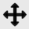

<!--- Don't change the HTML version of this file; edit the .md version -->

#  Overview on **PWDR** (Powder Diffraction) data tree entries 

This is where to find information on the Tree item in GSAS-II associated with powder diffraction (labeled PWDR) and its associated subitems. Note that GSAS-II uses the label of "histogram" for datasets of any type (single-crystal, powder,...) Powder diffraction histograms are added to a project using the Import/"Powder Data" menu items. After data are read, if there are phases present, you will be offered a chance to link the imported histograms to the previously imported phase(s). Likewise, if phase(s) are imported after histograms you will also be asked to link the new phase(s) to existing histograms. It is also possible to add histograms to a phase later by selecting that phase in the data tree and then selecting the "Data" tab and finally using the "Edit Phase"/"Add powder histograms" menu command. Note that there is no limit to the number of histograms that can be included in a GSAS-II project (other than as limited by available computer memory) and histograms that are not linked to at least one phase are ignored in refinements. 

Each powder diffraction dataset has a  [main (parent) entry](./powderparent.md) and a number of children (subdata tree items) in the tree: 

* [Comments](./powdercomments.md)
* [Limits](./powderlimits.md)
* [Background](./powderbkg.md)
* [Instrument Parameters](./powderinst.md)
* [Sample Parameters](./powdersample.md)
* [Peak List](./powderpeaks.md)
* [Index Peak List](./powderindexppeaks.md)
* [Unit Cells List](./powdercells.md)
* [Reflection Lists](./powderrefs.md)

Clicking on the parent or on the subdata tree items, as well as [main (parent) entry for the histogram](./powderparent.md) allows access to different parameters associated with the dataset and offers different menu commands. With the exception of the Instrument Parameters subtree item, which produces a different type of plot, showing peak widths, each PWDR subtree item produces similar plots of the powder diffraction histogram, with different variations:

* By selecting the Limits entry, range of data used, as well as possible excluded regions, can be set.
* Selecting Reflection Lists allows display of reflection indices (hkl values) for a selected phase. Letting the mouse rest unmoved at the position of a reflection in \(2\theta\), TOF, Q, etc. (the vertical position does not matter) will cause these to be displayed. After a short delay a "tool tip" will appear with indices for any reflections close to the lateral mouse position.
* Selecting Background allows a mouse to be used to define fixed points, where a background curve can be fitted to those points.
* Selecting Peak List allows positions of peaks to be defined for use in direct peak fitting.
* Selecting Unit Cells List can show the positions of reflections for an arbitrary set of unit cell parameters, optionally with space group extinctions applied.

* Selecting Instrument Parameters produces a different type of plot, which shows peak widths as a function of Q rather than the powder diffraction histogram.

<H3 style="color:blue;font-size:1.1em">What are the general options for the plot?</H3>

### Plot scaling

When the histogram is displayed by clicking on a data tree entry, the axes are initially scaled to fit the selected histogram. The plot can be rescaled a number of ways:

*  Clicking on the "Zoom" button allows you to trace out a box to use as new limits for the plot.
*  Clicking on "Pan" button allows the limits to be repositioned, by dragging with the left mouse button, or the increase or decrease the scaling by dragging either vertically or horizontally with the right button (control+left also works on Macs). 
*  The "Home" button resets the scale to allow the data to fit into the plot. Note that a stack of scaling values are stored. Clicking left arrow provides access to a previous scaling values and then the right button returns to later values. 
* Pressing the "s" key with the graphics window active causes the plot to enter "sqrt" plotting mode, where intensity values are shown as $\sqrt I$. This also causes the tickmarks and difference plot positions to be repositioned to their initial locations. Pressing the key again exits  "sqrt" plotting mode. 
Pressing this key twice is a convenient way to reset the plotting scaling and tickmark positioning. 
*  An alternative to remembering what key to press is to use the "K" button which provides a menu of all defined key strokes and allows the action to be selected from that menu, so  "sqrt" plotting mode can also be selected using this button. 
* When the main data tree item is selected, tickmarks and the difference plot location can be selected by dragging the plot item (using the left mouse button) to the desired location. 
* To specify exact values for plot limits, one can use the Commands/Set plot limits... menu command associated with main data tree item. One can select which limits are to b specified in the window that is opened, so it is possible to scale only the "x" axis. 

Note that plot scaling and difference/tickmark positioning is usually retained when selecting other histograms from the data tree, but only when the histogram type is the same. When moving from x-ray to neutron data, it is assumed that the scaling should be reset. 

It is also possible to define default scaling/appearance settings for a histogram. Use the commands above to define the scaling, as well as position difference & tickmark items (and then press the "!" key (or access from the "K" button. The current display settings for the histogram are saved and these settings will be used when the histogram is redisplayed by clicking on a data tree entry. This is of particular value when working with several histograms having different Q and/or intensity ranges. 

### Plot Actions 

Here is a list of things that one can do with the plot of diffraction patterns from the 
PWDR entry and some of its subtree entries.

#### For all plots

* **Move mouse**: As the mouse cursor is moved across the plot, the plot status line will show the cursor position as \(2\theta\) (or TOF), d-spacing, Q and the intensity.
* **Press keyboard keys** - See below. The "s" and "w" modes are commonly used.
* **Drag tick marks** - Select any tick mark and while holding the left mouse button down, move them to where you want them to be displayed (press the s key for Sqrt(I) mode to reset to the defaults). With multiple phases, selecting the 2nd phase, etc. changes the vertical spacing between phases. Tick marks can be dragged only when the main PWDR or Reflection Lists tree items are selected.
* **Drag the difference curve** - When the "normal" obs-calc plot is shown (as opposed to the "w" mode plot where (obs-calc)/sigma is displayed, select any point in the difference curve and while holding the left mouse button down move the curve to where you want it to be displayed (press the s key for Sqrt(I) mode to reset it to the default). The difference curve can be dragged only when the main PWDR or Reflection Lists tree items are selected.
* **Display/edit histogram information** - By selecting different tree items within the current histogram, it is possible to display and, in some cases, edit information associated with the histogram. See above.
* **Create a Publication-ready plot**  - Press the green "P" button to generate a customizable version of the displayed plot that can be exported at high resolution, [as discussed below](#PWDR_publication).
* **Highlight reflection positions** - By selecting the "Reflection Lists" tree item and a phase, if the mouse is moved to the region of a reflection in that phase, a "tool tip" (temporarily displayed text) with the indices for nearby reflections is displayed.
* **Label reflection positions** - Right-clicking on a reflection tickmark (in the PWDR and "Reflection Lists" plots) will cause an hkl label with the indices for nearby reflection(s) to be displayed. Once a reflection label is shown, it can be dragged to a new position vertically with the left mouse button. Right-clicking on the label will delete it. All hkl labels can be deleted with a menu command. The hkl labels, including their positions, are saved in the GSAS-II project (.gpx) file.

### Plot Key Commands

The following key press characters have defined actions. These actions can also be initiated from the Key Press button on the plot toolbar. Not all actions are available for all PWDR subdata tree items.

#### For line plots

* **a: add magnification region** - Adds a magnification region to the plot and sets the magnification amount to x2. This can be edited (or deleted) in the table that is shown when the main PWDR tree entry is selected.
* **b: subtract background** - Subtracts the fitted background from the powder pattern. Pressing this again turns the mode off.
* **c: contour on/off** - if multiple powder profiles, then a contour plot is shown of the observed intensities. Data sets of differing length are padded/trimmed to match the 1st pattern.
* **f: toggle full length reflection tick marks** - Reflection positions are indicated when the main PDWR tree entry is selected, or when the "Reflection Lists" entry is selected by display of vertical lines. These lines can be shown as tickmarks, short lines or a thin vertical line the full length of the plot. The 'f' key toggles between the two modes.
* **g: grid lines** - Toggle drawing vertical and horizontal grid lines at all axis label positions. Applies to all plot modes.
* **m: toggle single/multiple plot** - In single mode, this will show only the one selected from the data tree. In multiple “waterfall” mode all are superimposed; offset options (below) can be used to shift them. The selected one is displayed as points & curve for obs/calc; others as obs lines only.
* **n: log(I) on/off** - changes the y-axis to be the log10 of the intensity; difference curve is not shown for log(I) on.
* **o: remove obs...** - toggle removal of the labels for obs, calc, etc (only phase names for tickmarks remain).
* **p: plot partials** - plots the partial contributions from each phase, if they have been computed (using Calculate/Compute partials) in addition to the 
* **q: toggle Q plot** - changes the x-axis to Q (in Å$^{-1}$). This will put multiple powder patterns taken at different wavelengths/types on the same x-axis scale.
* **s: Sqrt(I) on/off** - changes the y-axis to be the square-root of the intensity. The tick mark and the difference curve location is reset.
* **t: toggle d-space plot** - changes the x-axis to d-space (in Å). This will put multiple powder patterns taken at different wavelengths/types on the same x-axis scale.
* **T: toggle plot title** - Removes or returns the plot title
* **v: Save CSV output** - exports the contents of the plot as a .csv file for use in plotting and spreadsheet programs.
* **w: toggle diff plot mode** - for the pattern selected from the data tree, this will replace the difference (obs-calc) curve with the differences divided by their standard uncertainty (esd) values [(obs-calc)/sigma], which shows the significance of the deviations in the fit of the pattern. (Recommended for proper evaluation of the differences). In this mode both plots have separate zoom control.
* **x: show excluded region** - Normally all observed data is plotted. When the "x" key is pressed, data inside excluded regions are not shown.
* **X: cumulative** $\chi^2$ - Superimposes a cumulative** $\chi^2$ plot that shows the data regions most contributing to the disparities in the fit.
* **+,=: no selection** - This is a three-way toggle. In the default mode, observed points are shown as blue "+" signs (the color can be changed in preferences) and the fitted pattern as a green line. Pressing this once adds a line for the observed points and pressing it again removes the "+" signs and for single histogram plots removes the difference curve. 
* **.: scaling diagnostic** - When the '.' key is pressed, data are plotted as intensity*weight. Normally this = 1.0 for CW data and proportional to incident spectrum for normalized neutron TOF data. Does not include effect of selected weight factor but is equal to number of detectors in multidetector data. (not in menu)
* **!: save plot parameters as default** - When the "!" key is pressed, the current display settings for the histogram are saved and these settings will be used when the histogram is displayed by clicking on a data tree entry. To reset the scaling, use either the "s" key (sqrt plotting mode) twice or press the "Home" button to the left on the Matplotlib toolbar. 

* **e: set excluded region** - Defines a new excluded region: press the "e" key with the mouse on one side of the region. Move the mouse to the other side and press "e" again. The region markers (magenta dashed lines) can be dragged to new positions.
Available only when the Limits tree entry is selected. 
* **d: highlight next peak** - Selects a peak in the table, or the next peak. 
Available only when the Peak List or Index Peak List tree entries are selected. 
* **u: highlight previous peak** - Selects a peak in the table, or the previous peak. 
Available only when the Peak List or Index Peak List tree entries are selected. 
 

#### For line plots with more than one powder pattern

* **c: contour on/off** - if multiple powder profiles, then a contour plot is shown of the observed intensities. Data sets of differing length are padded/trimmed to match the 1st pattern.
* **S: set color Scheme** - Select the color map used for contour plots
* **m: toggle single/multiple plot** - In single mode, this will show only the one selected from the data tree. In multiple “waterfall” mode all are superimposed; offset options (below) can be used to shift them. The selected one is displayed as points & curve for obs/calc; others as obs lines only.
* **f: select data** - Allows a subset of the powder patterns to be plotted, rather than all.
* **+,=: no selection** - For multiple powder profiles, only the observed curve is shown when this mode is turned on ('+' and '=' do exactly the same thing).
* **/: normalize** - For multiple powder profiles, all diffraction datasets are normalized so that the maximum intensity is 1 (does not affect the data).

#### Offset modes for line plots in waterfall mode (multiple patterns only)

* **l: offset left** - For a waterfall plot of multiple powder profiles, increase the offset so that later plots are shifted more to the left relative to previous plots.
* **r: offset right** - For a waterfall plot of multiple powder profiles, increase the offset to the right (or decrease the left offset.)
* **d,D: offset down** - For a waterfall plot of multiple powder profiles, increase the offset down. (D does the same as d but to a much larger amount)
* **u,U: offset up** - For a waterfall plot of multiple powder profiles, increase the offset up. (U does the same as u but to a much larger amount)
* **o: reset offset** - For a waterfall plot of multiple powder profiles, reset to no offset.

#### For contour plots

* **d: lower contour max** - This lowers the level chosen for the highest contour color.
* **D: lower contour min** - This lowers the level chosen for the lowest contour color; can be negative.
* **u: raise contour max** - This raises the level chosen for the highest contour color
* **U: lower contour min** - This lowers the level chosen for the highest contour color
* **i: interpolation method** - This changes the method used to represent the contours. If selected a dialog box appears with all the possible choices. Default is 'nearest'; the other useful choice is 'bilinear', this will smooth out the contours.
* **s: color scheme** - This changes the color scheme for the contouring. Default is 'Paired', black/ white options are 'Greys' and 'binary' (for black on white) or 'gray' (for white on black). Others can be very colorful (but not useful!)
* **c: contour off/on** -This turns off contouring and returns to a waterfall plot with any offsets applied.
* **t: temperature on/off** - Show “temperature” for y-axis; valid only if temperature is varied across data sequence and evenly spaced.
* **s: toggle sqrt(I) plot** - Show sqrt(intensity) in contour plot

#### For display of reflections from magnetic unit space groups

These two key commands allow one to step through the output from k-SUBGROUPSMAG in Unit Cells List that are marked “Keep”.

* **j: show next; clear Keep flag** - Show the next magnetic space group in the list, clearing the "Keep" flag for the currently displayed space group. Use this to remove magnetic substructures from consideration that don't satisfy the reflection extinction conditions.
* **k: show next** - Show the next magnetic space group in the list. The "Keep" flag for the currently displayed space group is unchanged.

### Publication Plots

 When the green "P" button is pressed, a copy of the current powder diffraction plot is presented in a separate window. This can only be done with plots of a single histogram, not for waterfall or contour plots. The separate plot offers GUI controls to modify aspects of the plot, for example by changing colors, line widths, plot limits the contents or size of displayed text. The displayed plot, including any changes made, can be exported in a number of formats. These include a number of bitmap formats (JPEG, PNG, TIFF,...) that can then be imported into other programs; several formats offer vector graphics (Postscript, PDF, SVG), that will render at whatever resolution is desired, which can be of great value for posters or other applications where pixilation would be problematic; other formats are intended to be read into other software: Input for the Grace, Igor Pro and Origin programs is offered, as well as a generic .csv file that can be used with custom software. Note that Igor Pro and Origin are commercial products. (Origin export is only available on Windows and requires that Origin 2021 or later be installed on the computer where GSAS-II is installed.) The Grace program is open-source, runs on all major computing platforms, and is available in several versions. 

#### Publication .csv contents

**The `.csv` file** consists of 10 or more columns (depending on the number of phases included in the histogram). The columns are described below, noting that N is the total number of phases and if there are M data points in the histogram, will be M datapoints in each column except in the Phase, tick-pos, and Axis-limits columns.

   1) Used: Indicates if the data point is inside the plot limits or is excluded from the fit. A value of 1 means the values are used and 0 means the data point is not used. 

  2) X: The x-values from the plot in the units used in the plot (2theta, Q,...). The units are noted in the header. 

  3) Obs: The observed diffraction intensity. This may be modified by scaling options or background subtraction, if that has been selected for the plot. 

  4) Calc: The computed diffraction intensity. This will usually be zero if "Used" is 0. 

  5) Bkg: The computed background value at the current "X" location, This will usually be zero if "Used" is 0. 

  6) Diff: The plotted difference curve. This will have the offset used in the plot. 

  6+i) Phase i: This has the reflection positions (tickmarks) in the same units as used for "X". There will be far fewer values for this than for the previous columns. 

  7+N) tick-pos: The name of each phase followed by the vertical position used to display the tickmarks for each phase. There will be 2N of these values. 

8+N) diff/sigma: The uncertainty-weighted difference plot [(Obs-Calc)/sigma where sigma is the statistically expected uncertainty in the obs values, i.e. the standard uncertainty values]. Note that values where "Used" is 0 are meaningless, as the Calc value is 0, but the Obs and sigma values are from the data. 

9+N) Axis-limits: Has four values, x-min, x-max, y-min and y-max as used as the limits for the plot. 
