<!--- Don't change the HTML version of this file; edit the .md version -->

* A video version of the first two parts of this tutorial is available at
[https://anl.box.com/v/FindProfParamCW](https://anl.box.com/v/FindProfParamCW)

* Exercise files are found [here](./data/){target="_blank"}

## Intro

The goal of this exercise is to determine approximate instrument
profile parameters for a lab instrument by a simple peak fit to a
standard sample. Then in the step labeled [Save Instrument
Parameters](#SaveInstrumentParameters) a new instrument parameter file is
created, allowing these parameters to be used as the starting point
for refinements with other datasets. Ideally, one should use a material or mixture of
materials that has peaks over the entire range where you collect data
and use material(s) that have negligible sample broadening (from
crystallite size or microstrain. The NIST LaB$_6$ standards
(SRM 660, 660a and 660b,...) are good choices for this, as they have very
little sample broadening and a relatively small number of peaks but over
a wide angular range, although it would be good to have a pattern with
peaks starting a somewhat lower in $2\theta$.

While older refinement codes used a single set of profile terms, which
treated both sample and instrumental broadening, GSAS-II offers a
much-improved mode of use, where these terms are separated into different
sections of the parameter arrays. (The sample terms are available for
each phase and for each histogram and are found in the Data tab for
each phase.) GSAS-II does allow for the older mode where both effects
are treated by a single set of terms, but this is creates for much
difficult refinements. With the new mode, the instrumental terms can
be fit once for an instrumental configuration and then *they do not
need to be refined* with other samples, making the fit much simpler to
perform and allowing the sample's crystallite size and microstrain 
contributions to be quantified. This tutorial shows how these
instrumental terms may be determined and saved for future use. 

GSAS-II uses a so-called pseudo-Voigt peak shape, where Gaussian and
Lorentzian (the term Cauchy is also sometimes used for Lorentzian)
contributions to the peak shapes are *added*. In reality, the Gaussian and
Lorentzian contributions are *convoluted* which yields a Voigt peak
shape, but the pseudo-Voigt function is a very good approximation of the
Voigt and is much simpler to compute. Also, for almost all diffraction
instruments and samples, instrumental broadening is Gaussian while
sample broadening is Lorentzian. For the Instrumental Parameters, the
U, V & W terms provide Gaussian broadening and the X & Y terms provide
Lorentzian broadening. (Hence X & Y are expected to be zero when the
Instrumental Parameters are not accounting for sample effects.) When
performing individual peak fits, the Gaussian broadening is determined
by the $\sigma^2$ term and the Lorentzian broadening is determined by
the $\Gamma$ term, as described in [the GSAS-II help pages](https://advancedphotonsource.github.io/GSAS-II-tutorials/help/powderpeaks.html).

**Note** that it is highly recommended to
collect reference data to a much higher $2\theta$ angles than the data
used in the example here. What is
done in this example would be sufficient only if one
will never collect and use data above 70$^\circ$ degrees (this is unlikely!).

## Individual peak fitting

### Read in the Diffraction Data

To get started, create a new project in GSAS-II, either by starting the
program fresh or using **File/New Project**. 

Use **Import/Powder Data/from Bruker RAW file** to read
file `LaB6_Jan2018.raw` from
the Tutorials CWInstDemo/data directory (download from
<https://advancedphotonsource.github.io/GSAS-II-tutorials/CWInstDemo/data/>).
After selecting this file, answer Yes to the question "Is this the file you
want?"

### Select Default Instrument Parameters

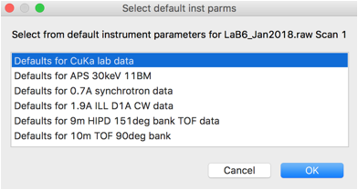
 
The next dialog to appear is titled, 
`Choose inst. Param file for LaB6_Jan2018.raw Scan 1 (or Cancel for default)`. Since we do
not have a set of instrument parameters to read, we must start from
one of the default set of parameters that GSAS-II provides. **Press
Cancel** for this dialog window. This raises the default Inst Parms dialog:

Here, **choose the first option** for CuKa lab data (which
is for a standard instrument with K$\alpha_1$ and K$\alpha_2$
radiation). Then **press OK**. A plot of the data will appear as to
the right:

### Change Data Range

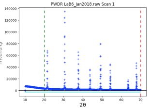 

Note that the data begins at 10$^\circ$, but the first peak is above 21$^\circ$.
So we can simplify the background fitting by changing the data
limits. **Click on the Limits** data tree item, and either change the
Tmin value from 10 to 20, or in the plot **"drag" the green
line to the right** to approximately 20$^\circ$.

### Add Peaks to Fit

To define peaks, **click on the "Peak List**" data tree item. Note
that as below, the peak list is initially empty.

**Move** the mouse to any of the data
points close to the **top of the first peak and click** the left mouse
button. A blue vertical line will be drawn through the peak, as
to the right, and the position will be
added to the peak table. 

**Repeat this for all 8 peaks** in the
pattern. Note that if a peak is entered in the wrong place it can be
moved by "dragging" it with the mouse, or use a right-click
to delete it. Be careful to make sure two peaks are not entered in the
same place by accident.

The peak table appears as to the right. 

###  Refine Peak Areas

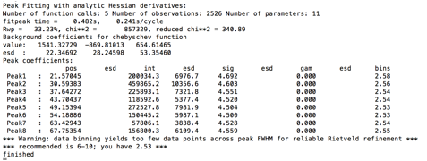

By default, the peak intensities are flagged as to be varied,
but not any of the other parameters. We will eventually fit peak
positions and widths in addition to intensities, but It is wise to
make sure each set of parameters has a chance to converge before
adding more, so we start with only the intensities. 
Use the **Peak Fitting/Peakfit**
menu item to perform a peak refinement. You will be asked for a name to
save the project. (Enter a name such as `peakfit.gpx` and press
Save). The peaks are then fit, here optimizing only the intensity
values. The console window shows the details of the
refinement:

The warning shown at the end is because the default peak parameters describe
a peak shape that is significantly sharper than what is actually present
for these data; the step size for these data is actually fine. This warning will later
go away, but if it did not, this would indicate that it would be better
to recollect the data with a step size decreased.

###  Refine peak areas and heights

In the peak list window, **double click in the refine heading for the
peak position** flags, this will bring up a dialog that allows
all peak positions to be varied. 

 
Select "vary all" and press OK. Now all peak positions and areas will
be refined. Use the **Peak Fitting/Peakfit** menu command to start peak
refinement. Note that control-P (on Mac command-P) is a shortcut for
the **Peak Fitting/Peakfit** menu item.

 
The fit improves significantly, as shown to the right, but a good fit
requires also fitting peak widths. 

### Refine peak positions, areas and widths (optional)

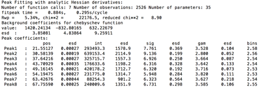

We could at this point proceed to fit the instrumental profile terms,
so this next step can be skipped, but for the purposes of showing how
individual peak fitting is done, we will try this first. It does have
the advantage as it will show if any peaks have anomalous widths. 

**Double-Click** on the refine headings for
the **sigma2** (Gaussian width) and **gamma** (Lorentzian width)
parameters so that all parameters can be refined. Use the **Peak
Fitting/Peakfit** menu item to again start peak refinement. The
results in the console window are shown to the right.

### Add more Background terms

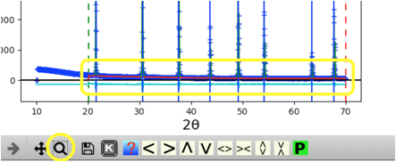
 
Use the zoom feature (magnifying glass below the plot) to draw a box around the low
intensity data. 

Looking at the magnified plot (to right), makes it
clear that the default number of background terms (3) does not allow
enough freedom to fit the curved shape of the background. Increasing
the background terms from 3 to 6 will fix this.

 
Select the **Background** tree item and change the **number of
coefficients to 6**, as shown to the right. 
Then return to the **Peak List** data tree item and use the **Peak
Fitting/Peakfit** menu item to perform a peak refinement. 

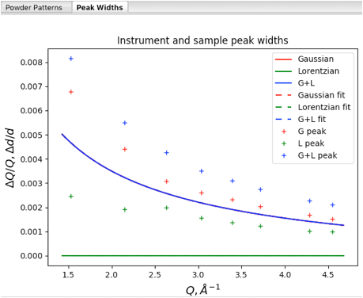

At this point it is instructive to click on the **Instrument Parameters**
data tree item to see a plot of peak widths.

Note that the solid curves here are plots of the profile coefficients
from the default instrument parameters (which are unimportant here), but
the fits for the individual peaks are shown (in units of Q/$\Delta$Q
vs Q), with Lorentzian widths (gamma) in green, Gaussian
widths (from sigma2) in red. The convolution of Gaussian and Lorentzian
(total broadening) for the individual peaks is shown in blue.

###  Refine Profile Parameters

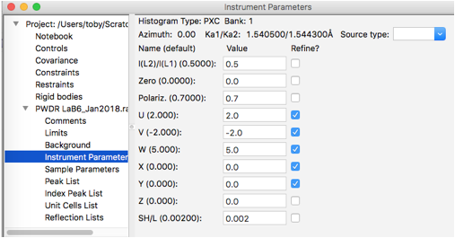

When individual peak profile terms are refined (sig2 and/or gam) ,
those values are used to compute the peak profiles, but when a sig2 or
gam value is not refined, these values are generated from the U, V and
W terms (for sig2) or X, Y and Y for gam. (Note that Z, which provides
for broadening independent of Q, is provided as an option, but is rarely, if
ever, appropriate.) It is possible to turn off the computation of sig2
and gam values from the instrumental terms by unselecting the "Gen
unvaried widths" menu option, but this is not needed here. 

GSAS-II allows X and/or Y to be refined where some
(but not all!) gam terms are refined individually, and one may expect
to see differing trends in the Lorentzian widths from peak to peak in
a sample that contains more than one phase or exhibits anisotropic
peak broadening. However, since Gaussian
peak widths should arise from instrumental broadening, which should be
independent of any sample effects, this mixed mode of fitting is not
allowed for refinement of sig2. If any individual peak sig2 values are
refined, the U, V and W terms cannot be varied. 

Here we will select to **refine** the overall profile terms: use **Gaussian U, V, &
W and Lorentzian X & Y**, as shown to the right:

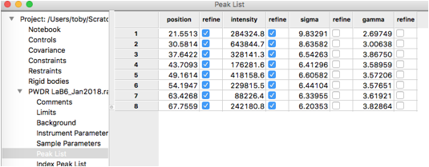

As noted before, we must remove fitting of the sigma2 terms in order
to fit the U, V & W terms. If we had any peaks that were not consistent with
the width of the others, we might choose to continue to refine their
individual Lorentzian profile terms (gam), if that is done, those peaks
varied individually would be excluded from the X & Y
fitting. Here we will refine U, V, W, X & Y against all peak and will
remove all individual peak widths from the fit. To do
this, select the **Peak List data** tree item and **remove refinement of
sigma & gamma** for all peaks by double-clicking on the refine column
headers for each and select "N -- vary none" so that the table appears
as to the right:

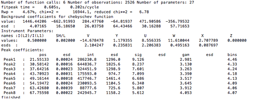
 
Use the **Peak Fitting/Peakfit** menu item to perform a peak
refinement optimizing U, V, W, X & Y. Note that the sigma and gamma
values are now computed from U, V, & W and X & Y, respectively. 

The difference curve shows only very small deviations, so use of the
Instrumental Parameters is very close in quality to the fit with
individual peak widths despite being more highly constrained (5 terms
vs 16 for the individual case). Note also that the
background is also quite well fit now. 

###  Save the Profile Parameters

So that we can use these profile terms as the starting point for a
future refinement, we want to create a file with these terms that we
can use for future fits for data from this instrument. However, we do
not want to include the sample broadening in this, so before saving
the values set the X & Y terms to zero. Note that equivalent to this
would have been to have only refined U, V & W, leaving X & Y at their
initial zero values and to have refined the individual peak gamma values. 

 After setting X & Y to 0.0, **save the profile terms** to a file by clicking on
the **Instrumental Parameters** data tree item and use the
**Operations/Save Profile** menu command. Since different sets of
instrument parameters will be needed for different instruments and
for different configurations (for example, slit settings), it is wise
to include information about the configuration in the file name. The
file extension will be `.instparm`. Place a copy of this file where it
will be conveniently accessed when reading in data files. Make a note
of this file name, as we will use it in a subsequent step.

### Compare Results of Individual Peak Widths with Instrumental Terms (optional)

We might want to see how well the U, V & W values reproduce the fits
where the sigma2 values were allowed to vary freely. Likewise,
comparing widths generated from the X & Y values to the individual
gamma values will provide evidence for the presence of a second phase
or anisotropic broadening. Also, this provides a place to make the
features of the "Instrument and sample peak widths" plot clear. 

First, since we have previously set the X & Y values to zero, repeat
the previous peak fitting, again using the **Peak Fitting/Peakfit** menu
item to perform a peak refinement that optimizes U, V, W, X & Y. This
should provide approximately the same values as seen before.

Next,  we **stop refining U, V, W, X & Y** by clicking on
**Instrumental Parameters** data tree item and turning the refinement
flags off for all terms, as seen to the right. 

In the **Peak List** data tree item, turn on the **refine** flag for **all
individual peak widths** (as was done before.)

 
Use the **Peak Fitting/Peakfit** menu item to perform a peak
refinement, again optimizing individual peak widths. Returning to the
**Instrumental Parameters** data tree item provides the plot seen to
the right.

This plot uses the following color coding: Lorentzian widths
are shown in green, Gaussian widths are in red and their convolution
(total broadening) is shown in blue. The plot components are:

 * **Solid curves** are the profile terms from the original instrument
 parameter file (here the CuKa lab data defaults, where the actual
 values are largely irrelevant here). Note since X, Y & Z
 are zero, there is only Gaussian broadening and the total broadening
 is exactly the same as the Gaussian. so the blue curve hides the red one.

 * **Dashed curves:** these values are generated by the refined U, V &
 W and X, Y & Z values. If we had used an instrument parameter file
 that had been appropriate for the instrument used here, the
 observation that displayed instrumental broadening here (dashed red
 curve) is significantly greater than the default values (the solid
 red curve, which is hidden by the blue solid curve) would be useful
 information. 

 * **Plus signs** (for individual peaks) these show the widths for the
individual unconstrained peak widths. Note that the Gaussian and
Lorentzian fitted widths agree well with the fitted Instrumental
parameter curves (dashed lines). 

*These profile terms are more than adequate for most structural fitting
problems, but it should be noted that better values would be preferred
to obtain quantitative measurements of microstrain and/or
crystallite size. To obtain more accurate terms, start fitting the
instrument profile from values determined as was done here
in a Rietveld fit. Ideally, use a standard where
microstrain and crystallite size effects are known and can be used as
fixed values in the calibration. This will allow U, V, & W to be
established optimally. As noted before, inclusion of higher angle data
would be preferable, as would be a sample with lower angle peaks. With
peaks at low Q values, the SH/L can also be refined.*

## Test the Profile Parameters

The obvious question will be how well do these parameters fit the data?
To test this, we can start a new refinement using the instrumental parameters and
see how well they do. 

### Read in the Diffraction Data

Use the **File/New Project** menu command to create an empty project. You can say
Yes to the prompt to save the current project (No would not
hurt.) As before, use **Import/Powder Data/from Bruker RAW
file** to read file `LaB6_Jan2018.raw` from
the Tutorials `CWInstDemo/data` directory (downloaded already
from
<https://advancedphotonsource.github.io/GSAS-II-tutorials/CWInstDemo/data/>).
After selecting this file, answer yes to "Is this the file you
want?"

### Select New Instrument Parameters

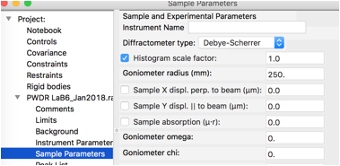

The next dialog to appear is titled, "Choose inst. Param
file for LaB6_Jan2018.raw Scan 1 unlike before, we do have profile terms
to read, [from the file created
previously](#SaveInstrumentParameters). Select this file as the 
instrument parameter file and **press
OK**. Note that you may need to change the
file filter to see files of type .instparm.

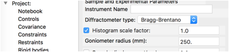
 
 At present, the instrument type is not saved, so go to the Sample
Parameters data tree item for the new histogram and change the
**Diffractometer type** from Debye-Scherrer **to
Bragg-Brentano**, as seen to the right.

### Add Phase

We will add a phase for LaB$_6$. Since this is a simple material
we will input this by hand rather than trying to import it. **Use
Data/Add new phase** to create a new phase. **Enter any name** you
choose, though LaB6 is a good choice and **press OK**.

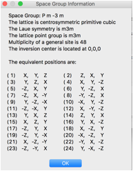

 The symmetry and cell need to be edited on the new phase's General
tab. **Click on the Space Group Button** (which defaults to P1) and
**enter P m -3 m** (note use of spaces to separate symmetry axes --
though in this case since this is a standard setting, omitting the
spaces works too. The space group symmetry information to the right is
displayed, **click OK**. 

**Change the lattice constant** (*a*) from
1.0 to **4.15689** A. (The certified value for SRM
660b)

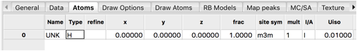

Finally add atoms to the phase by **clicking on the Atoms** **tab**.
Use the **Edit Atoms/Append atom** menu item to insert an atom. A new
atom is included in the table.

**Double-Click** on the **Type** value (H)
and which opens a periodic table window. Click on the **arrow next to
La** to bring up a menu of the defined
valences. **Select La** (neutral atoms are usually to be
preferred) from that pull-down and the period table window closes. This
atom is located at position 0,0,0 so no further editing is needed.

For completeness, add the second atom by using the **Edit Atoms/Append
atom** menu 
item again to insert an atom. For the second atom, change the
type to boron by **Double-Clicking** on the **Type** value (H) and
selecting B (the only choice) from the pull-down. The coordinates for
this atom are 0.1975,0.5,0.5 so the x, y and z values must be
edited.

Note that the site multiplicities indicate that the stoichiometry is
La$_1$ B$_6$, as is expected.

### Link Histogram and Phase

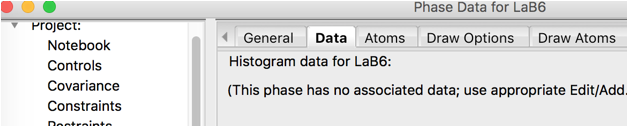

**Click** on the **Data tab** for the
phase. Note that there are no associated
histograms.

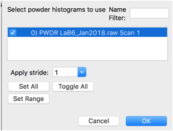

Use the **Edit Phase/Add Powder Histogram** menu command. **Select**
the one histogram and **press OK**.

Nothing needs to be changed of the new parameters added
here.

### Refine Histogram Parameters

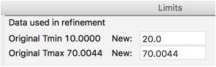

We will first change a few histogram parameters. For data tree item
**Limits change Tmin to 20** degrees, as was done before. 

For data tree item **Background change** the Number of
**coeff**. **to** **6**, as was done before as well. 
Note that the refinement flag is on by default. 

We will *not
refine* any of the Instrument parameters, but we will refine
the **histogram scale factor** (only) on the **Sample
Parameters**. This is also on by default, so it is not necessary to
select the Sample Parameters data tree item, but if it is selected it
will appear as to the right. 

Use the **Calculate/Refine** menu item to start refinement.The program will prompt requesting a name for
the newly-created .gpx file.

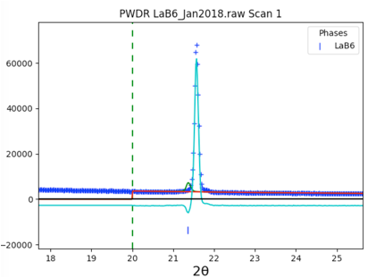

The fit is not very good, as seen in closeup to right. **Clicking** on
the histogram's (**PWDR**) 
data tree item and zooming in shows that the reflection ticks are not well
aligned with the peaks. This is due to sample displacement.

### Refine an additional Histogram Parameter

The position of the sample relative to the scattering circle is never
well determined in a Bragg-Brentano instrument, so the sample
displacement should always be varied. Click on **Sample Parameters**
and turn on refinement of **Sample displacement**.

Use the **Calculate/Refine** menu item to start another
refinement. Significant improvement is seen and even more 
if **Calculate/Refine** is used a second time.

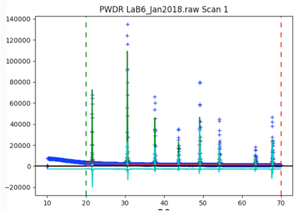

### Turn on Le Bail fitting

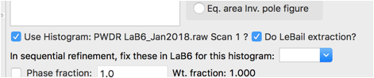

Part of the problem in the fit is that the intensities are not well fit
by the crystallographic model. Rather than fitting the few free structural parameters (x
for B and Uiso values), we will treat the intensities as
arbitrary, using Le Bail fitting. This is done by clicking on the
**Phase tree item** and the **Data tab** and **setting** the
**do LeBail** extraction flag.

Use the **Calculate/Refine** menu item to start another refinement. A warning message that "Steepest Descents
dominates" is shown because a high degree of parameter correlation
occurs as the reflection intensities change. The fit does not improve
very much if **Calculate/Refine** is used a second time, but the warning
goes away. 

### Fit Lattice

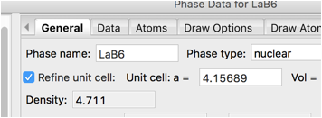

While this should not be needed for a standard, it is clear by looking
at the plots that peaks are still not quite lined up. In a less dense
sample it might be reasonable to refine the sample transparency, but
for highly absorbing LaB$_6$, that is not a reasonable parameter. A
better fit requires refining the lattice. On the
**Phase/General** tab press the **Refine unit cell**
control.

Use the **Calculate/Refine** menu item to start another refinement and
the positioning of the peaks improves significantly.

### Fit MicroStrain

The remaining major problem is that we have not treated the sample
broadening and LaB$_6$ does have some microstrain. That can be
refined with the **Phase/Data** tab with the
microstrain control.

Use the **Calculate/Refine** menu item to start another refinement. A
second refinement cycle brings the Rw to circa 5.8%, with the fit
improving dramatically.

### Additional Parameters

For these data, it appears the ratio of K$\alpha_1$ and K$\alpha_2$ is not
exactly the theoretical value of 0.5. This can happen due to
a slight misalignment in the monochromator setting. Allowing this to
shift slightly by including this in the fit brings the Rw to circa 4.9%.

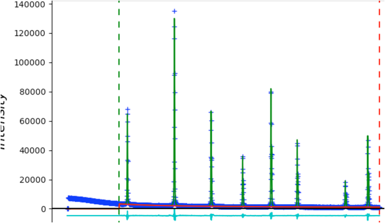

The fit is quite good without fitting the instrumental profile terms:

### Profile Term Quality Check

The quality of the profile parameters we previously fit can be
demonstrated by turning off refinement of the microstrain
term and refining the U, V, W and X & Y terms. This produces a small
improvement in the fit (expected as 1 fitting parameter as been
replaced by 5), but the actual changes are very small, as noted by the
Instrument Parameter terms plot:

## Fitting data over a wider range

In this section we fit a pattern with a wider range of data. This
proceeds quite simply. 

### Start new project and read in data

Restart GSAS-II or use the File/New Project to create a new empty project.

Use **Import/Powder Data/from GSAS powder data file** to read
file
`NIST660CBI.gsas` from the Tutorials
CWInstDemo/data directory (download from
<https://advancedphotonsource.github.io/GSAS-II-tutorials/CWInstDemo/data/>).
After selecting this file, answer yes to "Is this the file you
want?". As before, use Cancel to select the default
CuKa lab data instrument parameters.

### Change Data Range

Since the background for these data is quite curved at lower angles, reducing the
angular range to be fit will require fewer background terms. Select
Limits in the data tree and then set Tmin to 20.
Then select Background in the tree and change
the number of background parameters to 8. 

### Add Peaks

Select **Peak List** from the data tree to allow adding peaks. Zooming in on the
lower portion of the pattern makes it easier to see all the peaks. Be
sure to click on magnification icon a second time to turn off zoom mode.
Then click on a point for each of the 20 peaks in the pattern. You
should have a plot that looks like this: 

### Fit Peaks

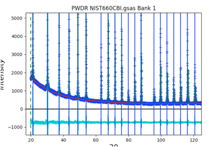

As the peaks are initially added to the table, the refine flag is set
for the peak intensity. Fit the individual peak intensities by using
the **Peak Fitting/Peakfit** menu command. Provide a file name and
the Rwp drops to ~40% with a reasonable background level,
but as before, poor initial (unrefined) peak shapes. 

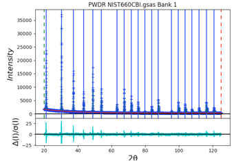

Select the Instrument Parameter tree item, select the refinement flags
for U, V, W and SH/L, then select the **Peak List** tree entry again
and use the **Peak Fitting/Peakfit** menu command. The fit
improves a bit, but since the peak positions have not been refined, a
good fit is not expected. Click on the refine column heading (to
the immediate right of the peak positions), then select "Y" and "vary
all" and again use the Peak Fitting/Peakfit menu command. Add
refinement of the gamma values by clicking on that column heading. 
The fit improves significantly with an Rwp value of ~8%. The
fit shows very small difference plot. However, pressing the "w" key in
the plot window changes the plot appearance to that on the right where
it can be seen that the fit at low angle is significantly worse than
at high angle. This suggests that low-angle asymmetry correction is not
being fit well and is stuck in a locak minimum.

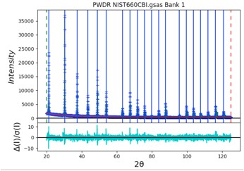

 To improve this, we can force the SH/L value to be larger. Instead of
the local minimum that was found with SH/L of ~0.003, we can select the
**Instrument Parameter** tree item and set SH/L to a larger value, say 0.03.
Then select the **Peak List** tree entry again and use the **Peak
Fitting/Peakfit** menu command. The Rwp improves somewhat, to
circa 5%, but now the difference plot is greatly improved at low angle
with SH/L increasing to 0.063. 

### Save Instrument Parameters

Select the **Instrument Parameter** tree entry and then use the
**Operations/Save Profile...** menu command to write a file. 
Note that in this case, the X & Y values were never refined, so they
do not need to be reset manually before the file is saved. Again, 
the file produced here can be
used to determine the instrumental profile terms for future
refinements and these terms do not need to be refined . The plot shown
when the **Instrument Parameter** tree entry is selected 
compares the mostly meaningless default starting profile
terms (as solid lines) to the fit results (as dashed lines and plus
signs for individual peaks). Using
**Operations/Load Profile...** will set the initial (default)
instrumental values to the current refined parameters, which makes for
a simpler plot as the dashed and solid-line curves are now
superimposed. 
