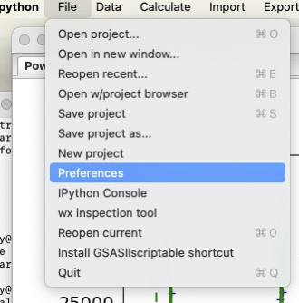
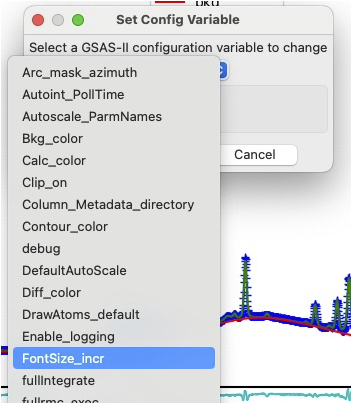
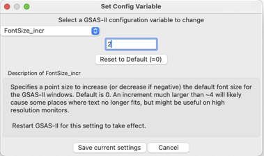
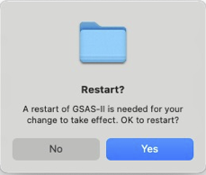
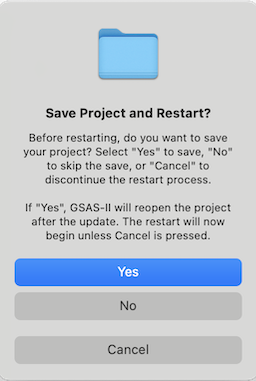
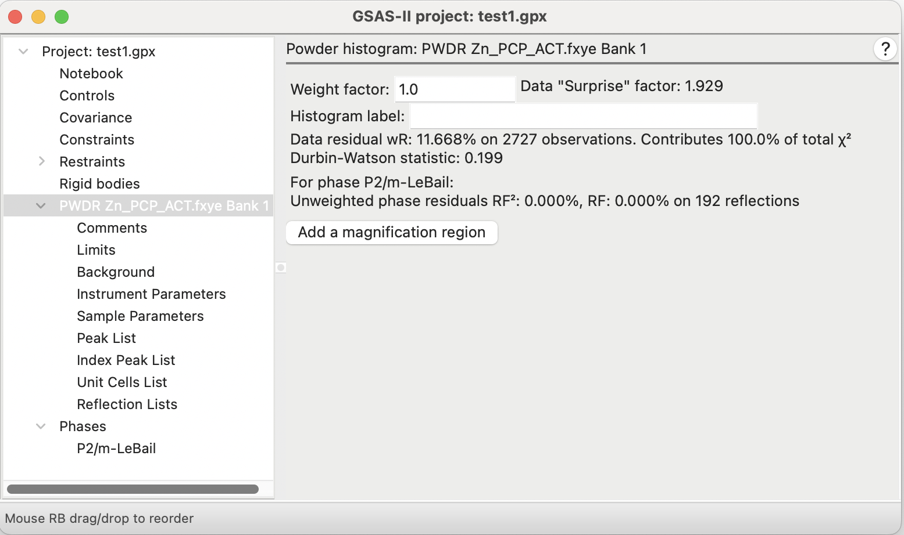
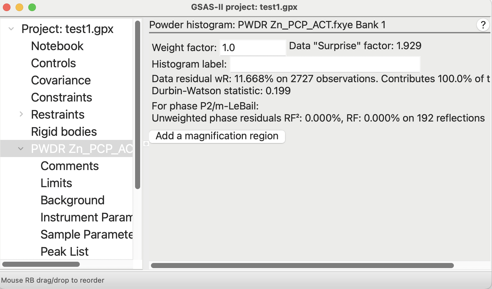

<!--- Don't change the HTML version of this file; edit the .md version -->

[//1]: <> (Comment: This is an attempt to create a Tutorial in Markdown.)

## Intro

GSAS-II has customizable settings which are called preference
settings. These are found in a menu command, as described below and
are saved with other GSAS-II settings. As of January 3,
2025 (in version #5802) a new feature was added that allows the
GSAS-II font size to be changed via these settings. The font size will
also be determined by settings on the local computer, so this size is
relative to the the local OS settings. 
Not all parts of the GUI will be affected by this setting. Note that
some of the modal windows (these are windows used to get
input such as file names) that GSAS-II opens are created by your
operating system and thus will have font sizes determined by system
settings. Others may need changes to utilize this setting. 
If your use of GSAS-II is impared by this font setting not being
applied to a section of GSAS-II please open a
[GitHub
ticket](https://github.com/AdvancedPhotonSource/GSAS-II/issues)
and provide an example of what could be improved.

The font size setting is applied when GSAS-II is started, so changing it requires 
restarting GSAS-II before the effect of this setting is seen. 

## Finding the preferences settings

The font setting is determined by preference variable `FontSize_incr` and this is set inside the File menu (File->Preferences). On MacOS, preference settings are also found in the usual App menu (labeled GSAS-II or python, depending on how the GSAS-II GUI is started), as shown here.

## Change the font preference value

When the Preferences menu is selected a window is opened where any of 
the preference variables can be selected. Select from the pull-down
list the variable `FontSize_incr` as shown here.

 This will open a window where the value can be set for the font
 size. Note that a value of 0 (the default) provides the
 system-default size for the font. A positive value provides a larger
 font and a negative value provides a smaller font. Only integer
 values can be used. 

As noted before, the value set for  `FontSize_incr` is applied only
when the GSAS-II application is started, so when the "Save current
settings" button is pressed, a window is displayed asking if GSAS-II
should be restarted so that the change can take effect. It is fine to
choose "No" here; the change will take effect the next time that
GSAS-II is started. If "Yes" is selected, you will get the chance to
save the current GSAS-II project. 

When "Yes" is above, the window here is shown to ask if you want to
save any changes made to the current GSAS-II project file. 

- If "Cancel" is chosen, GSAS-II will not restart (but the change to the font size
   will be saved). 
- If "No" is selected, GSAS-II will end; any changes made since the
   file was last saved will be lost. GSAS-II will then restart without
   reading a .gpx file. 
- If "Yes" is selected the current .gpx file will be overwritten with
  the current project contents (if the project has never been saved,
  you will be asked for a location and name for the .gpx file. GSAS-II
  will then restart with the saved version of the project loaded. 

## Example with the changed font size

Below are two examples of GSAS-II with two different font size
settings.

|  `FontSize_incr`  | Example |
| :---: | ------------------------------------- | 
| 0 |  |
| 3 |  |

Note that not all text (for example the status message at the bottom
of the window) has the font size changed.

----
| | 
| ---: |
| Brian Toby |
| January 10, 2025 |
