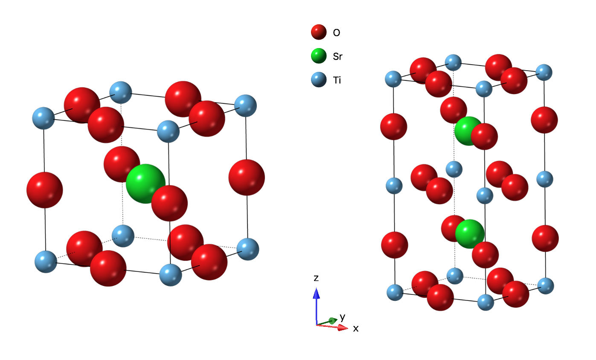
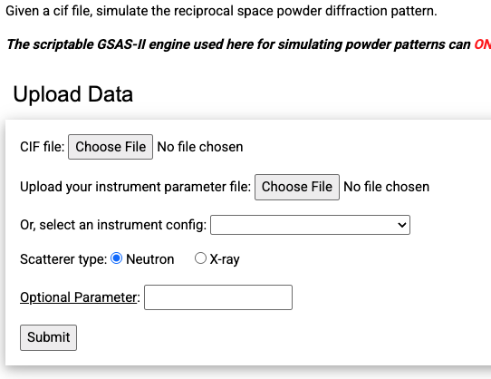
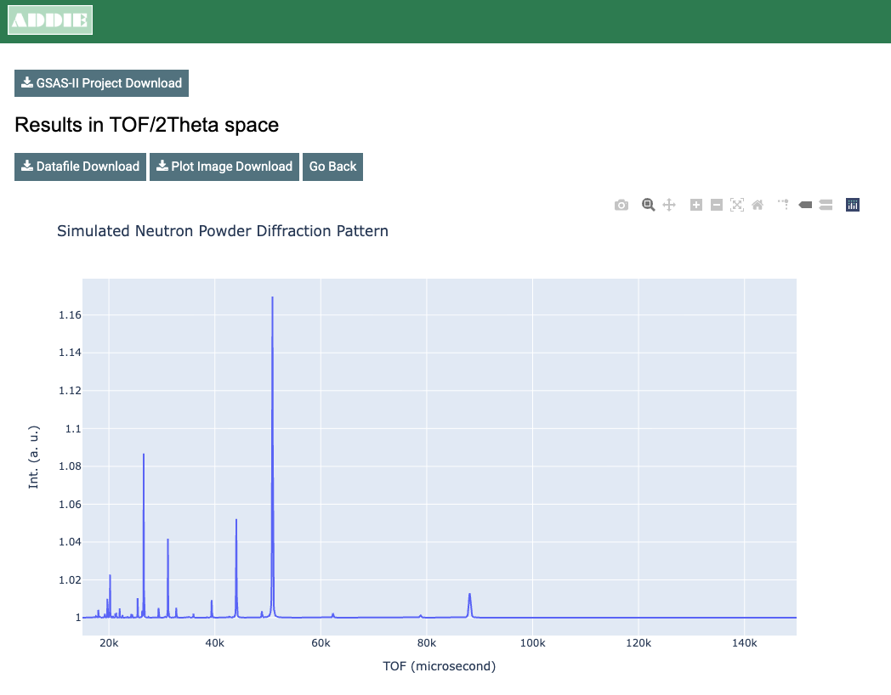
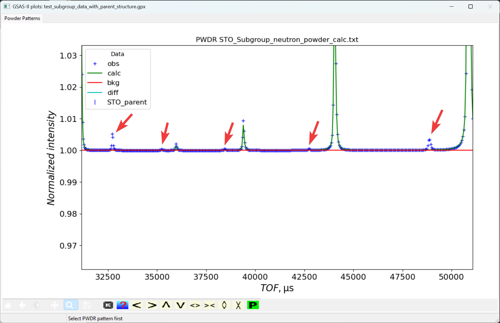
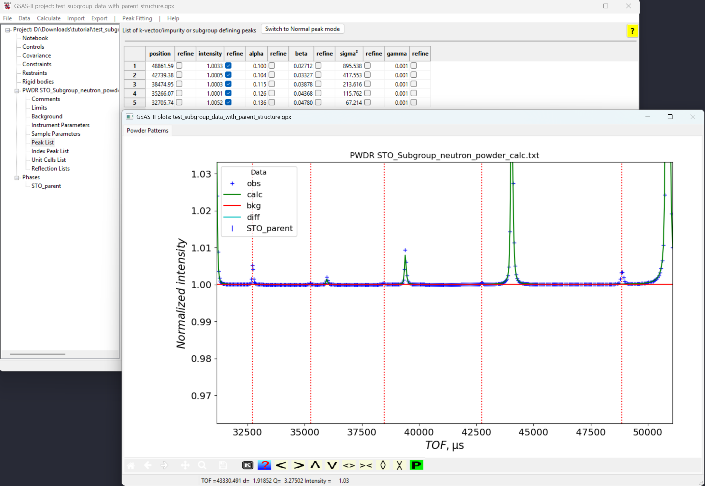
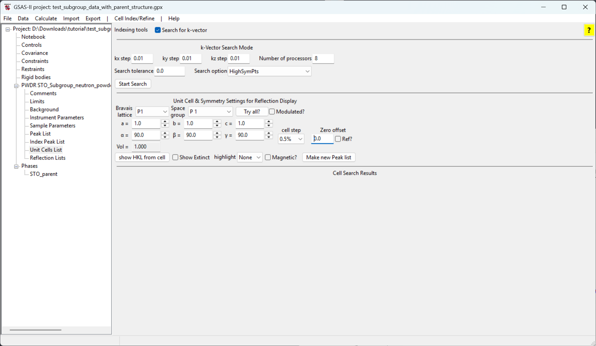
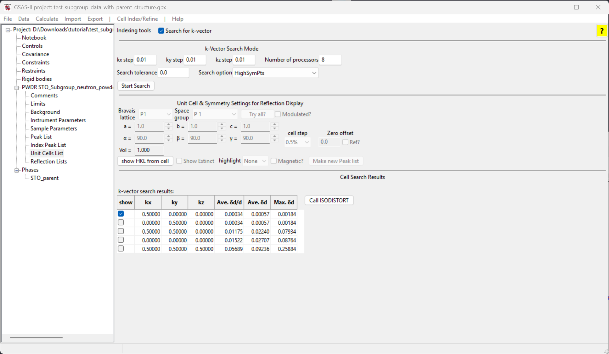

<!--- Don't change the HTML version of this file; edit the .md version -->

# Tutorial: Use of ISODISTORT with a k-vector found by GSAS-II

* Exercise files are found [here](data/index.html)

## Intro

When the symmetry of a system is lowered while going through a phase transition, it is commonly through a group-subgroup pathway. One can try to use the emerging satellite peaks in the diffraction pattern to search for a [k-vector (propogation vector)](https://conference.sns.gov/event/176/attachments/242/1921/Magnetic_Symmetry_an_overview_of_Representational_Analysis_and_Magnetic_Space_groups.pdf) that best describes the relation between the parent and child unit cells. See the two tutorials, [k-vector searching #1 (all-zero vector)](https://advancedphotonsource.github.io/GSAS-II-tutorials/k_vec_tutorial/k_vec_tutorial.html) and [k-vector searching #2 (non-zero vector)](https://advancedphotonsource.github.io/GSAS-II-tutorials/k_vec_tutorial_non_zero/k_vec_tutorial_non_zero.html), for more on k-vector searching in GSAS-II.
Once we have obtained one or more trial k-vectors, we can move forward providing a selected k-vector candidate within the ISODISTORT web server to search for all the isotropic subgroups that are compatible with the k-vector. This locates all the irreducible representations (IRs) compatible with the k-vector and the order parameters associated with each IR. An exhaustive set of refinements can then be performed for each candidate subgroup against the experimental diffraction data to determine the optimal symmetry for the low symmetry phase. In this tutorial, we will demonstrate how to use the implementation in GSAS-II to do this. To perform the steps to be presented here, we will need a GSAS-II project (.gpx) file for the parent chemical ("nuclear") structure and will then generate new project file(s) for each candiate subgroup structure.

To demonstrate this for this tutorial, we will generate simulated data for the SrTiO${}_3$ (STO) structure in space group $P 4/mmm$ and will select an arbitrarily generated subgroup with a k-vector of (0, 1/2, 0). We will simulate the powder diffraction data for both, with a typical instrument parameter file from the POWGEN diffractometer at SNS, ORNL. We will then use the simulated data to "reverse engineer" this simulation, meaning we can fit the simulated data first to discover the k-vector that allows generation of the additional superlattice peaks that are not fit by the parent structure. With that k-vector and the parent structure, we will use GSAS-II and ISODISTORT to construct GSAS-II project files for each of the subgroup candidates. The exhaustive refinement for all the generated project files will not be performed, here. It is under consideration that in the future, a capability may be added to GSAS-II to systematically fit all the generated subgroup project files. 

Below is shown the two structures used in this tutorial -- (left) the parent STO structure and (right) the arbitrarily generated subgroup structure.

## Data Simulation

The data simulation from a CIF file could be performed directly within GSAS-II, but for this tutorial we wish to showcase a convenient web-based tool for such a purpose, that uses GSAS-II as a backend calculation engine. (This requires an internet connection.) First, from [this tutorial's exercise files](data/index.html) download the two needed structure files, `STO_Parent.cif` and `STO_Subgroup.cif`, together with the instrument parameter file we will be using for the simulation `powgen_profile_lwf.instprm`. Then go to the website, [https://addie.ornl.gov/simulatingpowder](https://addie.ornl.gov/simulatingpowder) (or, go to [https://addie.ornl.gov](https://addie.ornl.gov), then click on `Scattering Tools` and on the next page `SimulatePowder`). The web interface looks like the figure to the right.

There we can upload the CIF file and the instrument parameter file to use for the simulation and click on the `Submit` button. Supply structure `STO_Subgroup.cif`  and  the instrument parameter file we will be using for the simulation `powgen_profile_lwf.instprm`. The result will be like the figure to the right. The simulation is also displayed in $d$ and $Q$ space units, but we do not need them here. 

We can download the simulated powder diffraction data by clicking on the `Datafile Download` button on top of the time-of-flight (TOF) result presented at the very top.
The downloaded data file will be named based on the CIF files name and thus will be `STO_Subgroup_neutron_powder_calc.txt`. 

Press the `Go Back` button and repeat the process, uploading the structure file `STO_Parent.cif` and the same instrument parameter file (`powgen_profile_lwf.instprm`). Download that pattern which will be named `STO_Parent_neutron_powder_calc.txt`.

Note that this web page could be used without supplying an instrument parameter file. The alternative is to use the dropdown selection menu, where one can select one of the predefined ORNL instruments such as NOMAD and POWGEN at the SNS, and HB-2A (Powder) and HB-2C (WAND$^2$) at HFIR. Other options include selecting the probe type to simulate with x-rays or to modify the computation with optional parameters (follow the link there to see what options are offered). 

Another useful option of this web interface allows plotting the two simulated powder diffraction patterns, `STO_Parent_neutron_powder_calc.txt` and `STO_Subgroup_neutron_powder_calc.txt`, for the parent and subgroup phase, respectively. (Optional) To make a quick comparison between the two datasets, we can go to [https://addie.ornl.gov/plotter](https://addie.ornl.gov/plotter), select the `Multiple Files Mode` and upload the two data files for a quick comparison plot. Here to the right is presented a demo for the tool.

## Refinement of the Parent Phase against the Subgroup Data

Since we are dealing with simulated data here, we are not going to refine the parent phase data against the simulated parent phase data since that will produce the trivial result of reproducing the initial structure, but in a real experiment one would do this to obtain an optimal model for the parent structure. To start, we load in the simulated data using the subgroup and refine against it with the parent phase, as if we were not aware of the subgroup structure. 

First, launch the GSAS-II GUI, and then proceed to the menu item `Import` => `Powder Data` => `from Topas xyz/qye or 2th Fit2D chi/qchi file`, followed by browsing files and selecting the simulated data from previous step, namely file `STO_Subgroup_neutron_powder_calc.txt`. If `ADDIE` interface was used previously for simulating the data, the downloaded simulated data file will have file extension `.txt`. So, for GSAS-II to find the file in the selection window, we have to select `any file (*.*)` from the file type dropdown selection to find the previously saved simulated data (not needed on MacOS). Once the data are selected, we want to click on `Yes` when prompted with the window to confirm the selection. Automatically, this will be followed by GSAS-II asking to select the instrument parameter file. Here, we want to select exactly the one that was used above for the data simulation, i.e., file  `powgen_profile_lwf.instprm`. By default, GSAS-II assumes `GSAS iparm file (*.prm, *.inst, *.ins)`. Therefore, here we want to select `GSAS-II iparm file (*.instprm)` from the file type dropdown selection so that we can select the instrument parameter file `powgen_profile_lwf.instprm` to use.

Next, proceed to the menu item `Import` => `Phase` => `from CIF file` and select the parent structure CIF file, `STO_Parent.cif`. Click `Yes` to confirm the selection when prompted. When asked, we want to give the phase a name -- here I am using `STO_parent`. GSAS-II will then let us select which histogram to attach the phase to -- here we only have one histogram and that is for sure the one we want to select. Just check the box in front of the histogram in the prompted window and click on `OK`. Without changing any other settings, let's just go ahead with the refinement -- go the menu `Calculate` => `Refine`. If we haven't saved the project yet, we will be asked to first save the project before proceeding and we can give the project a name like `test_subgroup_data_with_parent_structure.gpx` (we don't have to give the extension explicitly). 

The refinement progresses well. Since we are dealing with simulated data here, even though the parent structure does not fit any of the extra peaks from subgroup structure, we still obtain a very small Rwp (0.031%). However, if we zoom in the plot, we will see some peaks are not indexed by the parent structure, as shown below and to the right.

We will perform a peak fit to determine accurate positions for these extra (unindexed) peaks and from that perform the k-vector search. For more details about the k-vector search capability in GSAS-II, please refer to the
two tutorials, [k-vector searching #1 (all-zero vector)](https://advancedphotonsource.github.io/GSAS-II-tutorials/k_vec_tutorial/k_vec_tutorial.html) and [k-vector searching #2 (non-zero vector)](https://advancedphotonsource.github.io/GSAS-II-tutorials/k_vec_tutorial_non_zero/k_vec_tutorial_non_zero.html). Select the `Peak List` entry in the tree item (as one of the sub-items for the histogram tree item), and then in the menu `Peak Fitting` and enable `Add impurity/subgrp/magnetic peaks` (click on the item to see a check mark in front of the item text label); alternately, click on the button labeled "Switch to Extra Peak mode". Once this is done, peak fitting will add peaks to the computed pattern rather than replace the computed pattern, so we can fit the positions of the unindexed peaks. 

Make sure the `Powder Patterns` tab is selected (as peak fitting is only possible when that tab is selected) and then in the GSAS-II data plot window zoom in so that the unindexed peaks are more clear. Pressing the "f" key in the window also helps by displaying a thin vertical line through the indexed peaks. At this point, click on a point in the five unindexed peaks at TOF values around 48800, 42700, 38500, 35250 and 32700 microsec, as is seen to the right.

Note that If by accident we select an extra peak unintentionally, we can remove it by right clicking on the extra peak that we want to remove. Or we can left-click and drag the extra peak to the position that we want it to be. The peaks can be fit, initially the intensity variables are all set. Refine them using the "Peak fit" command in the "Peak Fitting" menu. Then add the five position flags to the fit and repeat the  the "Peak fit" command. Finally, add the sigma${}^2$ term to adjust peak widths and repeat the "Peak fit" command a final time. 

Now that we have positions for five of the unindexed peaks are accurately defined, we can proceed to the k-vector search. Go back to the GSAS-II main window, click on the `Unit Cells List` item under the histogram tree item and check the `Search for k-vector` box, as shown to the right,

Here, let's keep all the inputs as default and click on the  `Start Search` button near the bottom left of the k-vector input section. In a fraction of a second you should see five candidate k-vector results from the search. These are ranked by how closely the k-vector can reproduce the extra peak positions, with the best fit at the top, as shown to the right and below. Clicking on a show button will show the positions for reflections that would be generated by the candidate k-vector. Note that the first two entries generate all five fitted peaks, as well as many additional in other parts of the pattern. The remaining three do not generate these peaks. ***GSAS-II does not try to determine uniqueness; these frist two vectors are actually equivalent***.

Select the first candidate k-vector to be supplied to the ISODISTORT program. This had selected by default. Then click on the `Call ISODISTORT` button to use this selected k-vector within ISODISTORT for constructing an exhaustive list of subgroups that are compatible with the selected k-vector. (This requires an internet connection). Once that button is clicked, we will first be asked to note citation information on ISODISTORT before proceeding. After clicking on `OK`, GSAS-II will then contact ISODISTOT in the background, with these critical steps happening: 

- The phase in GSAS-II is uploaded to ISODISTORT

- ISODISTORT is provided the selected k-vector

- In an exhaustive manner, each combination of IRREPs and order parameters is tried, generating a complete list of the corresponding subgroups 

- For each generated subgroup, a CIF is written

- For each generated subgroup, a GSAS-II project file is created where the parent phase is replaced by the candidate subgroup

This processing will take some time, depending on the number of candidate subgroups compatible with the selected k-vector. For the test case here, the result is a total of 19 candidate subgroups. The CIFs are named `{phasename}_{number}_{HMname}.cif` and the project files are named  `{GPXname}_{phasename}_{number}_{HMname}.gpx`, where `{GPXname}` is the project name, `{phasename}` is the name of the phase, the source of `{number}` is unclear and `{HMname}` is the Hermann-Mauguin space group name, where any slashes are replaced with an underscore (_). In the list of CIFs and .gpx files, we can see a file containing the string `P4_mmm` corresponding to space group $P 4/mmm$, which is indeed our ground truth, so the proper result has been found. 

In a real analysis, we would not know which result is the best choice. It would be necessary to perform a refinement with each of the GSAS-II project files created here, and from that determine the highest symmetry subgroup that gives a good fit to the data. We hope in the future to develop a script to do that automatically. 

## Authors

| | 
| ---: |
| Yuanpeng Zhang |
| October 14, 2025 |
