<!--- Don't change the HTML version of this file; edit the .md version -->

***This tutorial was built from the presentation by [Keith Taddei](https://www.anl.gov/profile/keith-taddei) at the [MagStr Workshop](https://conference.sns.gov/event/434/) for magnetic structure solution. The data associated with the tutorial has been published in*** 
[K. Taddei, *et al.*  Phys. Rev. Mater., 3, 014405 (2019)](https://doi.org/10.1103/PhysRevMaterials.3.014405)

## Intro

In this tutorial, I will be using the neutron diffraction data of Er${}_2$Ge${}_2$O${}_7$ possessing a pyrogermanate lattice to
demonstrate the k-vector search functionality in GSAS-II. The paramagnetic phase possesses a nuclear structure with the
space group of P$4_1 2_1 2$, as shown in the picture below.

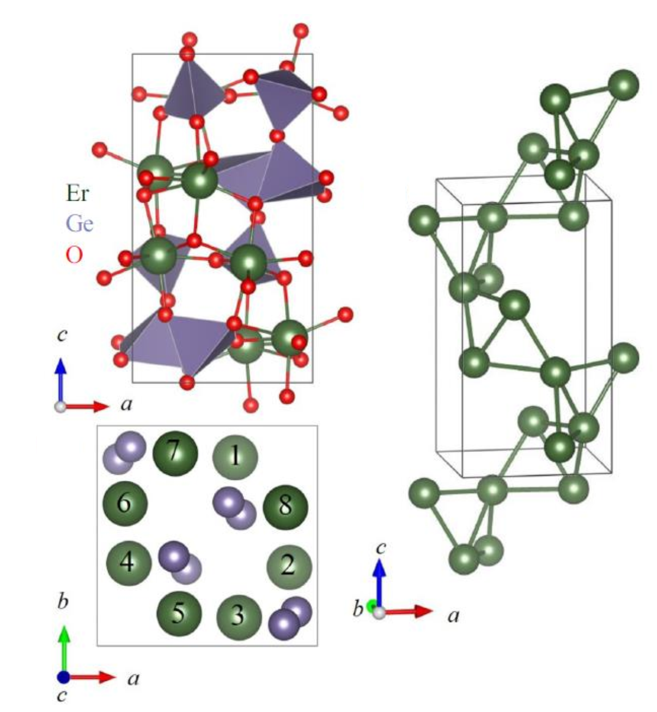

The magnetic transition happens around 1.2 K, as shown by the sequence of diffraction patterns and the measured order parameter, seen below.

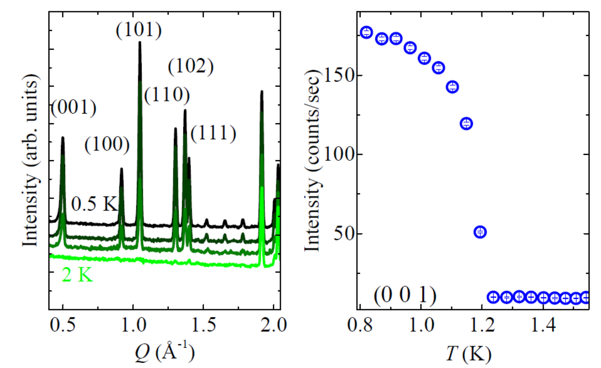

Here I will be using the neutron diffraction patterns measured at two temperature points for the demo -- one above
(at 2 K) the transition temperature and one below (at 0.5 K). I will start with the 2 K data to refine the nuclear structure,
which will be used as the starting point for the 0.5 K data. This tutorial will not fit the magnetic structure, as the goal of this tutorial is to demonstrate a k-vector search with the 0.5 K data.

## Read Paramagnetic data

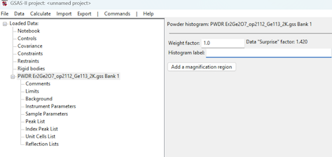

* Let's first launch GSAS-II and read in the 2 K diffraction data into a new project 
 using menu command 
`Import/Powder Data/from GSAS powder data file`. Then, we use the file
browser to select the neutron Bragg diffraction data included in the tutorial files, with the file name of
`Er2Ge2O7_op2112_Ge113_2K.gss`. When asked "`Is this the file you want?`", we just click on the `Yes` button to
load in the data. 
* A subsequent file browser will open for us to select the instrument parameter file, and to
load in the included file, we need to change the file type to `.instprm` so that we can select the included
instrument parameter file `HB2A_ge113_op2112_Si_cycle866.instprm`. 
The main GSAS-II window should now look like the figure to the right.

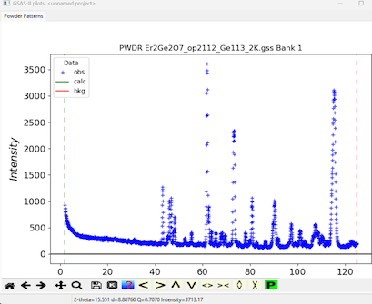

The GSAS-II graphics window should now look like the figure to the right.

## Read Magnetic dataset

Next, we need to exclude certain regions in the data -- they either come from the direct beam contamination (the very
low angle part), or specifically in this example data, the diffraction peaks corresponding to the aluminum container
used for holding the sample. For the direct beam contamination part, we can load in the 0.5 K data and overlay the data
from the two temperature points for a direct comparison. The goal is to exclude the low angle
contaminated part without influencing the regions a real signal might be seen. 

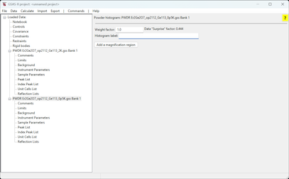
 
In the 0.5 K data, we expect 
some extra peaks in the low angle part corresponding to the magnetic structure and we want to set the upper limit for
the low angle signal exclusion to the lower bound where we stop seeing magnetic signal in the 0.5 K data. To do this,
let's import the 0.5 K data into current project. 

* Use `Import/Powder Data/from GSAS powder data file` again but this time 
select the `Er2Ge2O7_op2112_Ge113_0p5K.gss` data file which has the 0.5 K data. As usual, we need to confirm the selected data file followed by
selecting the instrument parameter file as above. The GSAS-II item tree should look like the window to the right.

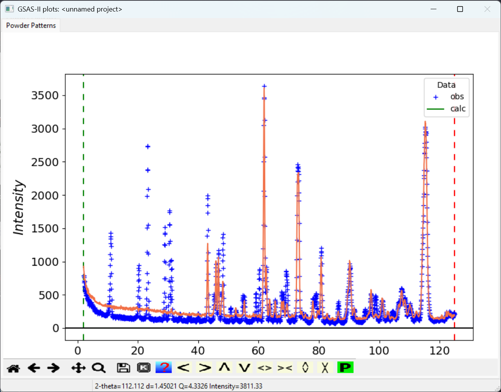
 
* We then move the mouse onto the GSAS-II plotting window and press 'm' key on the keyboard to go to the `multidata` plot mode.
(Alternately, we can see the full list of keyboard commands in the plot window by clicking on the
 icon in the plot window. Select an entry in that menu and click on OK) 

The two patterns
will then be presented in a single plot for comparison, as seen to the right. 

## Exclude Unneeded & Spurious Data

In the plot window, we can click on the magnify glass to go to the zoom mode and zoom in the low angle region. We can
see that the magnetic peaks in the 0.5 K data start to appear around 10° 2𝛳. So, for the low-angle region exclusion, 8°
can be used as the upper limit safely. 

* Click on the `Limits` entry for the first (2 K) histogram in the data tree. Note that the lower limit for the data (Tmin) is listed at the first data point at 2.025° 2𝛳. To change this so that we do not need to fit the lowest angle data with a widely changing background change the lower limit by putting in `8` into the `Tmin` input box. Note that the green dashed line moves to 8° 2𝛳 when the mouse is moved out of the box or Enter is pressed.

* At this stage, we no longer need the 0.5 K data and we can delete the
corresponding histogram in GSAS-II. To do this, we do `Data/Delete data entries` and in the pop-up `Delete data`
window, we check the box corresponding to the 0.5 K data and click on `OK` to remove the data from the tree. 

Next, we need to worry about the
exclusion of the aluminum peaks from the container used to hold the sample. 
We will create an excluded region around each of the three Al peaks. This is done using `Edit Limits/Add excluded region` from the
menu and then in the plot window click on a data point near the aluminum peak.
The first Al peak is around
60° 2𝛳. To see this more clearly, and we can zoom in to the relevant region, but note we 
need to deactivate zoom before we can click on a data point. 

* Click on the magnifying glass to zoom in around 60-65° 2𝛳. 
* Then 
click on the magnifying glass again, to deactivate zoom mode.
* Then click on menu item `Edit Limits/Add excluded region`. 
Then we go to the plot window and click on a data point near the aluminum peak.
The two windows should appear as below. 

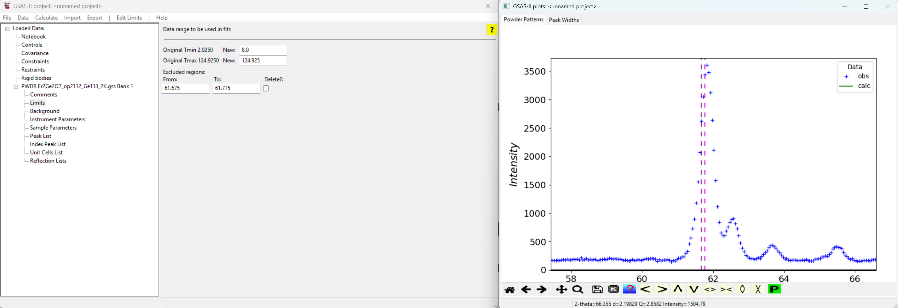

Note that the excluded region (between the two magenta lines) is too small. We can either use the mouse to drag the dashed lines in the plot window to adjust the region to
exclude or edit the excluded region lower and upper limits in the GSAS-II main window.

* Edit the lower and upper limits for the excluded region to `60.8` and `62.35`, respectively. 

Repeating this for the other two Al peaks:

* Create an excluded region using the procedure to exclude the region `72.0-74.0`. 

* Repeat this again to exclude the Al peak in region `113.0-117.0`.

It is also possible to fit the Al peaks as a second phase, but these peaks are usually from a highly textured material and a LeBail or Pawley intensity extraction would be needed for a good intensity match. Here we will just use exclusion of data. 

## Load structural information & inital refinement 

Next, we need to load in the initial structure configuration file.

* Use menu command `Import/Phase/from CIF file`. Then select the included `ErGeO_distbase.cif` file. Click on `Yes` when asked
`Is this the file you want?`, followed by typing in the name of the phase -- in my case, I used `Er2Ge2O7` but
we can use any name that makes sense. We will be asked which histogram that the imported structure will be associated with. In our case, we only have one histogram so just select the 2 K data set and click on the `OK` button.

Now we are ready to begin parameter optimization, which we can start with fitting the background. 

* Go to `Background` item
under the data histogram and change the `Number of coeff.:` dropdown selection to `5`. 

* Then we can use
`Calculate/Refine` to start the initial refinement -- since we haven't saved the project yet, we will be asked to supply a name for the project.

The initial refinement will fit the five background terms and the scale factor (where the refine flag was on by default). The weighted profile R-factor (Rw, sometimes called Rwp) will be ~9 and the reduced $\chi^2$ will be ~7.5.

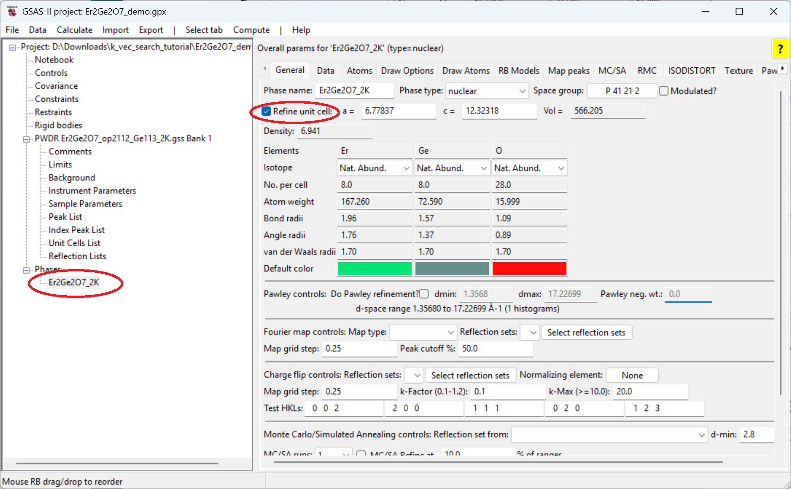

* Next, we want to release the unit cell for refinement. So, click on the phase and in the `General`
tab, check the `Refine unit cell` option and refine again. The Rw will drop to ~8.6 and the reduced $\chi^2$ will be ~6.8.

The next step would be to fit a potential offset to the data. Traditionally this was done by fitting a zero shift, should the detector bank be inaccurately aligned, but the more common problem is that the sample position is not in the exact center of the diffraction circle. 

* Select the `Sample Parameters` tree entry for the histogram and select the refinement flag for `Sample X displ. perp to beam` and then refine again. The Rw will drop to ~6.4 and the reduced $\chi^2$ will be ~3.7.

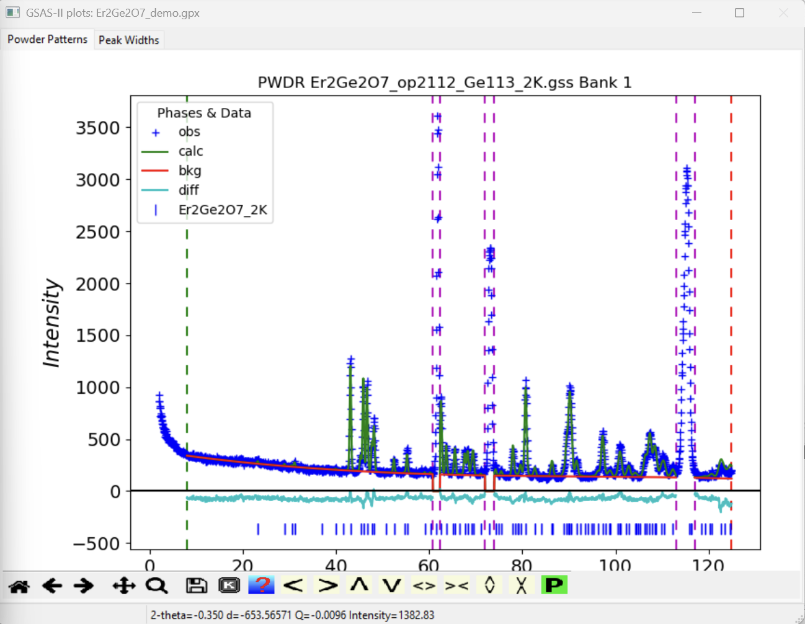

Note that these data do not extend to high enough angle to vary the second sample displacement parameter; data to perhaps 150° 2𝛳 would be needed. To vary the detector zero correction, you would use `Zero` in the`Instrument Parameters` data histogram entry but this should not be used with the sample displacement parameter. Choose one of the two and usually the `Sample X` is preferred. 

The windows should appear as to the right; at this
stage, the fitting is already a pretty good match to the experimental data.

## Fit the atomic structure

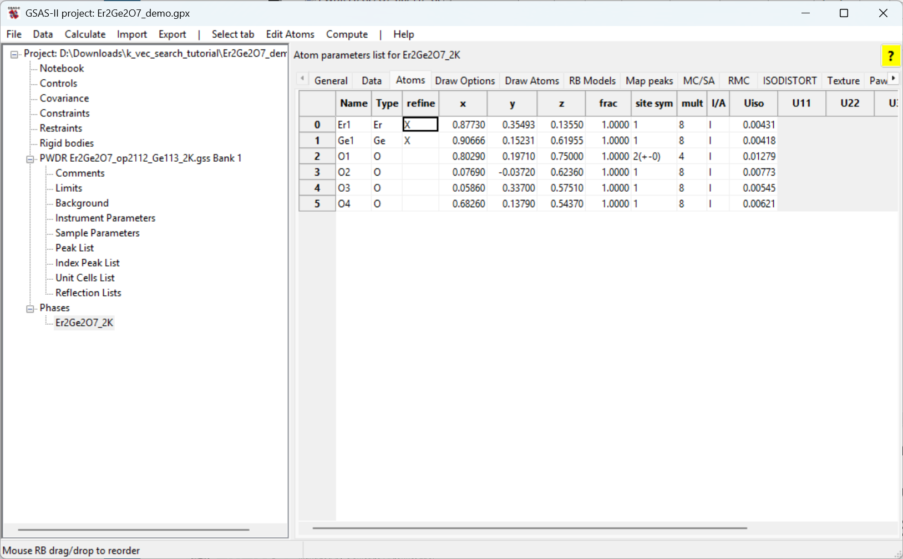

Next, we will refine the atomic positions and the suggestion would be to start with those atoms with high multiplicity
and scattering strength to keep the refinement stable. This is done by setting the `X`
in the `refine` column, indicating the atomic position will be refined.

* Go to the phase and then click on the `Atoms` tab. Then double-click on the box in the `refine` column for the Er atom. Select `X`from the menu. 

* Repeat this to set the `X` flag for the Ge atom.

Note that here we are not refining the atomic
displacement parameter, Uiso, (i.e., setting the `U` or `XU` refinement flag) as these data are at very low temperature; we do not have very high Q needed to determine the Uiso value.

* Refine again. The Rw will drop to ~6.2 and the reduced $\chi^2$ will be ~3.5.

* Set the `X` flag for the O atoms. Double click on the `refine` column heading. In the dialog that is displayed select `X` and click on OK. The `X` flag will appear for all atoms. 

* Refine again. The Rw will drop to ~5.4 and the reduced $\chi^2$ will be ~2.7.

We now have a good model for the nuclear scattering (chemical structure) for this phase. We would not expect the atom positions to change when the magnetic spins align at the lower structure. We will use this result as the starting point to fit the 0.5 K dataset. 

* Export the refined structure, use menu command `Export/Phase as/Quick CIF`.  The suggested name is `Er2Ge2O7_2K.cif`, but you can use whatever you prefer.

## Create project with 0.5 K dataset

Now, we can start a new project to work on the 0.5 K data. Note that the focus of this tutorial is on the k-vector search process and not on the magnetic structure refinement. 

* Start a new project either by restarting GSAS-II or use menu command `File/New project` and when asked `Save & Clear?`, confirm `Yes` to continue. 

* As before use menu command `Import/Powder Data/from GSAS powder data file` to import the 0.5 K data with file `Er2Ge2O7_op2112_Ge113_0p5K.gss` followed by
selecting the `HB2A_ge113_op2112_Si_cycle866.instprm` instrument parameter file. 

* Following the instructions in the [Exclude Unneeded & Spurious Data](#exclude) step,
exclude the low-angle region (set Tmin to 8) and and those aluminum peaks (exclude regions `60.8-62.35`, `72.0-74.0` and `113.0-117.0`.

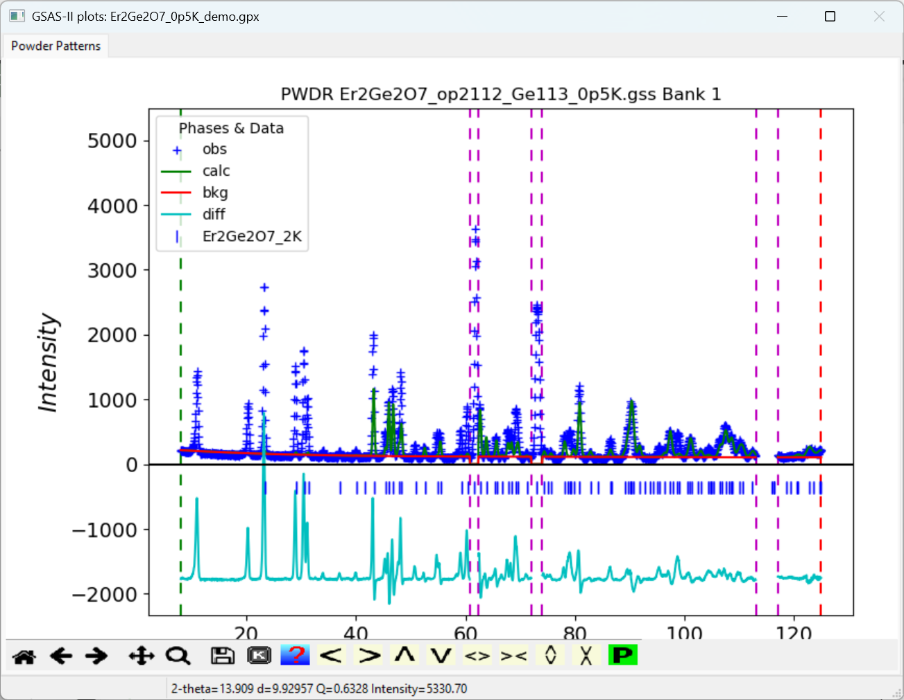

* Import the CIF file created in the previous step (with suggested name `Er2Ge2O7_2K.cif`) using the `Import/Phase/from CIF file` menu command and associate the phase and the dataset at the `Add histogram(s)` dialog.

* Changing the number of background coefficients to `5` and refine background and scale factor, as was done in the [Initial fit](initfit). 

## Find the magnetic scattering peaks

Note that this relatively poor fit (Rp=35.5) is expected since we are not generating any of the very substantial magnetic scattering intensity, but this is sufficient for the purpose of determining the k-vector for the magnetic cell. This will be done using the `Extra Peak mode` in the `Peak List` fitting, where additional intensity is added to the existing fit. 

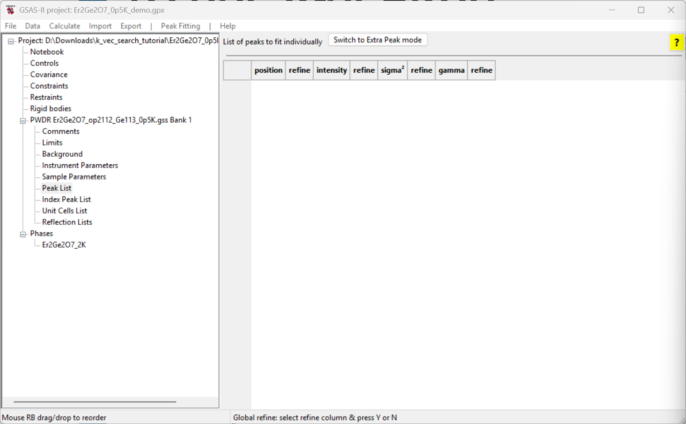

* Select the `Peak List` data tree entry for the histogram; the window will appear as to the right. 

* Select Extra Peak using the button labeled `Switch to Extra Peak mode` (the `Peak Fitting` menu's `Add impurity/subgroup/magnetic peaks` menu command does the same thing. 

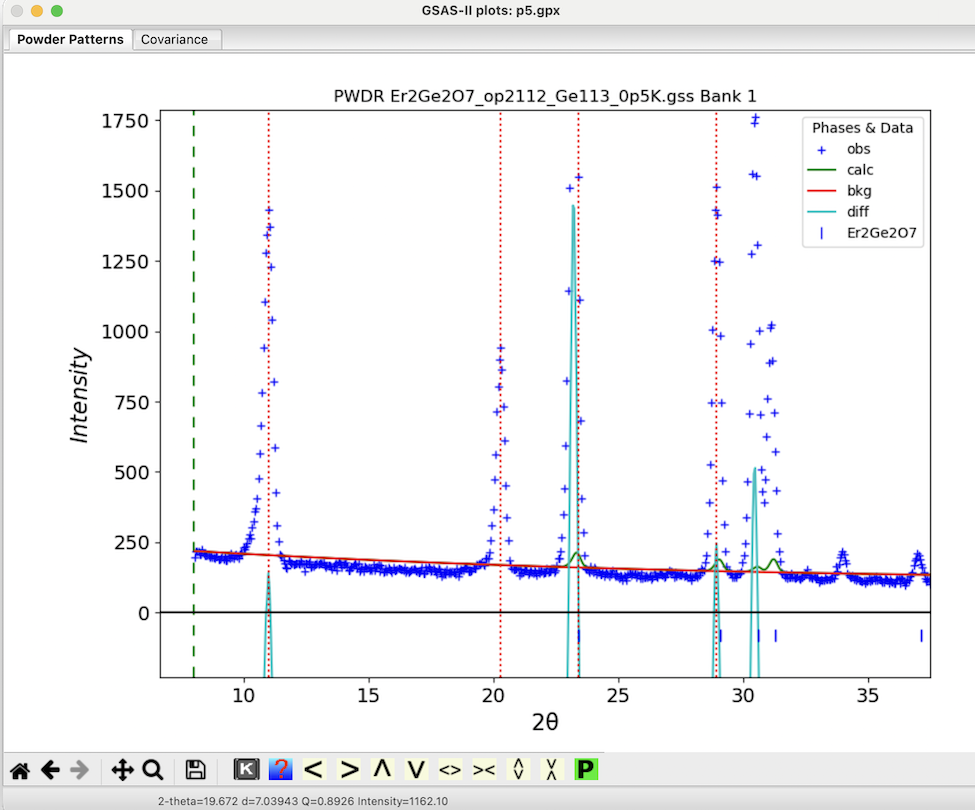

* In the plot window, we want to zoom in the low angle region (~8-35 ° 2𝛳). Remember  to deactivate the zoom mode by clicking on the magnifying glass again. 

Then we want to add peaks that have significant magnetic intensity. This is done by adding peaks to the peak list and then fitting them to find accurate positions. The fitting can account for low angle peak asymmetry or when a peak is on the shoulder of another and thus the peak maximum does represent the actual peak position. 

Next we add four peaks at the four intense low angle reflections that do not appear in the pattern collected above the transition temperature: 

* With the mouse in the graphics window, click on a point near the top of the lowest angle peak at ~11° 2𝛳. A dashed red line appears at that location and a peak appears in the peak list. (If a line does not appear, check if zoom mode is still enabled and be sure to click on or very close to one of the blue crossmarks.) Note that it is not essential to locate the line at the exact maximum for the peak as this will be optimized later. 

* Repeat this for the peak at 20.2° 2𝛳. 

* Repeat this for the peak at 23.2° 2𝛳. 

* Repeat this for the peak at 28.9° 2𝛳. 

The plot window will appear as to the right and the main window will appear as below. 

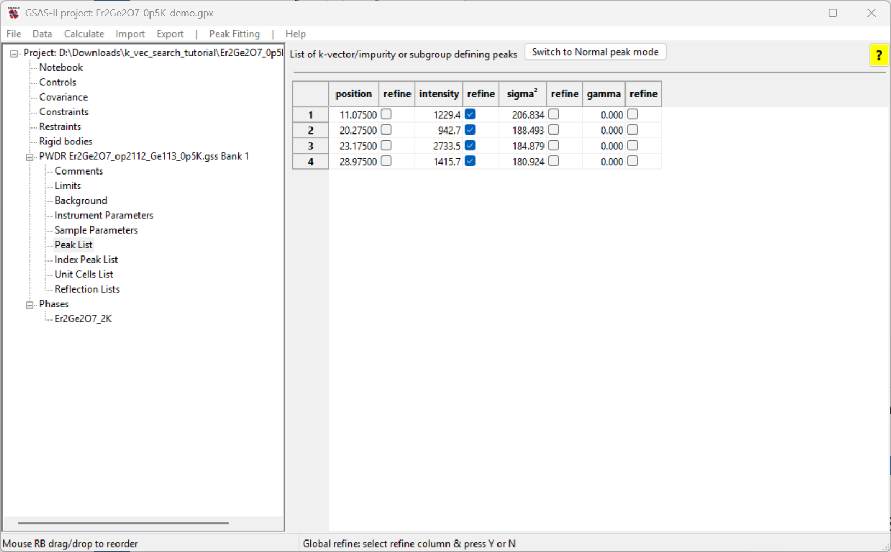

## Peak fitting

To optimize the peak positions, we first refine the intensities for all four reflections. Note that the `Refine` flag for the peaks have already been selected by default. 

* Refine the peak intensities using the `Peak Fitting/Peakfit` menu command. 

* Turn on the position refinement for all four peaks by double-clicking on the left-most `refine` column label. Select `Y` and click on `OK`. Note that now the first two refine checkboxes are now selected for all four peaks. 

* Refine the peak positions and intensities using the `Peak Fitting/Peakfit` menu command again. 

Note that the peak widths are generated from the peak width parameters in the `Instrument Paramneters` read from the Instrument Parameters file. These do a good job of fitting the peaks. Were that not true we could refine the sigma${}^2$ (Gaussian) or gamma (Lorentzian) widths.  

## k-vector search

We now use the unit cell from the Er2Ge2O7 phase and the four peak positions that have been fit to search for a magnetic unit cell using commands in the `Unit Cells List` data tree item.

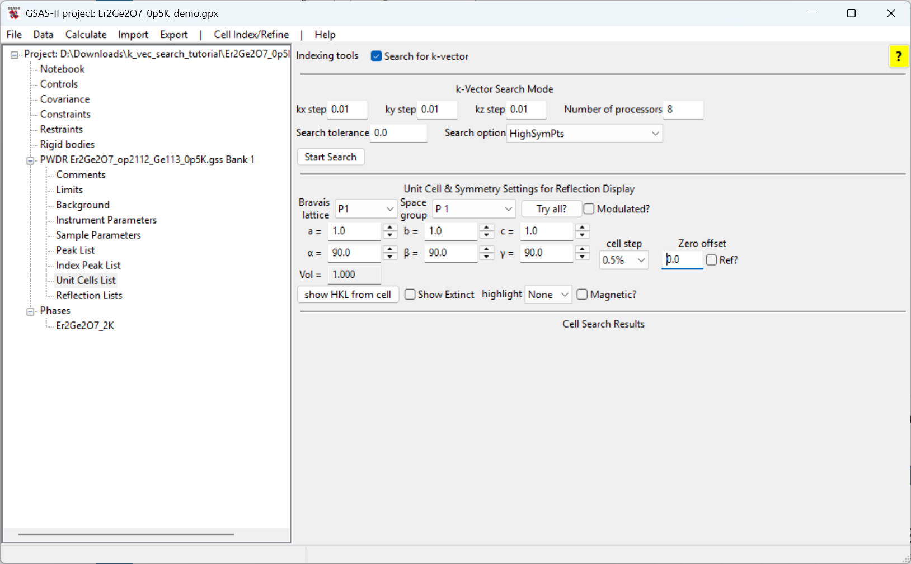

* Select the `Unit Cells List` item under the data histogram tree and click on the `Search for k-vector` checkbox. The window will appear as to the right. 

Note the options for the k-vector search that are available. By varying the search step, the tolerance and the search over high symmetry points, lines or general positions the search can be optimized. 
The tolerance option controls the threshold for determining the optimal k-vector found -- if a certain k-vector yields a
mismatch (indicated by $\delta_d/d$) smaller than the threshold, it will be regarded as the optimal k-vector and the
search will be terminated. If the tolerance is specified as `0`, this means an exhaustive search will be performed and
those top options of the k-vector will be listed. In the case of `HighSymPts` option, the search will be performed over only those high
symmetry points; such a search should be done in a short amount of time. 

* Perform a k-vector search using the default options for the search. To start the
search, click on the `Start Search` button. A new table will appear in the window with the search results, as seen below. 

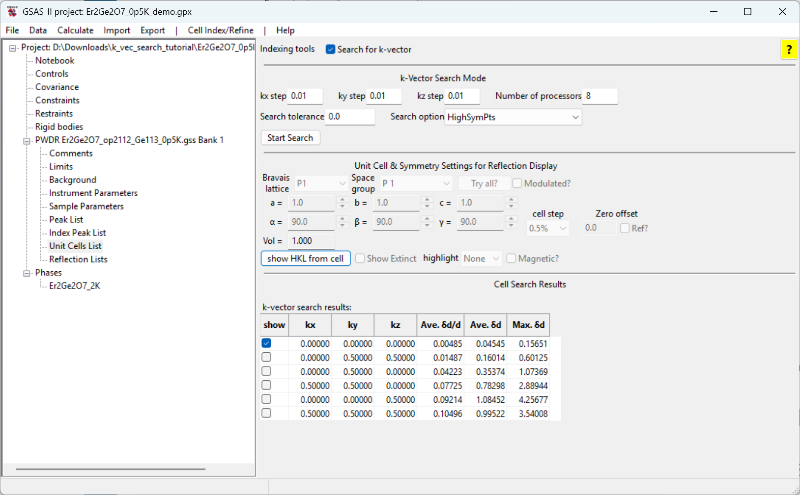

We can then examine how each of the identified k-vectors matches the observed
magnetic reflections by clicking on the `show` checkbox in the row with the k-vector. When a k-vector is selected, the reflection positions generated by that cell are shown with vertical dashed orange lines 

* Click on each `show` button. Note that only the first, with $k = (0, 0, 0)$, reproduces the observed reflections. Thus, this is the best choice to fit the magnetic structure. 

Now that the k-vector has been located that generates a unit cell for the magnetic lattice it is possible to examine the potential magnetic space groups. This can be done with the Bilbao k-SUBGROUPSMAG website. The tutorials 
[Magnetic Structure Analysis-I](https://advancedphotonsource.github.io/GSAS-II-tutorials/Magnetic-I/Magnetic%20Structures-I.htm), 
[Magnetic Structure Analysis-II](https://advancedphotonsource.github.io/GSAS-II-tutorials/Magnetic-II/Magnetic-II.htm),
[Magnetic Structure Analysis-III](https://advancedphotonsource.github.io/GSAS-II-tutorials/Magnetic-III/Magnetic-III.htm), 
[Magnetic Structure Analysis-IV](https://advancedphotonsource.github.io/GSAS-II-tutorials/Magnetic-IV/Magnetic-IV.htm),
and 
[Magnetic Structure Analysis-V](https://advancedphotonsource.github.io/GSAS-II-tutorials/Magnetic-V/Magnetic-V.htm)
show how this is interfaced into GSAS-II.

----
| | 
| ---: |
| Yuanpeng Zhang & Brian Toby |
| January 15, 2025 |
