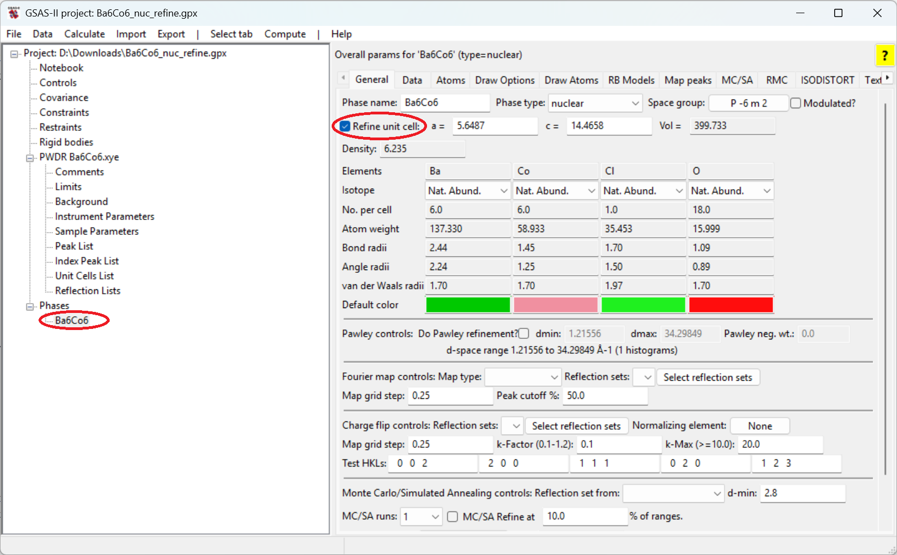
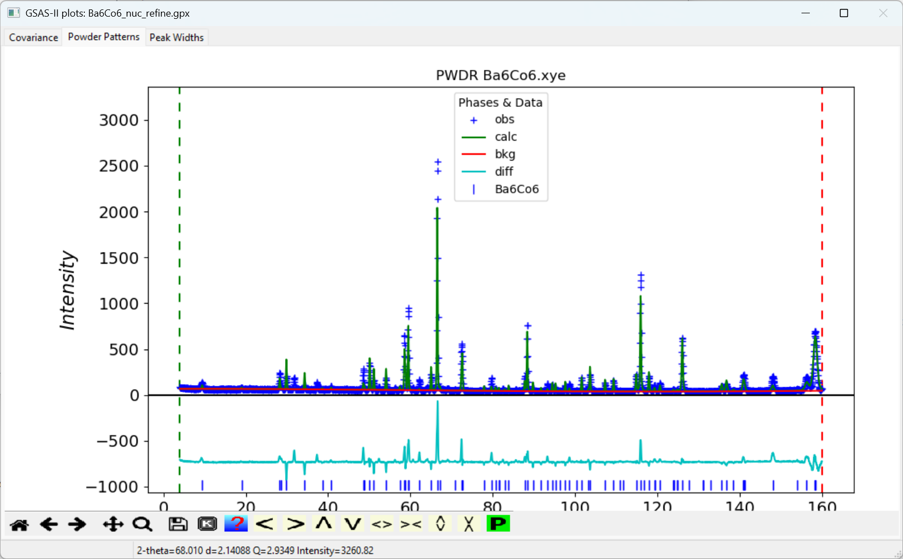
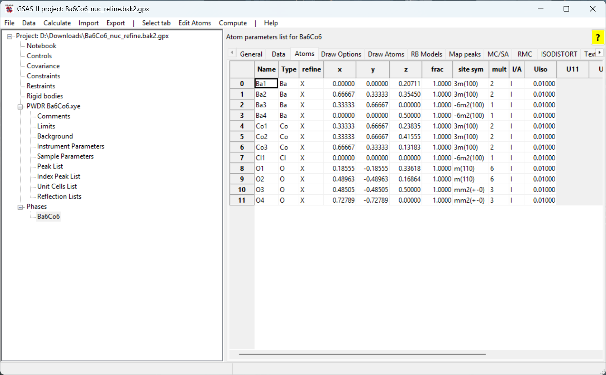
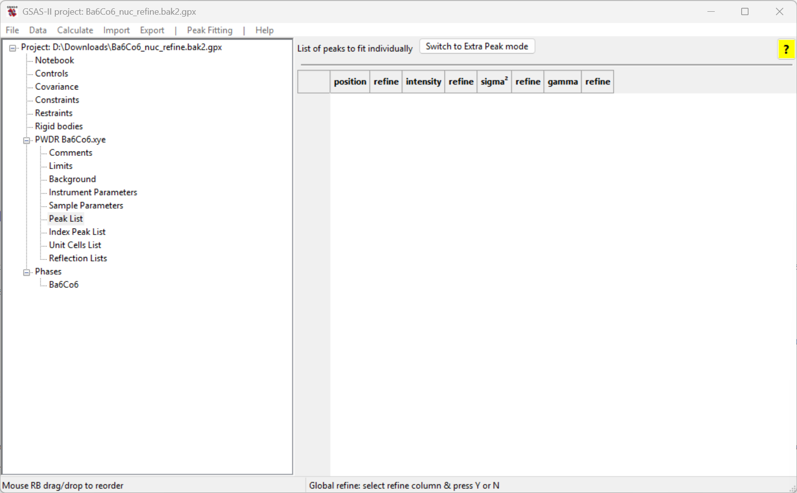
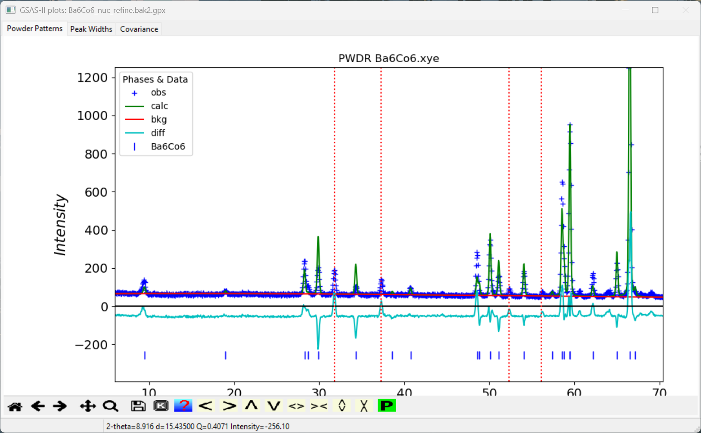
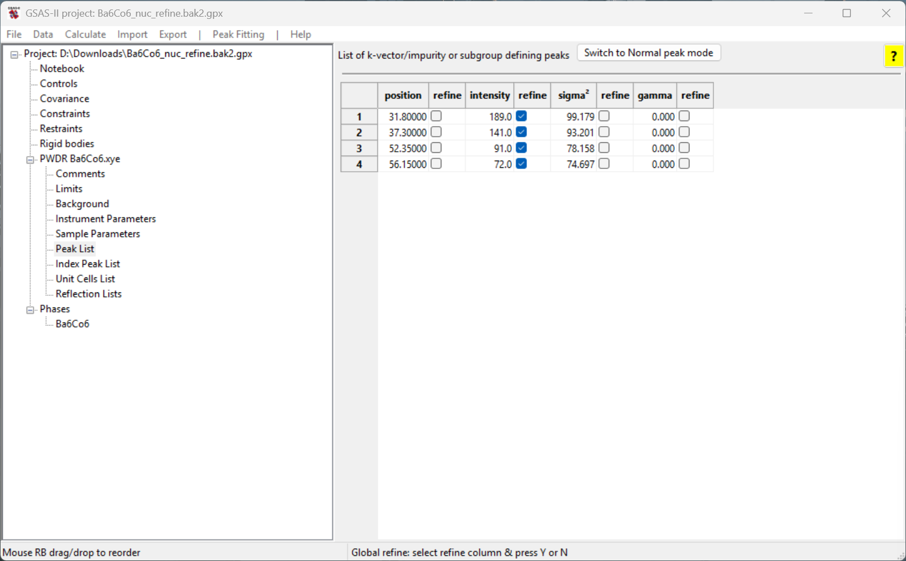
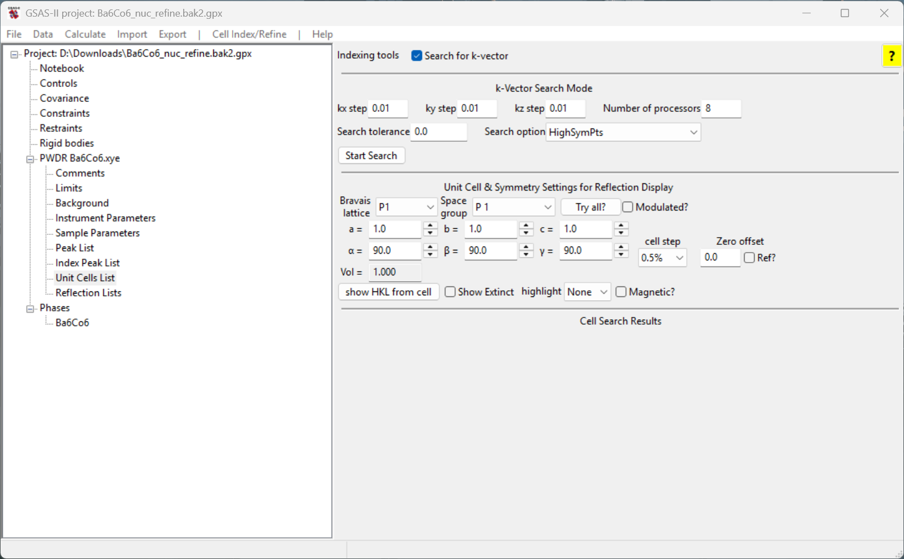
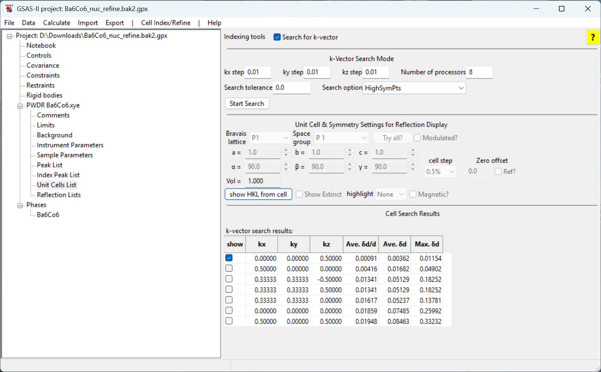

<!--- Don't change the HTML version of this file; edit the .md version -->

# Tutorial: k-vector searching in GSAS-II #2 (non-zero vector) 

* Exercise files are found [here](data/index.html)

## Intro

This tutorial was built from the GSAS-II tutorial [Magnetic Structure Analysis-III](https://advancedphotonsource.github.io/GSAS-II-tutorials/Magnetic-III/Magnetic-III.htm). For an introduction about the system under study (Ba${}_6$Co${}_6$ClO${}_15.5$), refer to that tutorial. The current tutorial will focus on the k-vector search capability in GSAS-II, going beyond the trial-and-inspecting approach followed in [Magnetic Structure Analysis-III](https://advancedphotonsource.github.io/GSAS-II-tutorials/Magnetic-III/Magnetic-III.htm). In that tutorial, we ended up using a propagation vector of (0,0,1/2).

## Read in data & phase

To avoid duplication, one can refer to the `Step-1` and `Step-2` in the [k-vector searching in GSAS-II #1](../k_vec_tutorial/k_vec_tutorial.html) for `exactly the same procedures` of loading in the experimental diffraction data and the configuration file for the nucleus structure.

## Inital refinement 

Now we are ready to begin parameter optimization, which we can start with fitting the background. 

* Go to `Background` item
under the data histogram and change the `Number of coeff.:` dropdown selection to `5`. 

* Then we can use
`Calculate/Refine` to start the initial refinement -- since we haven't saved the project yet, we will be asked to supply a name for the project.

The initial refinement will fit the five background terms and the scale factor (where the refine flag was on by default). The weighted profile R-factor (Rw, sometimes called Rwp) will be ~25 and the reduced $\chi^2$ will be ~4.9.

* Next, we want to release the unit cell for refinement. So, click on the phase and in the `General`
tab, check the `Refine unit cell` option and refine again. The Rw will drop to ~24 and the reduced $\chi^2$ will be ~4.5.

* The next step would be to fit a potential offset to the data. Select the `Sample Parameters` tree entry for the histogram and select the refinement flag for `Sample X displ. perp to beam`. Also, select the `Instrument Parameters` tree entry for the histogram and select the refinement flag for `Zero`. Then refine again. The Rw will drop to ~22 and the reduced $\chi^2$ will be ~3.8.

The plot window should appear as to the right.

## Fit the atomic structure

Next, we will refine the atomic positions. At this stage, we are not going to refine the atomic displacement parameters (i.e., the `U` or `XU` flag). We can give it a try, but what we would find is some of the refined values for the `Uiso` parameter would be negative,  which is physically non-sense. The reason is the refinemnt at this stage does not take the magnetic contribution into account and therefore if the displacement parameters are released to be refined, the magnetic instensities (which we have nothing to account for at this stage) would potentially mess up the displacement parameters.

* Go to the phase tree entry and click on the `Atom` tab, double-click on the box in the `refine` column and select `X` from the menu.

* Refine again. The Rw will drop to ~18 and the reduced $\chi^2$ will be ~2.7.

As we would see, the refinement does not look so good, but that is because we haven't done anything about the magnetic intensities. However, this is good enough for us to pick out those extra peaks that cannot be accounted for (by the nucleus structure) so that we can perform a k-vector search using them.

## Find the magnetic scattering peaks

Next, we will be using the `Extra Peak mode` in the `Peak List` fitting, where additional intensity is added to the existing fit.

* Select the `Peak List` data tree entry for the histogram; the window will appear as to the right. 

* Select Extra Peak using the button labeled `Switch to Extra Peak mode` (the `Peak Fitting` menu's `Add impurity/subgroup/magnetic peaks` menu command does the same thing).

* In the plot window, we want to zoom in the low angle region (~8-65° 2𝛳). Remember to deactivate the zoom mode by clicking on the magnifying glass again. 

Then we want to add peaks that have significant magnetic intensity. This is done by adding peaks to the peak list and then fitting them to find accurate positions. The fitting can account for low angle peak asymmetry or when a peak is on the shoulder of another and thus the peak maximum does represent the actual peak position. 

Next we add four peaks at the four intense low angle reflections that cannot be indexed by the nucleus structure: 

* With the mouse in the graphics window, click on a point near the top of the lowest angle peak at ~32° 2𝛳. A dashed red line appears at that location and a peak appears in the peak list. (If a line does not appear, check if zoom mode is still enabled and be sure to click on or very close to one of the blue crossmarks.) Note that it is not essential to locate the line at the exact maximum for the peak as this will be optimized later. 

* Repeat this for the peak at 37.3° 2𝛳. 

* Repeat this for the peak at 52.3° 2𝛳. 

* Repeat this for the peak at 56.2° 2𝛳. 

The plot window will appear as to the right and the main window will appear as below. 

## Peak fitting

To optimize the peak positions, we first refine the intensities for all four reflections. Note that the `Refine` flag for the peaks have already been selected by default. 

* Refine the peak intensities using the `Peak Fitting/Peakfit` menu command. 

* Turn on the position refinement for all four peaks by double-clicking on the left-most `refine` column label. Select `Y` and click on `OK`. Note that now the first two refine checkboxes are now selected for all four peaks. 

* Refine the peak positions and intensities using the `Peak Fitting/Peakfit` menu command again. 

Note that the peak widths are generated from the peak width parameters in the `Instrument Paramneters` read from the Instrument Parameters file. These do a good job of fitting the peaks. Were that not true we could refine the sigma${}^2$ (Gaussian) or gamma (Lorentzian) widths.

## k-vector search

We now use the unit cell from the Ba${}_6$Co${}_6$ClO${}_15.5$ phase and the four peak positions that have been fit to search for a magnetic unit cell using commands in the `Unit Cells List` data tree item.

* Select the `Unit Cells List` item under the data histogram tree and click on the `Search for k-vector` checkbox. The window will appear as to the right. 

Note the options for the k-vector search that are available. In this case, we only have one phase in the tree so it will be used as the parent to search against. If two or more phases are in the tree, a dropdown selection will become available in the k-vector search interface for us to choose the phase to search against. By varying the search step, the tolerance and the search over high symmetry points, lines or general positions the search can be optimized. By varying the search step, the tolerance and the search over high symmetry points, lines or general positions the search can be optimized. 
The tolerance option controls the threshold for determining the optimal k-vector found -- if a certain k-vector yields a
mismatch (indicated by $\delta_d/d$) smaller than the threshold, it will be regarded as the optimal k-vector and the
search will be terminated. If the tolerance is specified as `0`, this means an exhaustive search will be performed and
those top options of the k-vector will be listed. In the case of `HighSymPts` option, the search will be performed over only those high
symmetry points; such a search should be done in a short amount of time. 

* Perform a k-vector search using the default options for the search. To start the
search, click on the `Start Search` button. A new table will appear in the window with the search results, as seen below. 

We can then examine how each of the identified k-vectors matches the observed
magnetic reflections by clicking on the `show` checkbox in the row with the k-vector. When a k-vector is selected, the reflection positions generated by that cell are shown with vertical dashed orange lines 

* Click on each `show` button. Note that only the first, with $k = (0, 0, 0.5)$, reproduces the observed reflections. Thus, this is the best choice to fit the magnetic structure. 

Now that the k-vector has been located that generates a unit cell for the magnetic lattice it is possible to examine the potential magnetic space groups. This can be done with the Bilbao k-SUBGROUPSMAG website. The tutorials 
[Magnetic Structure Analysis-I](https://advancedphotonsource.github.io/GSAS-II-tutorials/Magnetic-I/Magnetic%20Structures-I.htm), 
[Magnetic Structure Analysis-II](https://advancedphotonsource.github.io/GSAS-II-tutorials/Magnetic-II/Magnetic-II.htm),
[Magnetic Structure Analysis-III](https://advancedphotonsource.github.io/GSAS-II-tutorials/Magnetic-III/Magnetic-III.htm), 
[Magnetic Structure Analysis-IV](https://advancedphotonsource.github.io/GSAS-II-tutorials/Magnetic-IV/Magnetic-IV.htm),
and 
[Magnetic Structure Analysis-V](https://advancedphotonsource.github.io/GSAS-II-tutorials/Magnetic-V/Magnetic-V.htm)
show how this is interfaced into GSAS-II.

----
| | 
| ---: |
| Yuanpeng Zhang |
| January 19, 2025 |
