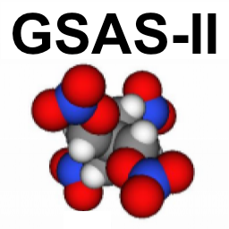

.. index:: Home
	   
====================================
GSAS-II Home Page
====================================

.. tip::

   A new section in the GSAS-II web documentation,
   `Announcements in "GitHub Discussions" <https://github.com/AdvancedPhotonSource/GSAS-II/discussions/categories/announcements>`_
   is now in use as a source of information on new capabilities added to
   GSAS-II. 

Welcome to the home page for GSAS-II, a unique and comprehensive open
source Python project for determination of crystal structures and
diffraction-based materials characterization for crystalline solids on
all scales, from perovskites through proteins, using both powder and
single-crystal diffraction and with both x-ray and neutron
probes. Refinements can combine measurements from laboratory and
synchrotron x-rays, as well as constant wavelength or time-of-flight
neutron sources. It provides structure solution and refinement, as
well as extensive visualization capabilities. 

.. toctree::
   :caption: Home Page Contents
   :maxdepth: 1 
   :numbered:     
      
   install.rst
   documentation.rst
   mailinglist.rst
   bug.rst
   options.rst
   help.rst 
   developers.rst 
   misc.rst 
   AboutGSASII.rst

.. tip::
    Please help us by citing:

     .. index:: Citation
    
    Toby, B. H., & Von Dreele, R. B. (2013). "GSAS-II: the genesis of a modern open-source all purpose crystallography software package". *Journal of Applied Crystallography*, **46**\(2), 544-549. `DOI: 10.1107/S0021889813003531 <https://doi.org/10.1107/S0021889813003531>`_

       Note that some sections of the program utilize externally provided
       codes or reference later work, with citations provided
       as they are used. *Please* cite them as well.
 
GSAS-II is made available for free use (`see license <https://raw.githubusercontent.com/AdvancedPhotonSource/GSAS-II/master/LICENSE>`_) with open access to the `source code <https://github.com/AdvancedPhotonSource/GSAS-II>`_.  

Also, please do sign up for the GSAS-II mailing list `see below <mailinglist.html>`_.
We add new features to GSAS-II quite frequently, so we may break
things from time to time (`see bug reporting <bug.html>`_). Be
sure to use the ``Help-->Update`` capability frequently to stay abreast of
new features and fixes as they are added and please make sure to use
the latest version before reporting a bug to us, but *please* do report
bugs.

Installing GSAS-II: Overview
============================================

There are several different ways to install GSAS-II, as are outlined below. Most people will use the GSAS2MAIN installer
 
.. toctree::
   :maxdepth: 2
   :caption: Installation information:
      
   install.rst

GSAS-II Documentation
====================================

While there is no manual for GSAS-II, there is quite a bit of
web-based documentation, as listed below.

.. toctree::
      
   documentation.rst

Mailing List
====================================

If you use  GSAS-II, please join the mailing list so we can tell you
about what is new and changing. 

.. toctree::

   mailinglist.rst

Reporting GSAS-II Bugs
====================================

If something is not working properly in GSAS-II, please let us
know. If we don't know its broken, its not going to be
fixed. Information on how to report bugs is here. 

.. toctree::

   bug.rst

Customizing GSAS-II
====================================

There are many options within GSAS-II that allow you to tailor aspects
of the program to operate differently. These are described
here. Options are available to change how
powder diffraction refinement results are plotted or change defaults
used in different parts of the program, for example. 

.. toctree::

   options.rst

Help: GSAS-II will not start
====================================

If there is a bug in GSAS-II, check for updates (using the Help/Update
menu command) and if the bug is present in the latest version, please
report it (see section above on reporting bugs).
Should GSAS-II fail to start after an update, then there are alternate
ways to update GSAS-II, as discussed below. 

.. toctree::
      
   help.rst

Notes for GSAS-II Developers
======================================

We encourage you to improve GSAS-II or to use the code in your own
projects. Some starting information is here:

.. toctree::

   developers.rst 
   
Miscellaneous GSAS-II Links
======================================

Other things related to GSAS-II can be found here.

.. toctree::

   misc.rst

GSAS-II Statisics: Usage & Size
======================================

Some statistics about GSAS-II are included here.

.. toctree::

   AboutGSASII.rst
