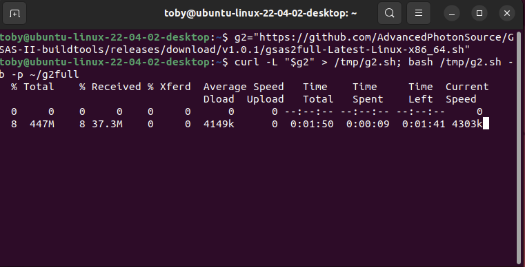
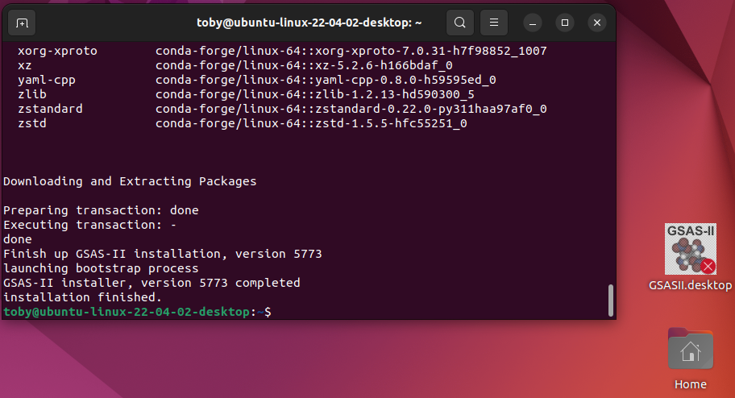
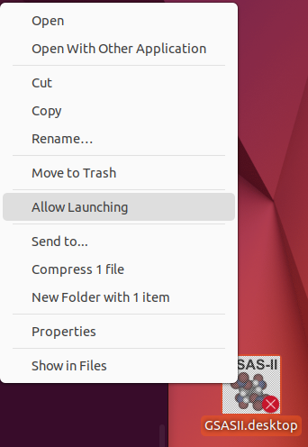

.. raw:: html

	 

.. image:: ./images/gsas2.png
   :scale: 25 %
   :alt: GSAS-II logo
   :align: right

Linux GSAS2MAIN Installation Details
========================================================
The exact details for how the installation is performed will depend on "flavor" of Linux in use. Here I am using Ubuntu.

1) In a terminal window paste the commands::

     g2="https://github.com/AdvancedPhotonSource/GSAS-II-buildtools/releases/download/v1.0.1/gsas2main-Latest-Linux-x86_64.sh"
     curl -L "$g2" > /tmp/g2.sh; bash /tmp/g2.sh -b -p ~/g2main

   as seen to right. Note that I have chosen to install in location ``~/g2main`` (which is subdirectory ``g2main`` in my home directory), but you can install this where you prefer.
   
.. raw:: html

	 

	   

Note that binary compatibility between Linux systems is not all that
good. The above is constructed on an Ubuntu 24.04.2 LTS GitHub runner, but
that will not run on APS Redhat Enterprise Linux systems. For RHEL a
separate installer is available. Use this command, instead::

  g2="https://github.com/AdvancedPhotonSource/GSAS-II-buildtools/releases/download/v1.0.1/gsas2main-rhel-Latest-Linux-x86_64.sh"
  curl -L "$g2" > /tmp/g2.sh; bash /tmp/g2.sh -b -p <install-loc>

If neither of the two installers will work for your flavor of Linux
(which will be obvious as starting either the GUI or loading the scriptable module
will produce error messages about being unable to import the GSAS-II
binaries), you will need to compile GSAS-II yourself. This can be done
after using either of the two Linux installers by following the chapter
`on compiling GSAS-II
<https://advancedphotonsource.github.io/GSAS-II-tutorials/compile.html>`_. Note
there the meson instructions.

2) The previous install step will run for a few minutes (or longer depending on download speeds) and then the conda installation process will start, with the display of lots of text. At the end, the terminal window will appear as seen to the right. Note the addition of the GSASII file on the desktop (this may not happen on all Linux desktop managers.). The installation has been completed. 

.. raw:: html

	 

	   

	   
3) Note the red "X" on the desktop icon and the "grayed-out" colors. This is because by default new icons are disabled. Right-click on the icon and select "Allow launching" from the menu. The "X" disappears and colors return to normal, as seen in the upper right.

   Clicking on the icon will open GSAS-II. Likewise a GSAS-II project (.gpx) file can be dragged onto the icon to open that file in GSAS-II.

