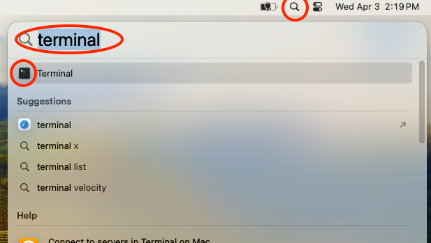
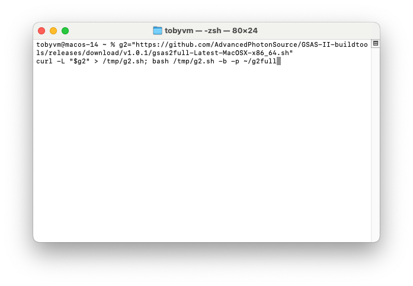
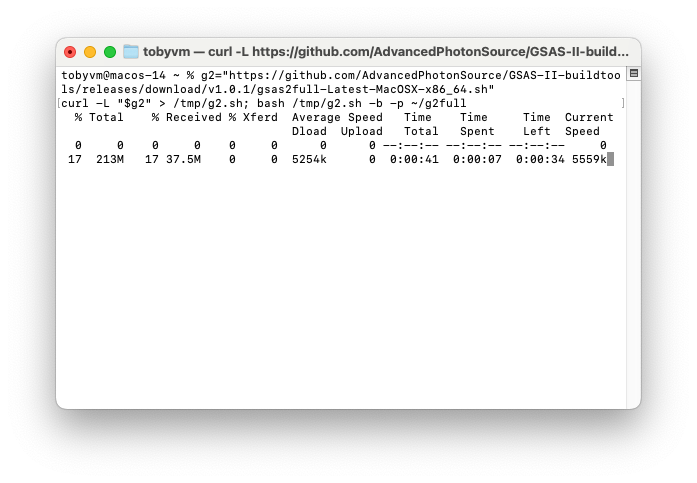
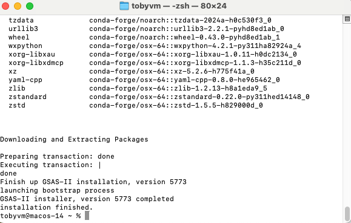
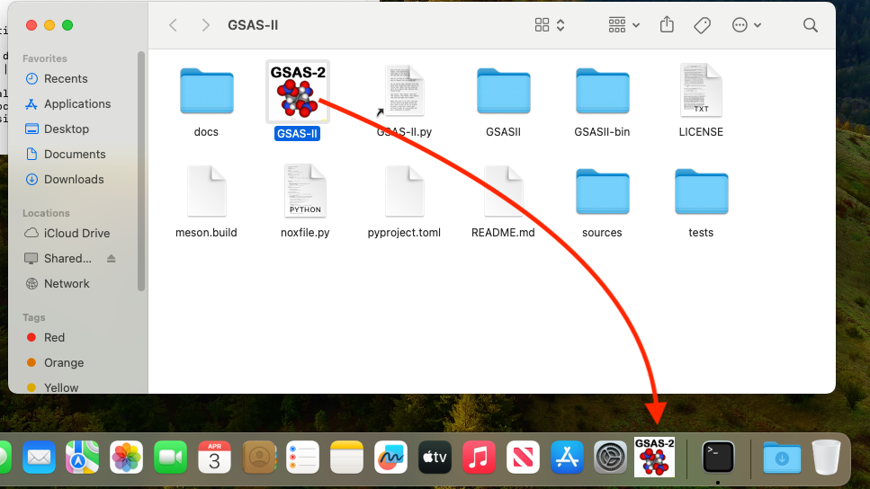
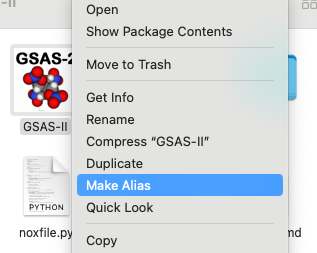
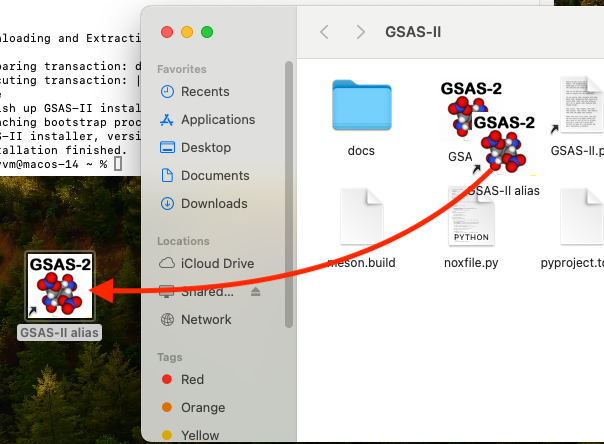
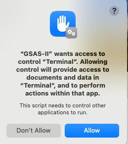

.. raw:: html

	 

.. image:: ./images/gsas2.png
   :scale: 25 %
   :alt: GSAS-II logo
   :align: right

MacOS GSAS2MAIN Installation Details
========================================================

1) The first step in this process is to open a terminal window. There are many ways on a Mac to do this, but one of the most easy is to click on the magnifying glass for Spotlight, as shown to the right, and then type terminal and finally click on the terminal application. 

.. raw:: html

	 

	 

2) Into the terminal window paste these commands (for an ARM aka "Apple Silicon" or M1, M2,... Mac)::
     
     g2="https://github.com/AdvancedPhotonSource/GSAS-II-buildtools/releases/download/v1.0.1/gsas2main-Latest-MacOSX-arm64.sh"
     curl -L "$g2" > /tmp/g2.sh; bash /tmp/g2.sh -b -p ~/g2main

   Or on an older Intel Mac::
     
     g2="https://github.com/AdvancedPhotonSource/GSAS-II-buildtools/releases/download/v1.0.1/gsas2main-Latest-MacOSX-x86_64.sh"
     curl -L "$g2" > /tmp/g2.sh; bash /tmp/g2.sh -b -p ~/g2main
  
   as seen to right. If you are not sure which you have, use "About This Mac" and look for the 1st line which will say "Chip" or "Processor" and will either list Intel or M1, M2,... Note that I have chosen to install in location ``~/g2main`` (which is subdirectory ``g2main`` in my home directory), but you can install where you prefer. Note that nothing happens until the Return key is pressed.   

.. raw:: html

	 

3) Once Return is pressed, the download of the installation kit file is started, which may take a while (typically minutes), depending on your internet connection speed.

.. raw:: html

	 

4) After the download is complete, the installation starts and that usually completes in a minute or two, as seen to the right.

.. raw:: html

	 

5) The installer will create a Mac app as a shortcut for running GSAS-II and will open the folder containing it. You cannot move that app from the folder. You can start GSAS-II by double-clicking this icon or by dropping a GSAS-II project (.gpx) file on it. 

   You can, if you wish, drag it to the doc, as seen to the right. In the doc, you can also start GSAS-II by single-clicking this icon or by dropping a GSAS-II project (.gpx) file on it. 

.. raw:: html

	 

6) Alternately, if you do want to place the shortcut somewhere, for example in the desktop, you can create an alias of the app by control-clicking on the icon (or right-clicking with a three-button mouse) and select "Make Alias" in the pop-up menu. This will create a new copy of the GSAS-II icon labeled "GSAS-II alias". You can then start GSAS-II by double-clicking this icon or by dropping a GSAS-II project (.gpx) file on it. 

.. raw:: html

	 

7) Once the alias icon is created, it can be dragged to any folder or the desktop. Once moved, it can be renamed if desired. 
	   
.. raw:: html

	 

Note: When the icon is first used, you will likely see one or more Mac security warnings asking you to confirm that you do want to give GSAS-II access to components in your computer, as shown to the right. GSAS-II will not run properly unless you press "Allow". Each warning should only be shown once. 

