.. raw:: html

	 

.. image:: ./images/gsas2.png
   :scale: 25 %
   :alt: GSAS-II logo
   :align: right

Windows GSAS2FULL Installation Details
========================================================

1 ) In your favorite browser click on the link to the download file, https://github.com/AdvancedPhotonSource/GSAS-II-buildtools/releases/download/v1.0.1/gsas2full-Latest-Windows-x86_64.exe.

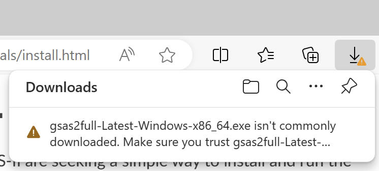

2) You may need to confirm that the file you have just downloaded is safe to open. If your employer's or school's security policy will not allow this file to be downloaded or run, seek help from your local computer assistance office.

.. raw:: html

	 

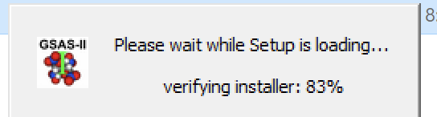

3) I needed to then rename the file to end in .exe (the rest of the name is not important) so that I could run it. Double-clicking on the file causes the window to the right to be displayed briefly and then the window below it opens. 
	   
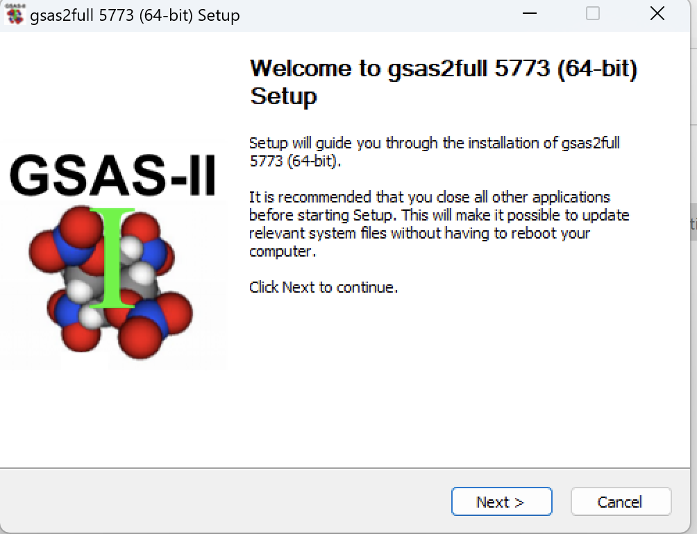

.. raw:: html

	 

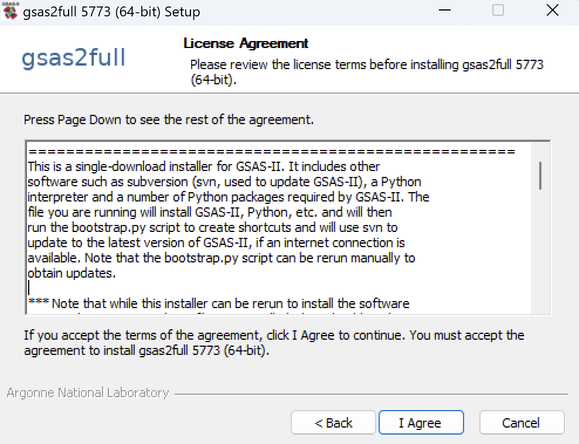

	   
4) Click on next to start the installation process. You will be shown information on the installation process and software licensing. Please review it. You must click on "I Agree" to continue.

.. raw:: html

	 

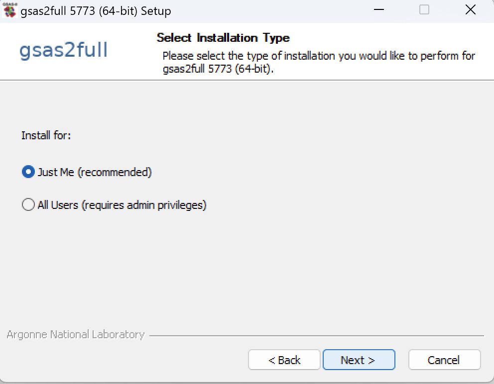
	 
5) Select "Just Me" for the installation type. It is not clear if "All Users" will even work for  computers shared between multiple users. 

.. raw:: html

	 

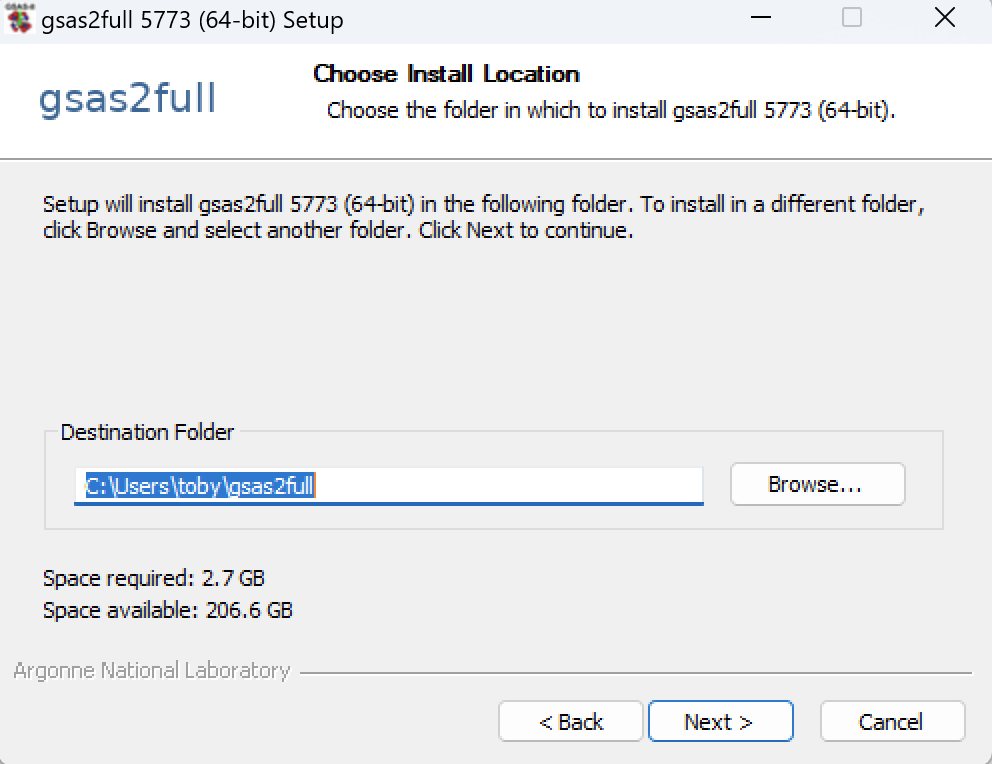
	 
6) The default installation folder is usually fine, but I often prefer to change this to ``C:\G2`` or something short. Some compters have been set so you must place the GSAS-II files within your account, however.

.. raw:: html

	 

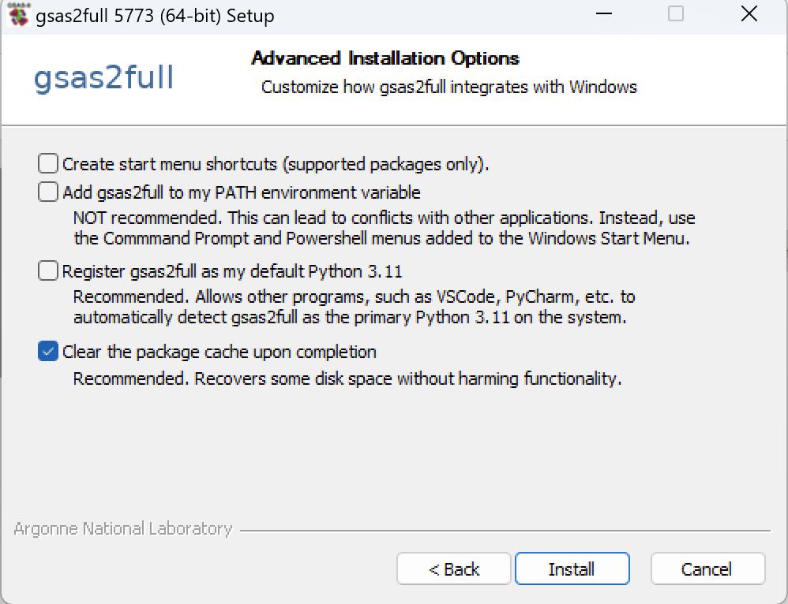

7) For the "Advanced Install Options", I recommend unselecting the first option, leaving the first three options unchecked. Note that the start menu choice offered in the first option creates shortcuts for starting Python, not GSAS-II.

.. raw:: html

	 

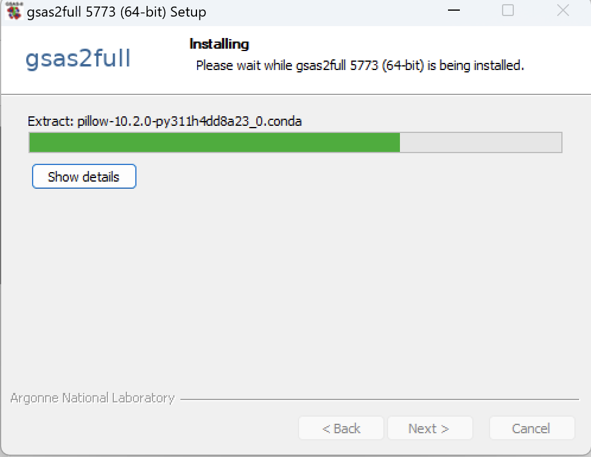

Installation then starts and may take at least a few minutes to complete, depending on computer speed and in one section, internet speed (as GSAS-II is updated). You may see a cmd.exe screen briefly as some GSAS-II Python commands are executed. 

.. raw:: html

	 

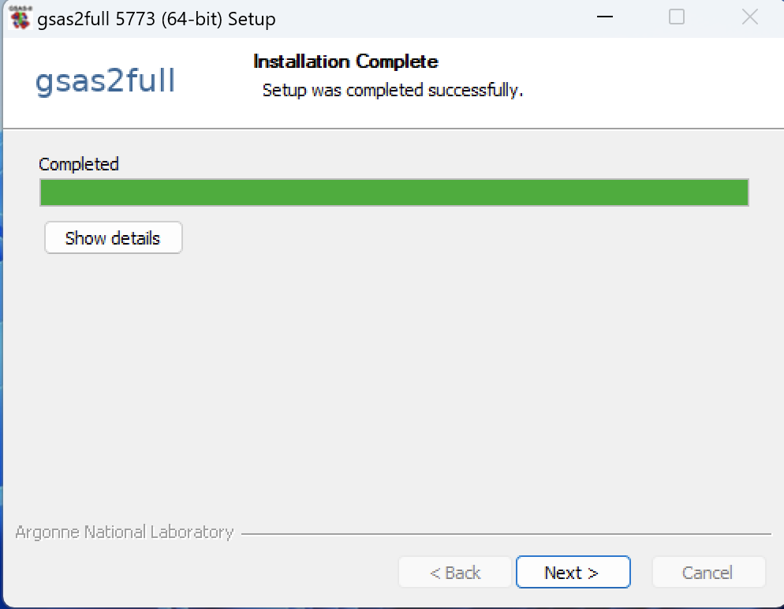

8) Once installation is complete, the window to the right is shown. Clicking on "Next" causes the window below it to open. Press "Finish" there. The GSAS-II installation is now complete. If the computer has internet access, then GSAS-II should have been updated to the most recent version. If not, no warning message are displayed, but GSAS-II can still be updated later, when internet access is available, using the Help->"Check for updates" command.

   .. raw:: html

	 

	 
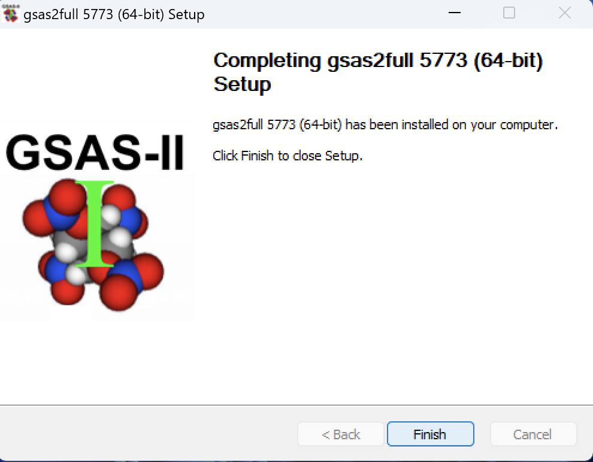

.. raw:: html

	 

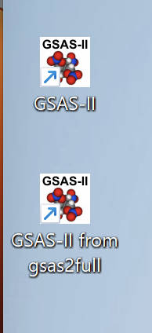

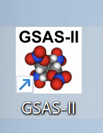
	   
Note that this installer will associate the .gpx extension (used for GSAS-II projects) with the newly installed GSAS-II program. Clicking on a .gpx file will open that in GSAS-II. Also, a desktop icon for starting GSAS-II is created. If GSAS-II has already been installed in a separate location, the icon will be named by the directory. 

Notes
-----

If you want to install on multiple machines, one can install GSAS-II
into shared directory or a file server, but the path where the
software is installed is recorded in the files that are
installed. This means that the path used to access GSAS-II
should be the same on all systems
where GSAS-II will be used. Likewise, it is possible to install GSAS-II
on one computer and then copy the directory where GSAS-II has been
installed to other computers, but again the full path for installation
should be the same on all computers. E.g., if GSAS-II is installed
in ``C:\software\GSASII`` it can be copied to a directory with the
same name on other computers and used from that location, but not to 
``E:\software\GSASII`` or ``C:\Users\someone\GSASII``.

It should be possible to run the GSAS-II self-installer in NSIS "silent
mode," which would allow it to be run inside a script, but that does
not seem to work and I am not sure why. Ref: 
https://github.com/conda/constructor/blob/main/CONSTRUCT.md#installer_type
